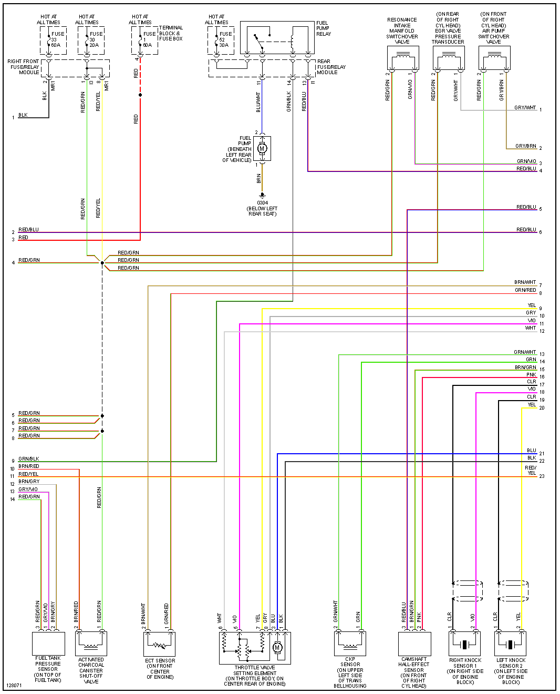
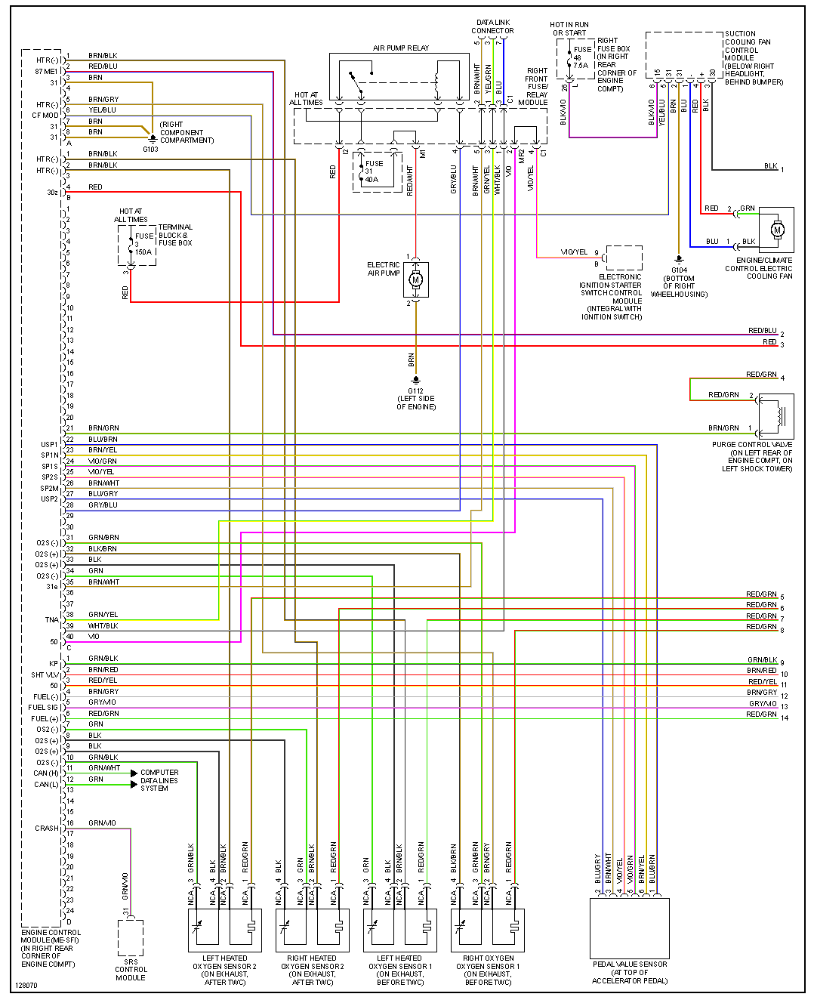

[Mercedes-Benz M113 Engine - Wikipedia]](https://en.wikipedia.org/wiki/Mercedes-Benz_M113_engine)

# 2000 S430

| Connector/ Pin Number | OEM Color | Name / Function | 
| --------------------- |------- |---------------- |
| E1  |  GRY/VIO        | INJECTOR NUMBER 6   |                         
| E2  |  GRY/GRN        | INJECTOR NUMBER 3  |                             
| E3  |  GRY/PNK        | INJECTOR NUMBER 7  |                             
| E4  |                 | INJECTOR NUMBER 8  |                             
| E13 |                 | INJECTOR NUMBER 4   |                             
| E14 |                 | INJECTOR NUMBER 2  |                             
| E25 |                 | INJECTOR NUMBER 1  |                             
| E25 |                 | INJECTOR NUMBER 5  |                             

# 2000 S500

