# Mitsubishi 3000GT

[Engine Control Module (ECM) Terminal Voltage Inspection Mitsubishi 3000GT & Dodge Stealth](http://www.stealth316.com/2-ecu-terminals.htm)

[Pinout Spreadsheet](https://docs.google.com/spreadsheets/d/1ZlcC5cdCwjYoV-z49MNaa9zpLiu_ZYBIx5H-j0F6QpI)

## 1994

DOHC Non-turbo California: 1994 to 1997

DOHC Non-turbo Federal: 1996 to 1997

DOHC Turbo: 1994 to 1997

### 94-1

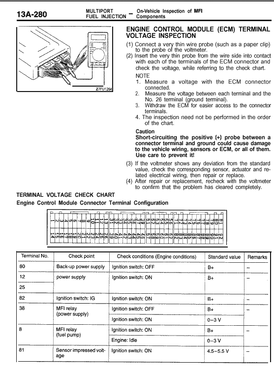

### 94-2

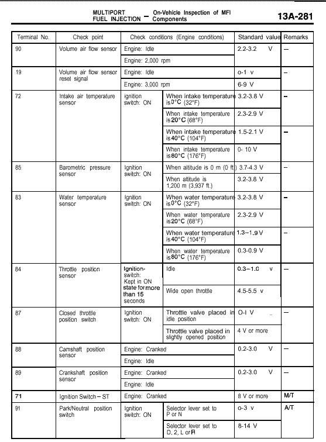

### 94-3

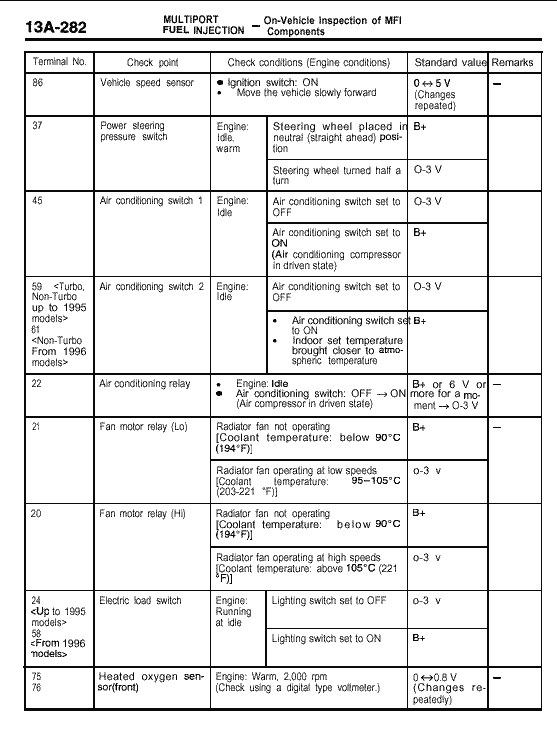

### 94-4

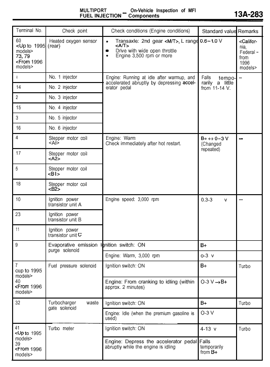

### 94-5

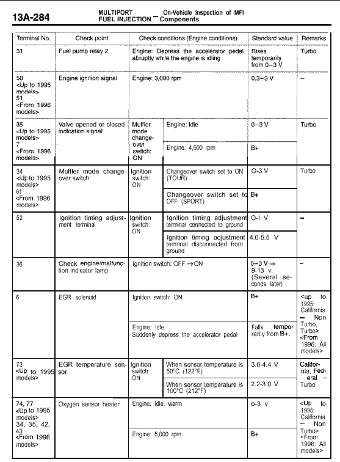

### 94-6

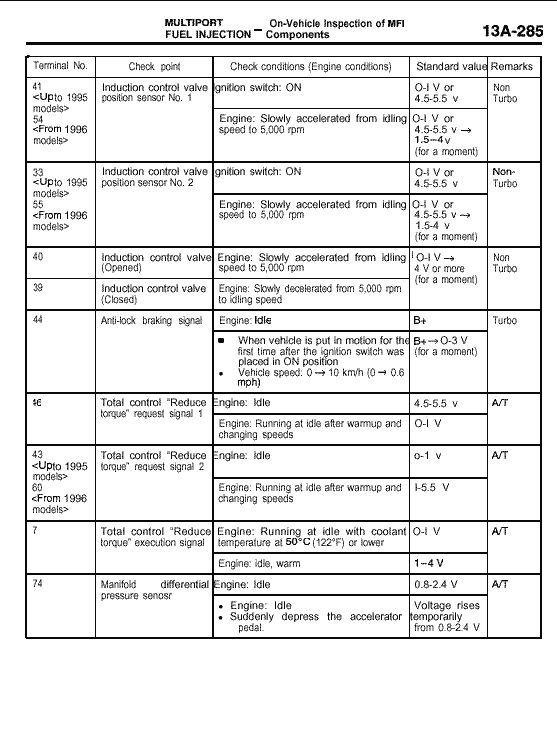

## 1996-1997

### 96-1

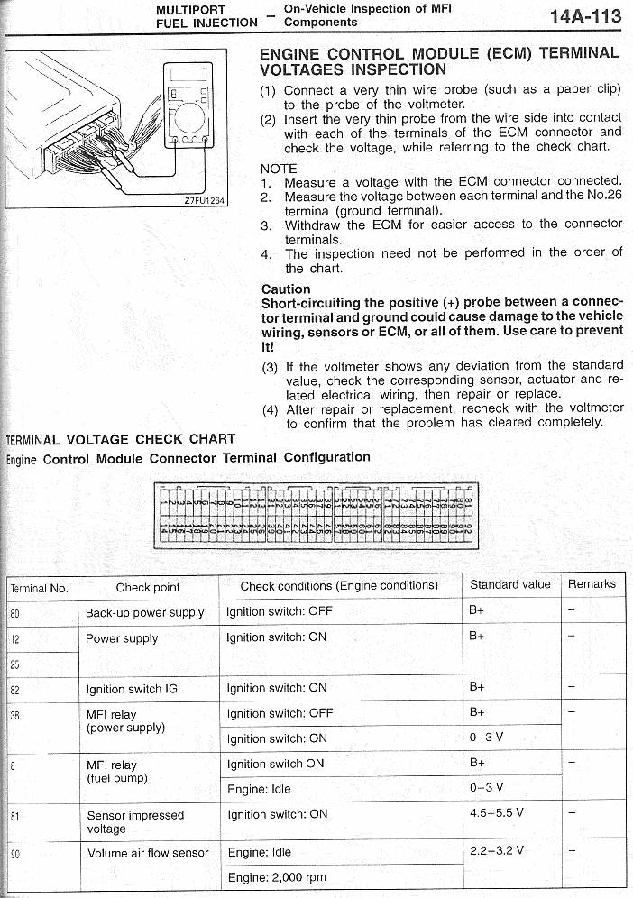

### 96-2

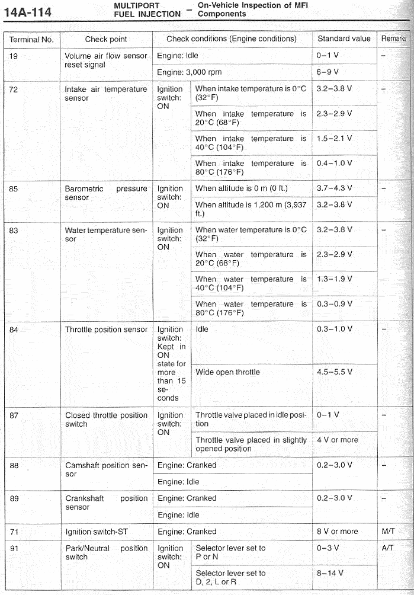

### 96-3

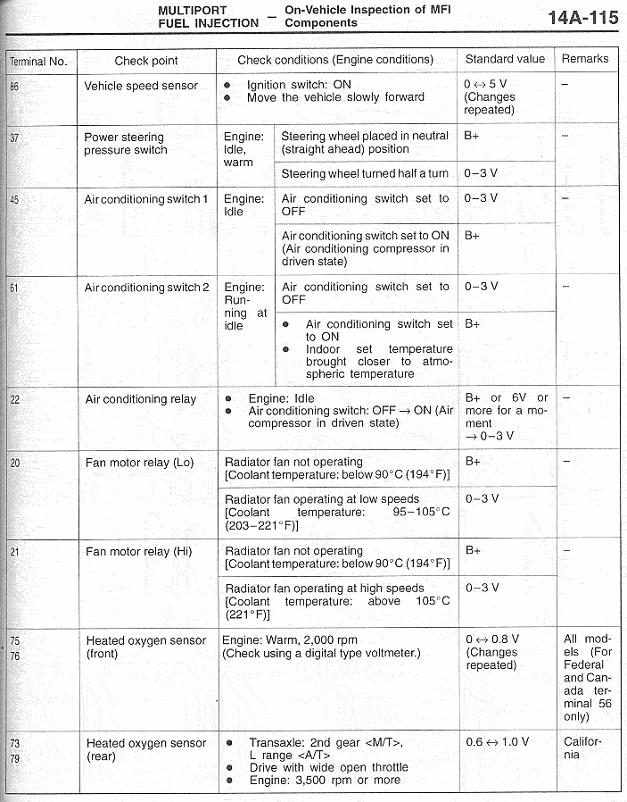

### 96-4

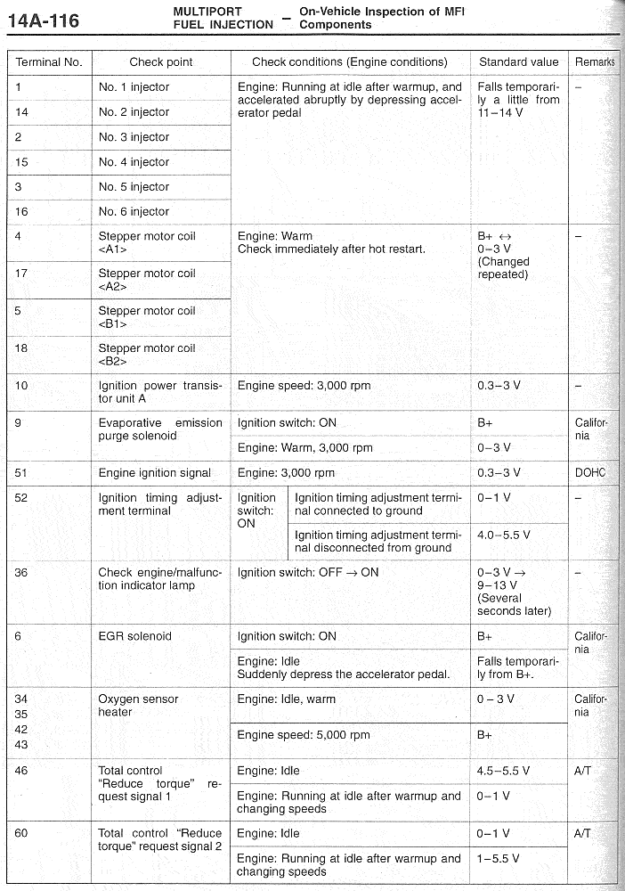

### 96-5

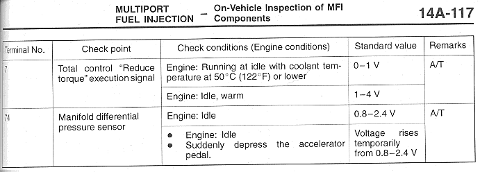
