See also [Trigger](Trigger)

To change your trigger settings, open TunerStudio, Engine->Trigger Configuration

Dev note: unit_tests executable produces triggers.txt file - gen_trigger_images.bat reads triggers.txt and produces these .png files. TODO: automate this further?

May, 2020: Subaru SVX added

April, 2020: Honda K 12+1 added.

April, 2020: Renix 44-2-2 added.

 

## Universal skipped wheel
A basic wheel - assumes equally spaced teeth with a number of missing teeth.
Tuner studio allows up to 500 teeth with 500 missing - functional limits are not tested.

## One tooth

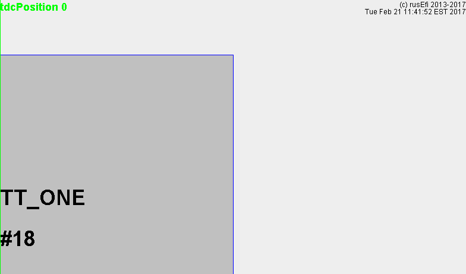

## 36/2/2

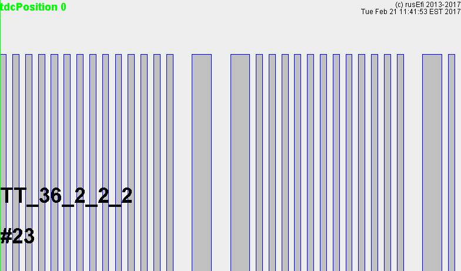

## Dodge Neon 1995

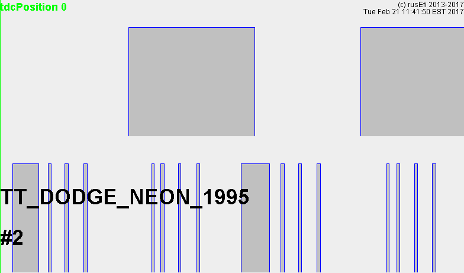

## Dodge Neon 1995 only crankshaft sensor

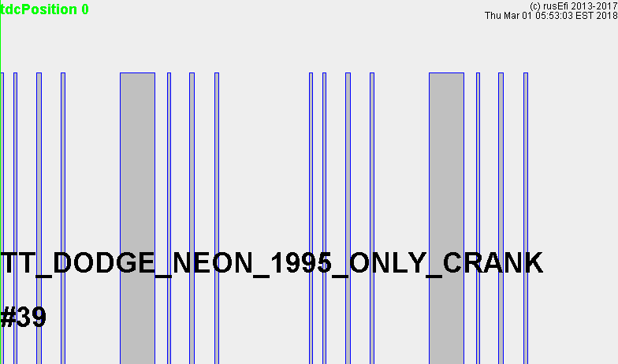

## Dodge Ram

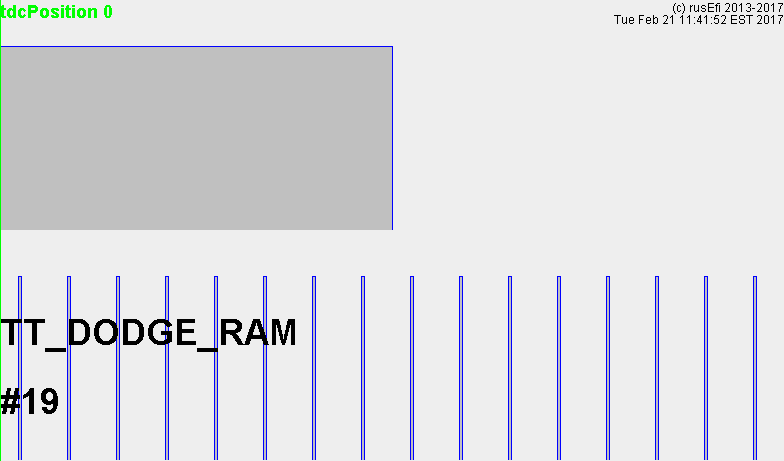

## Dodge Neon 2003
Chrysler NGC 4 cylinder

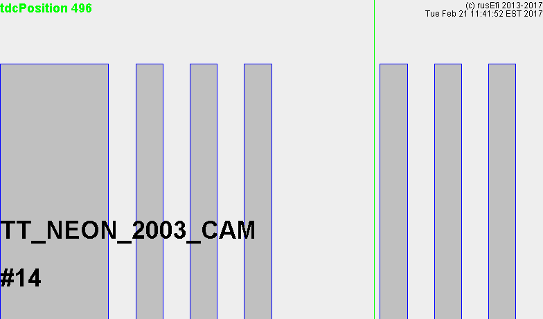

## Dodge Stratus
Chrysler NGC 6 cylinder

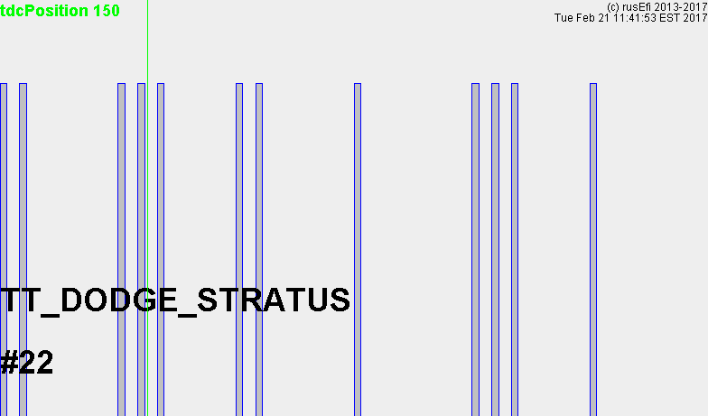

## Ford Aspire

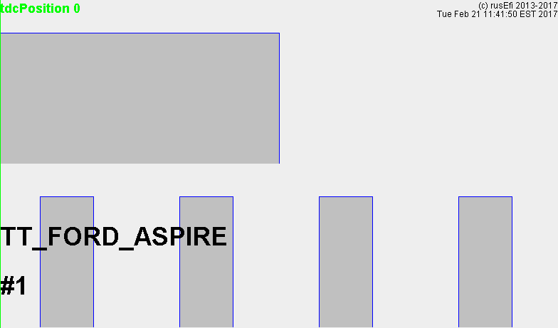

## GM 7x

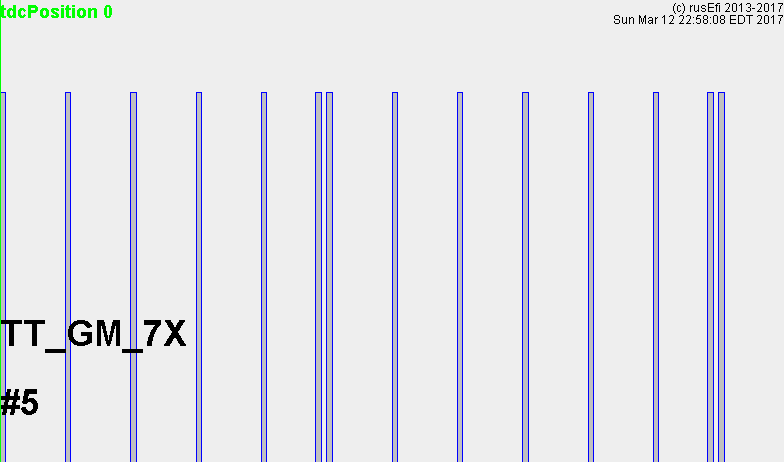

## Mazda Protege SOHC

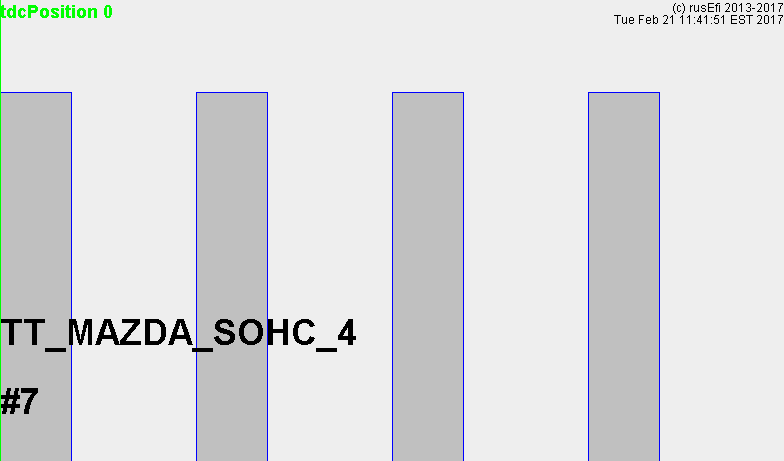

## Mazda Miata NA

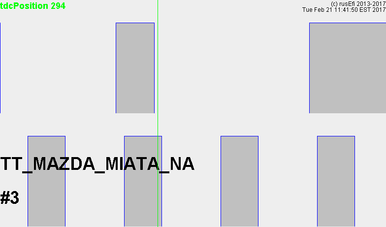

## Mazda Miata NB1

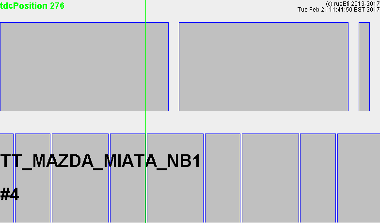

## Mazda Miata NB2 VVT

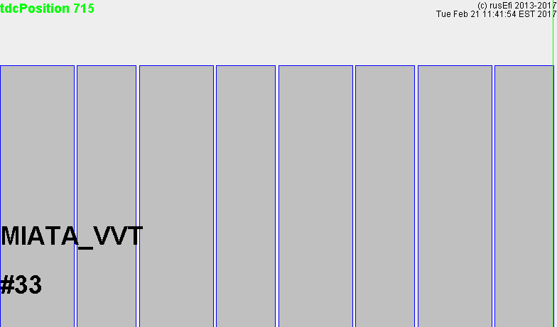

## Mazda Protege 1993 DOHC

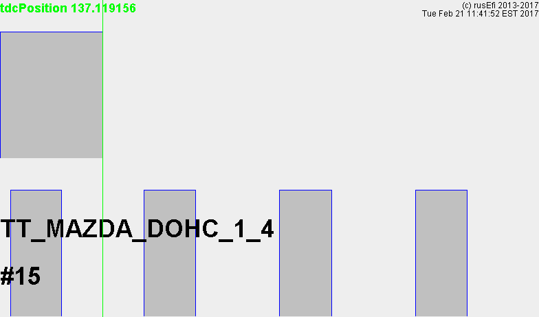

## Mitsubishi

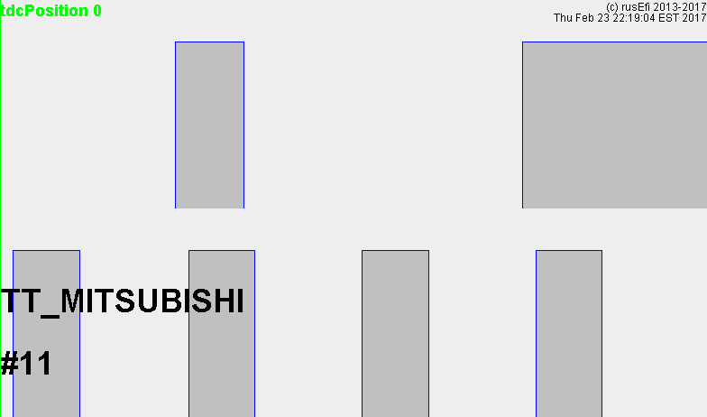

## Nissan

360 slot trigger not ready yet, no test vehicles :(

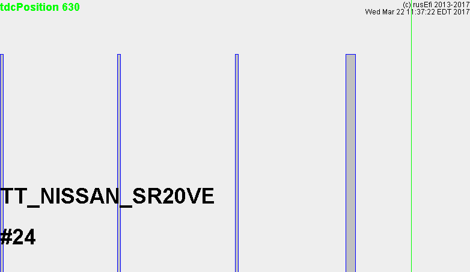

## Universal 36/1

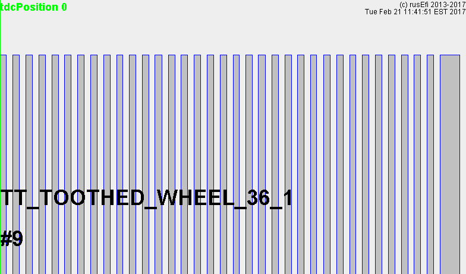

## Universal True 60/2

If you also have a CAM sensor somewhere see https://rusefi.com/wiki/index.php?title=Manual:Software:VVT

## 1 + 60/2

Please use this one only if your CAM sensor position matches this picture exactly. For a CAM which does not match this picture exactly, see above for universal 60/2 with cam input.

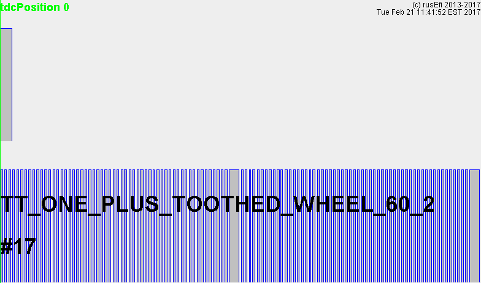

## VW 60/2
VW special understanding of 60/2 with a wide tooth instead of of just missing tooth.

See also https://rusefi.com/wiki/index.php?title=Manual:Software:Trigger#Universal_True_60.2F2

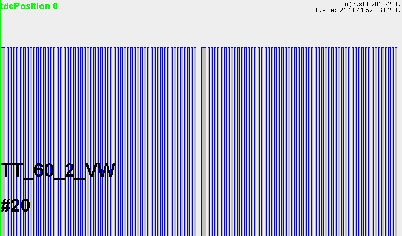

## Toyota 2JZ

3/34 version

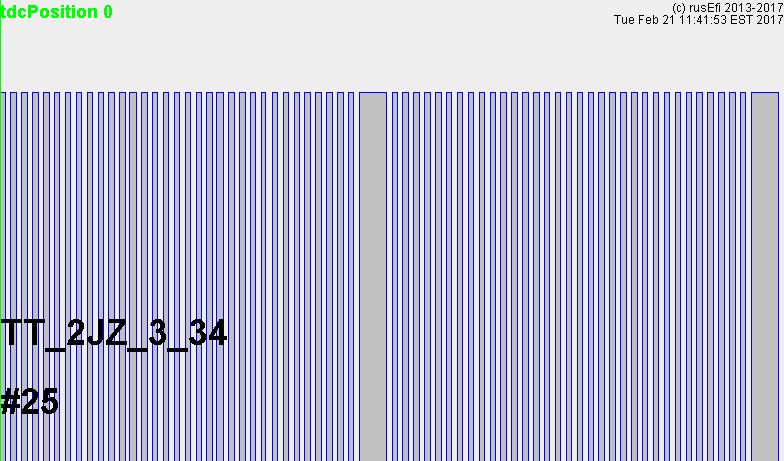

1/12 version

## GM LS 24 tooth

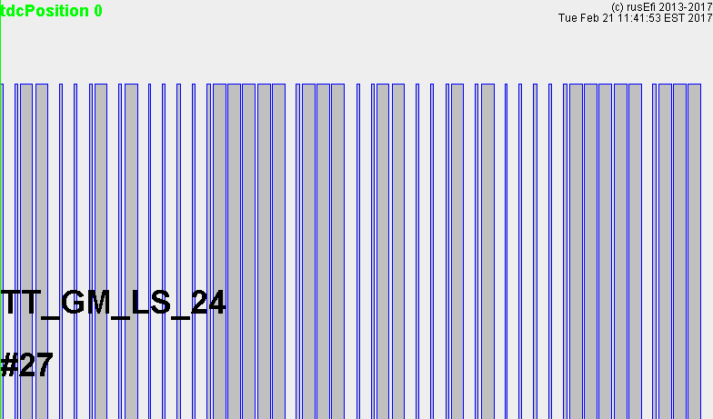

## Subaru 7+6 tooth

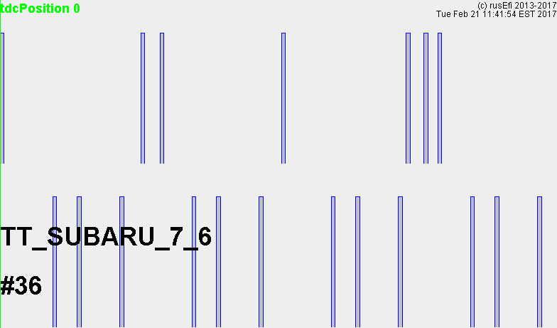

## Jeep 18-2-2-2

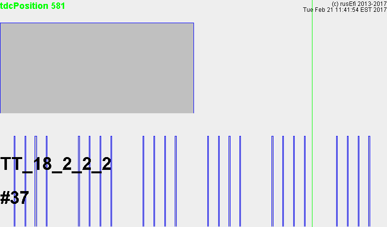

## Honda 1+24

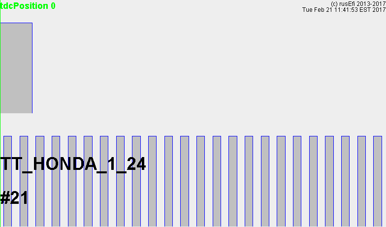

## Honda 4+24

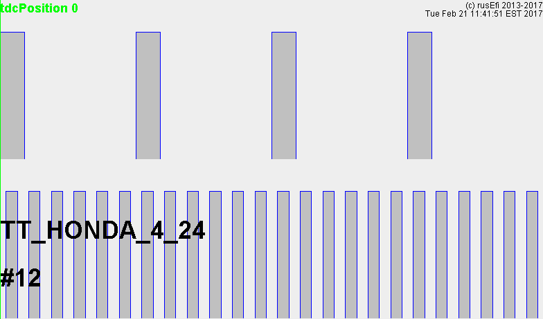

## Honda 1+4+24

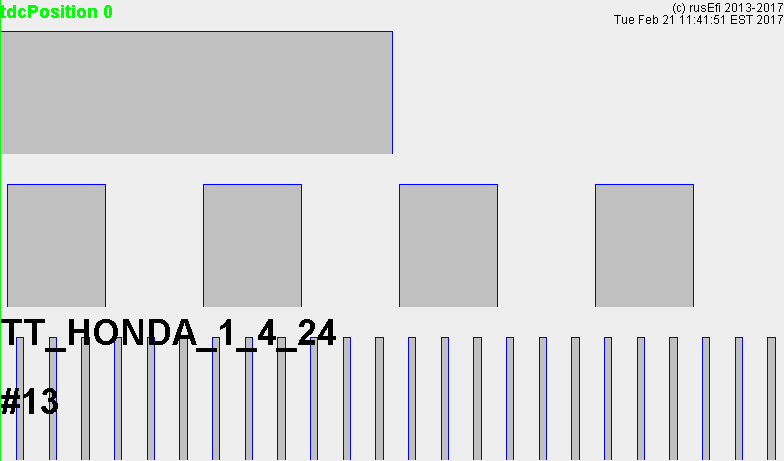

## Honda CBR600

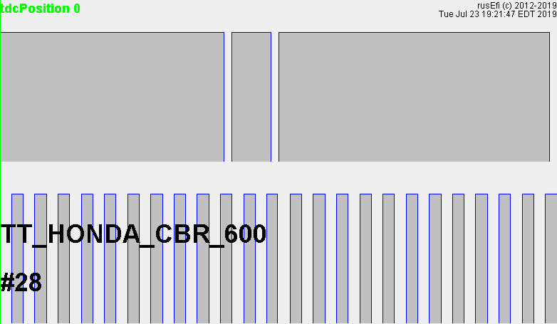

## Unknown trigger type

Manual:Software:UnknownTrigger

TODO: implement a feature so that trigger could be defined via TunerStudio

If your have an unknown or an unsupported trigger shape, once you've confirmed that trigger events are getting into the software (see "troubleshooting" sections) you need to crank your engine while rusEfi console is connected with Engine Sniffer tab active.

With long enough cranking you should get a visual log of your trigger signal, that would give you some idea of what kind of trigger shape you have. Save an image and post it on a forum. It's recommended to remove spark plugs while investigating trigger shape to make your cranking more even.

Once preliminary shape of a new trigger is added into rusEfi firmware based on the Engine Sniffer image, second step is getting a more precise recording of the shape with exact angles. This is done with spark plugs removed and Sensor Sniffer mode set to TRIGGER. With long enough cranking a chart of trigger shape would appear on the Sensor Sniffer tab and the console log file (see out/ folder next to rusefi console binaries) would contain the angles. Please post this log file on the forum for the developers to encode the new trigger shape into the software.

## How this works

Trigger decoding cycle starts at 'synchronization point' - that's the trigger fall or rise event which satisfies the 'synchronization gap' condition. Since trigger synchronization point usually has nothing to do with top dead center #1 (TDC), we have have 'globalTriggerAngleOffset' parameter - that's the offset between synchronization point and TDC.

For example, 'set global_trigger_offset_angle 0', TDC is set to synchronization point, the green vertical line is TDC mark:

Now the real TDC, 'set global_trigger_offset_angle 175' command:

Note the different location of the green TDC line. Also note how all Injector #1 pulse has moved (injector #3 is the lowest signal on these pictures) - that's because ignition and injection are scheduled based on TDC point.

While running ignition is controlled by ignition timing map, you can also offset the whole ignition timing map using 'set ignition_offset' command. Ignition dwell is controlled by dwell time curve.

Injection could be offset using 'set injection_offset X' command.

While cranking, you can set angle-based ignition instead of timing map & dwell based ignition. In angle-based mode, dwell is defined in crankshaft angle duration and timing is constant. set cranking_charge_angle and set_cranking_timing_angle.

See 'trigger decoding' in http://rusefi.com/docs/html/
