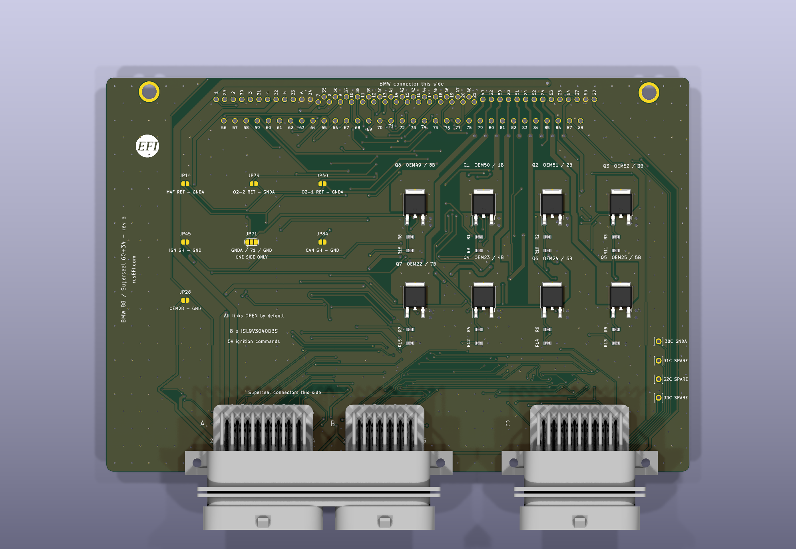
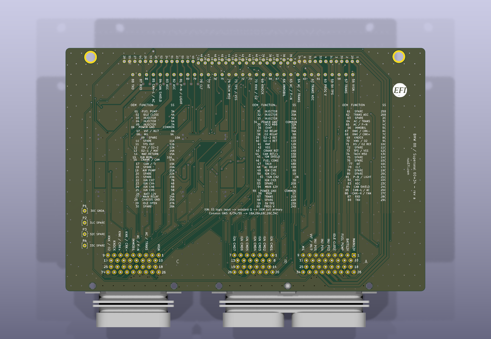

# BMW Motronic 88 Superseal adapter

The BMW Motronic 88 adapter connects the factory 88-terminal harness to Superseal 60 + 34 connectors and includes eight ignition power drivers for coils without built-in igniters. Revision a is a 170 × 115 mm, two-layer board.

[Adapter schematics (PDF)](Hardware-files/adapters/BMW-88-adapter/BMW-88-superseal-adapter.pdf) | [Vehicle pinout](https://rusefi.com/docs/pinouts/bmw88/) | [Adapter board pinout](https://rusefi.com/docs/pinouts/bmw88-adapter/)

[Reference wiring — 1994 325i M50TU, sheet 1](OEM-Docs/Bmw/1994_e36/94_325_1.png) · [sheet 2](OEM-Docs/Bmw/1994_e36/94_325_2.png) | [Reference wiring — 1994 540i M60, early, sheet 1](OEM-Docs/Bmw/1994_e34/94_540_early_1.png) · [sheet 2](OEM-Docs/Bmw/1994_e34/94_540_early_2.png) · [sheet 3](OEM-Docs/Bmw/1994_e34/94_540_early_3.png)

## Vehicle applications

The adapter covers the Bosch Motronic M3.1, M3.3 and M3.3.1 interface used by the [Hellen 88 BMW application family](Hellen-88-BMW.md): M50/M50TU, M60 and early S50 engines. Reference vehicles are the **1994 BMW 325i with M50TU** and **1994 BMW 540i with M60**. Early M3 applications require matching the engine, DME and harness to the variant notes in the pinouts; a shared connector does not make cylinder assignments interchangeable.

This adapter does not cover Siemens MS40/MS41 or other Bosch 88-terminal generations outside the M3.x mapping. Check the exact DME and equipment before making the ECU cable.

## Connector numbering

The vehicle side uses the original terminal numbers 1–88. Superseal **A** is the 34-position bank of the 60-way connector, **B** is its 26-position bank, and **C** is the separate 34-way connector. Thus `12B` means terminal 12 of bank B. Use the connector-face images in the adapter pinout for orientation.

All 88 vehicle terminals are accounted for. Vehicle terminals **6, 34 and 55** share power GND and connect to Superseal **18A, 26A, 18C, 26C and 34C**. The eight coil-primary terminals connect through the ignition drivers. Every other vehicle terminal has its own independent Superseal contact.

Superseal **30C** brings the ECU's GNDA sensor-ground rail to the adapter and has access pad **P1**. It is isolated from power GND on the adapter. Spare contacts **31C, 32C and 33C** have access pads **P2, P3 and P4**.

## Ignition connections

Superseal **1B–8B** accept 5 V logic ignition commands. Eight ISL9V3040D3S drivers switch the corresponding coil-primary terminals on the vehicle side. ECU dwell control is required: the adapter does not add a dwell timeout or current limiter. Do not connect a coil primary or a high-voltage ECU ignition output to these logic inputs.

| Driver channel | Superseal command | Vehicle coil-primary terminal |
|---|---|---|
| 1 | 1B | 50 |
| 2 | 2B | 51 |
| 3 | 3B | 52 |
| 4 | 4B | 23 |
| 5 | 5B | 25 |
| 6 | 6B | 24 |
| 7 | 7B | 22 |
| 8 | 8B | 49 |

Channel numbers are board channels, not universal cylinder numbers. The vehicle pinout lists engine-specific coil assignments; configure ignition and injector order for the chosen engine.

The eight collector heat spreaders are separate live ignition-primary conductors. A shared metal heatsink requires electrical insulation. Check driver temperature and coil operation under the intended load after assembly.

## Jumper configuration

All seven solder jumpers are **open by default**. Each affected vehicle wire retains its independent Superseal connection even when its jumper is open. Close a jumper only when that connection is appropriate for the vehicle and ECU. Closing a jumper also connects its independent Superseal contact to the selected ground rail.

| Jumper | Vehicle terminal | Independent Superseal contact | Connection when closed |
|---|---|---|---|
| JP14 | 14 | 15A | MAF return to GNDA on 30C |
| JP39 | 39 | 10B | Oxygen sensor 2 return to GNDA on 30C |
| JP40 | 40 | 11B | Oxygen sensor 1 return to GNDA on 30C |
| JP28 | 28 | 25A | Electronics/chassis ground to power GND |
| JP45 | 45 | 16B | Ignition-monitor shield/return to power GND |
| JP84 | 84 | 24C | Shield/return to power GND |
| JP71 | 71 | 10C | Selector: 1–2 connects to GNDA on 30C; 2–3 connects to power GND |

**JP71:** pad 1 is GNDA, pad 2 is vehicle terminal 71, and pad 3 is power GND. Bridge at most one side. The M50TU/M60 wiring shows a shield/ground arrangement; the M50 variant uses an oxygen-sensor return. Match the variant and ECU grounding before selecting a bridge.

**Vehicle terminal 28 is not the GNDA source.** The M60 wiring connects it to chassis ground; the M50TU wiring also routes it into the chassis/shield ground network. GNDA comes separately from the ECU on 30C.

Vehicle terminals **15, 43 and 44** remain independent. Their ignition-monitor and crank/cam functions vary; a wire labelled “return” must not automatically be joined to chassis or sensor ground.

## Vehicle-to-Superseal connections

Functions and interface types follow the interactive pinouts. A type is omitted where engine variants use different interfaces. On the Superseal side, `Smart Ignition Coil N` describes the logic command to the onboard driver; the vehicle-side coil terminal is the driver's power output.

| Vehicle terminal | Superseal contact | Function |
|---|---|---|
| 1 | 3A | Fuel Pump Relay Output |
| 2 | 4A | Idle valve close control |
| 3 | 5A | Injector 5 (M50TU); Injector 1 (M60/S50/M50) |
| 4 | 6A | Injector 6 (M50TU); Injector 4 (M60); Injector 3 (S50/M50) |
| 5 | 7A | Injector 4 (M50TU); Injector 6 (M60); Injector 2 (S50/M50) |
| 6 | 18A, 26A, 18C, 26C, 34C | Power/Chassis GND ground (injector/output/ignition return) |
| 7 | 8A | VANOS solenoid (M50TU) / Injector 7 (M60) |
| 8 | 9A | Check Engine Light Output |
| 11 | 12A | Throttle-position output to transmission / traction control (variant dependent) |
| 12 | 13A | Universal analog input. Suggested TPS 1 sensor input (M50); oxygen sensor 2 input (M60/S50) |
| 13 | 14A | Oxygen sensor 1 input (M50TU/M60/S50) / MAF burn-off (M50) |
| 14 | 15A | GNDA Analog/Sensor Ground (MAF return; JP14 to ECU GNDA) |
| 15 | 16A | Ignition monitor / return (do not assume chassis ground) |
| 16 | 17A | Crank sensor input (M50TU/M60/S50) / cam sensor negative (M50) |
| 17 | 19A | Cam sensor input (M50TU/M60/S50) / fuel-consumption output (M50) |
| 18 | 20A | Auxiliary circuit (not specified for M3.x in reference) |
| 19 | 21A | Secondary air pump control (M60/S50; verify equipment) |
| 22 | 7B via driver 7 | Ignition primary output, driver channel 7 (M60: coil 7) |
| 23 | 4B via driver 4 | Ignition primary output, driver channel 4 (M50TU: coil 4; M60: coil 6; S50: coil 2; M50: coil 2) |
| 24 | 6B via driver 6 | Ignition primary output, driver channel 6 (M50TU: coil 6; M60: coil 4; S50: coil 3; M50: coil 3) |
| 25 | 5B via driver 5 | Ignition primary output, driver channel 5 (M50TU: coil 5; M60: coil 1; S50: coil 1; M50: coil 1) |
| 26 | 2A | 12V Battery Supply (constant, terminal 30) |
| 27 | 24A | Main Relay Control Output |
| 28 | 25A | Power/Chassis GND ground (electronics/shields; connected to chassis in M50TU/M60 wiring; JP28 to GND) |
| 29 | 27A | Idle valve open control |
| 31 | 29A | Injector 3 (M50TU); Injector 5 (M60/S50/M50) |
| 32 | 30A | Injector 2 (M50TU); Injector 8 (M60); Injector 6 (S50/M50) |
| 33 | 31A | Injector 1 (M50TU); Injector 3 (M60); Injector 4 (S50/M50) |
| 34 | 18A, 26A, 18C, 26C, 34C | Power/Chassis GND ground (injector/output/ignition return) |
| 35 | 32A | Injector 2 output (M60) |
| 36 | 33A | EVAP canister purge valve control |
| 37 | 34A | Oxygen sensor heater relay control (M60/S50/M50; separate from pin 38) |
| 38 | 9B | Oxygen sensor heater relay control (M50TU; separate from pin 37) |
| 39 | 10B | GNDA Analog/Sensor Ground (oxygen sensor 2 return, M60/S50; JP39 to ECU GNDA) |
| 40 | 11B | GNDA Analog/Sensor Ground (oxygen sensor 1 return, M50TU/M60/S50; JP40 to ECU GNDA) |
| 41 | 12B | MAF Sensor Input |
| 42 | 13B | Vehicle speed input (M50TU/M60/S50) |
| 43 | 14B | Crank sensor return (M50TU/M60/S50); sensor ground on M50 reference |
| 44 | 15B | Cam sensor return (M50TU/M60/S50) / cam sensor positive (M50) |
| 45 | 16B | Ignition-monitor shield / return (verify harness) |
| 46 | 17B | Fuel consumption output (Ti) |
| 47 | 18B | Tachometer Output (TD; M50TU/M60/S50) |
| 48 | 19B | A/C compressor relay control |
| 49 | 8B via driver 8 | Ignition primary output, driver channel 8 (M60: coil 2) |
| 50 | 1B via driver 1 | Ignition primary output, driver channel 1 (M50TU: coil 1; M60: coil 3; S50: coil 4; M50: coil 4) |
| 51 | 2B via driver 2 | Ignition primary output, driver channel 2 (M50TU: coil 2; M60: coil 8; S50: coil 6; M50: coil 6) |
| 52 | 3B via driver 3 | Ignition primary output, driver channel 3 (M50TU: coil 3; M60: coil 5; S50: coil 5; M50: coil 5) |
| 54 | 1A | 12V supply from main relay (terminal 87) |
| 55 | 18A, 26A, 18C, 26C, 34C | Power/Chassis GND ground (injector/output/ignition return) |
| 56 | 1C | Ignition Switch / Battery Voltage Analog Input (terminal 15) |
| 57 | 21B | Transmission ignition-timing intervention (M50TU) |
| 59 | 23B | 5V Sensor Supply (TPS) |
| 60 | 24B | Diagnostic programming-voltage circuit (verify protocol) |
| 62 | 26B | Transmission / traction-control signal (variant dependent) |
| 64 | 3C | A/C request (M50TU/M60/S50) / transmission timing intervention (M50) |
| 65 | 4C | A/C pressure input (M50TU/M60/S50) / transmission P/N (M50) |
| 66 | 5C | Immobilizer / drive-away protection input (variant dependent) |
| 67 | 6C | Knock sensor, cylinders 7-8 (M60) / crank negative (M50) |
| 68 | 7C | Knock sensor, cylinders 5-6 (M60/S50) / crank positive (M50) |
| 69 | 8C | Knock sensor, cylinders 4-6 (M50TU) or 3-4 (M60/S50) |
| 70 | 9C | Knock sensor, cylinders 1-3 (M50TU) or 1-2 (M60/S50) / oxygen signal (M50) |
| 71 | 10C | Knock-sensor shield/return (M50TU/M60/S50) / oxygen sensor return (M50); JP71 selects GND or GNDA; leave open until variant is verified |
| 73 | 12C | Universal analog input. Suggested TPS 1 sensor input (M50TU/M60/S50); VSS on M50 |
| 74 | 13C | Tachometer output (M50 reference; otherwise unspecified) |
| 77 | 16C | IAT Sensor Input |
| 78 | 17C | ECT CLT Coolant Sensor Input |
| 81 | 21C | Transmission P/N (M50TU); headlights-on signal (M60); verify variant |
| 82 | 22C | ABS/traction-control interface (verify harness) |
| 83 | 23C | ABS ignition intervention (verify harness) |
| 84 | 24C | Shield / return (M60/S50); independent contact |
| 85 | 25C | CAN bus Low (M60/S50) / A/C pressure input (M50) |
| 86 | 27C | CAN bus High (M60/S50) / auxiliary fan signal (M50) |
| 87 | 28C | Diagnostic RXD circuit |
| 88 | 29C | Diagnostic TXD circuit |

The reference does not identify a function for the following terminals. They remain independent pass-through connections: **9 → 10A**, **10 → 11A**, **20 → 22A**, **21 → 23A**, **30 → 28A**, **53 → 20B**, **58 → 22B**, **61 → 25B**, **63 → 2C**, **72 → 11C**, **75 → 14C**, **76 → 15C**, **79 → 19C**, **80 → 20C**.

## Board views

KiCad renders of revision a. The OEM connector body is not shown in the 3D view.

## References

The 1994 325i and 540i wiring linked above defines the reference applications. [Hellen 88 development pin notes](https://docs.google.com/spreadsheets/d/1OiEaak7TElKwF-fXWvl9Dk-fD84a0NENe6lOwhXiOe4/) cover the other engine variants; use the vehicle wiring where the comparison differs. [ISL9V3040D3S datasheet](https://www.onsemi.com/pdf/datasheet/isl9v3040p3-d.pdf).
