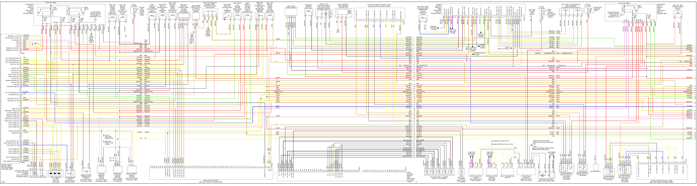
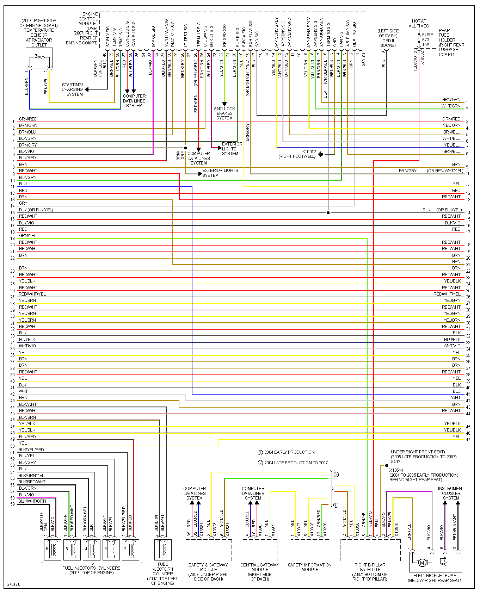
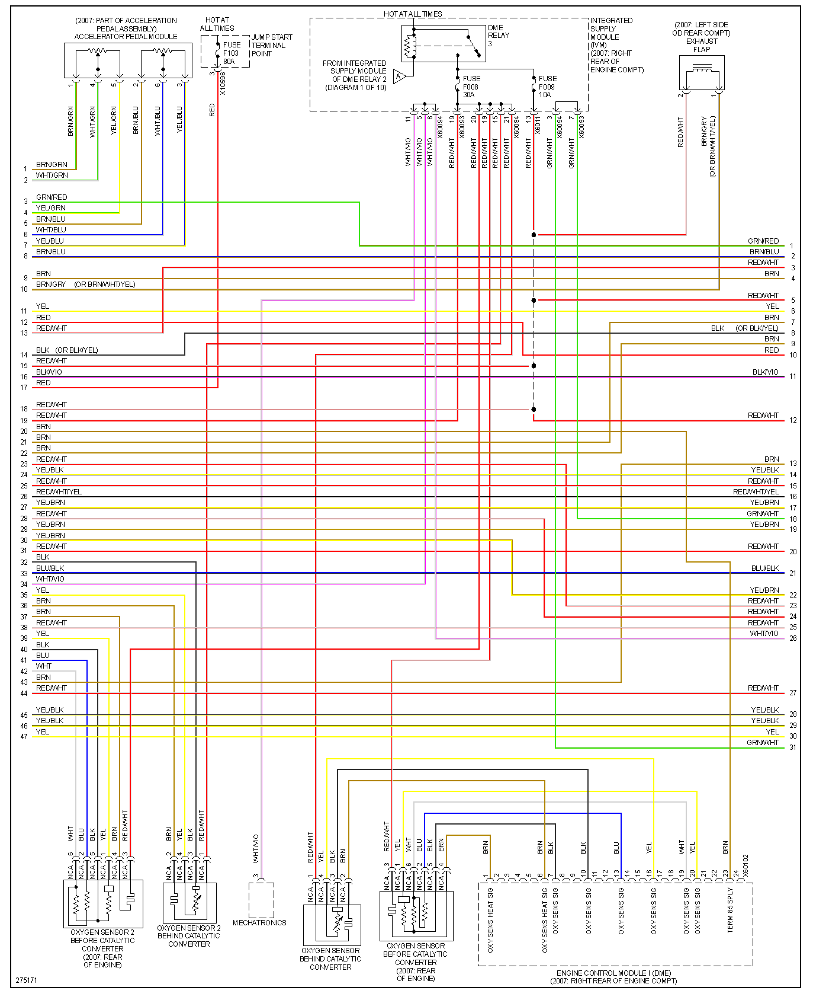
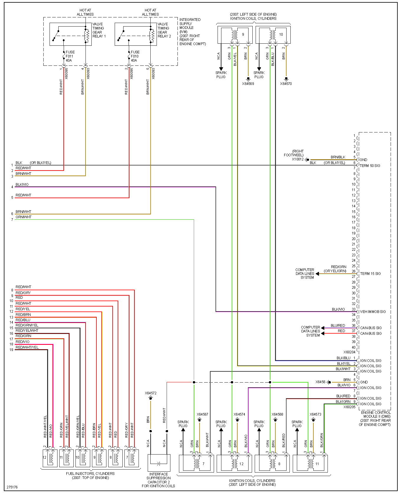

# N73

BMW 760 12 cylinders
e65/e66

x2 DME - engine control unit using [134 pin connector](OEM-connectors#134)

x2 HDEV fuel injection module 7506280 [121 pin connector](OEM-connectors#121)

|Pin Number|Name   | Default function                            | OEM Color   |
| ---:|:---------- |:------------------------------------------- | ----------- |
| 4   | **GND**    |  Power GND                                  | BRN         |
| 5   | **GND**    |  Power GND                                  | BRN         |
| 6   | **GND**    |  Power GND                                  | BRN         |
| 15  | HPFP       |  High Pressure Fuel Pump Control Signal     | Blue/Yellow |

Injector #1 + #118

Injector #1 GND #114

Injector control #44-#49
These pins are pulled-up to +12v - low-side driven control.

GND #1 #2

Power +12v: #4 #51 

The larger chip inside 7506280 says 30429, obviously google knows nothing about this 30429. But it's probably CJ830.

SAK-C505 

[wikipedia](https://en.wikipedia.org/wiki/BMW_7_Series_(E65))

Injector 13647512081 looks to be solenoid type. Fuel pressure maxes out at 120bar.
R=2.1OHm

Ignition COP 12138657273 is shared with a lot of other BMW and Mini models.

CAS 61326943828 51210030982
CAS 61356972681 
CAS 61326922329

Programming keywords:
ISTA ICON
