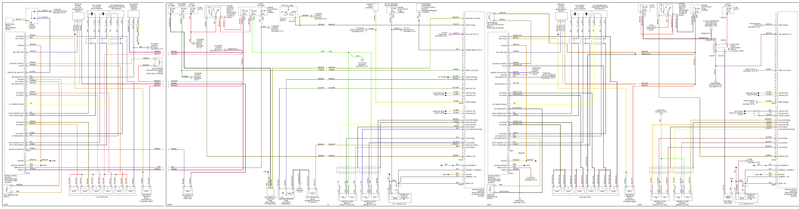
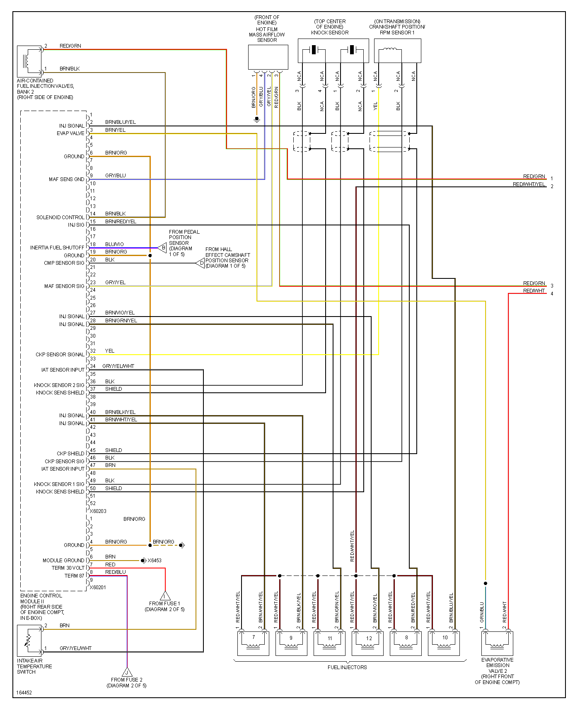
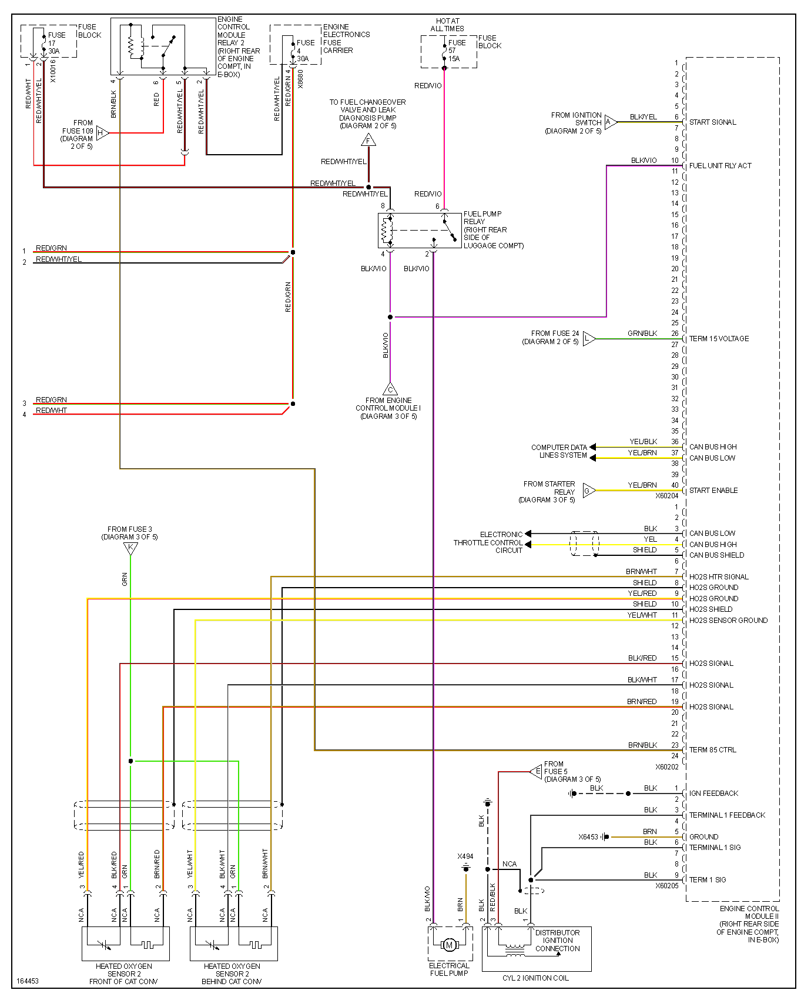
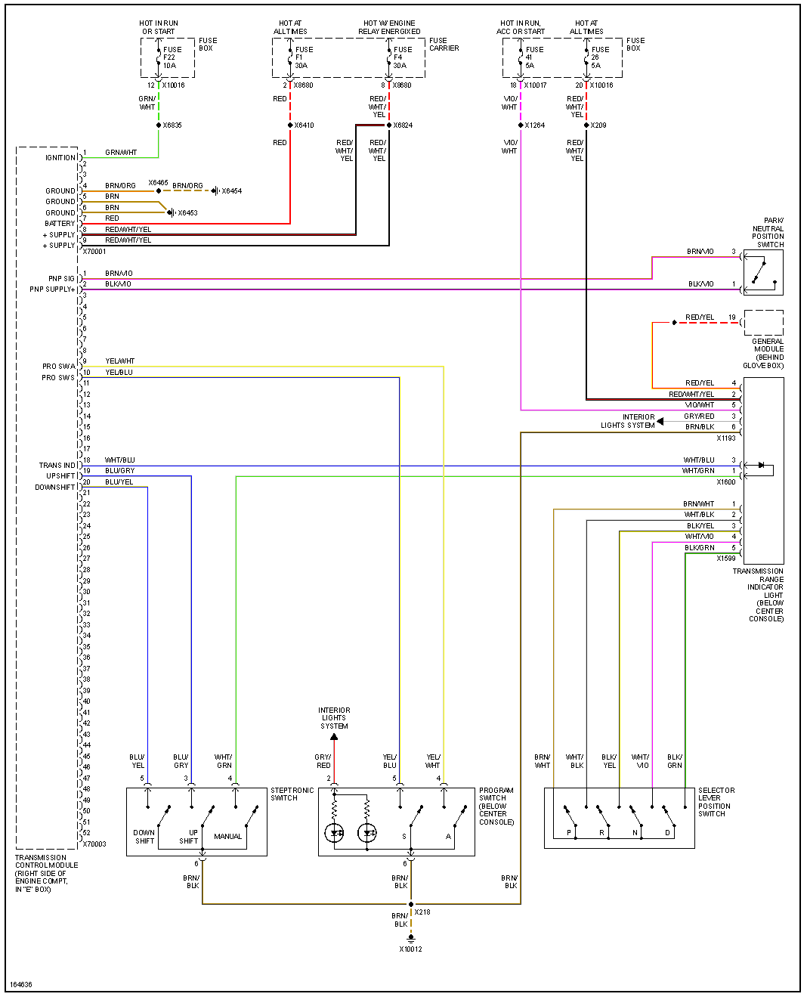
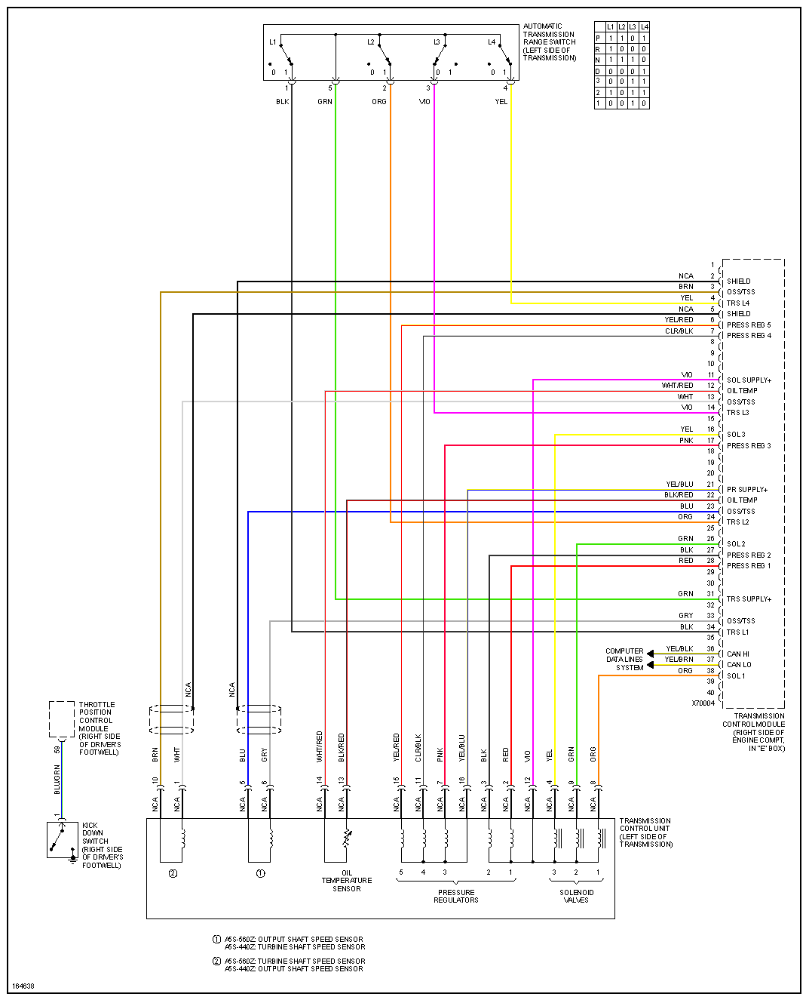

# BMW e38 750

[M73 engine](https://en.wikipedia.org/wiki/BMW_M73)

[HOWTO-M73-v12-on-Proteus](HOWTO-M73-v12-on-Proteus)

[broken link](http://www.unixnerd.demon.co.uk/m70.html)

Weight 150 kg

Throttle body left 1435709
Throttle body 17452071

ECU#1

ECU#2

ECU#3

ECU#4

ECU#5

## EML

## TCU

Shift Interlock

Charging

Starter

Washer

[Vin Registry](http://www.e38registry.org/e38-production-numbers/)
