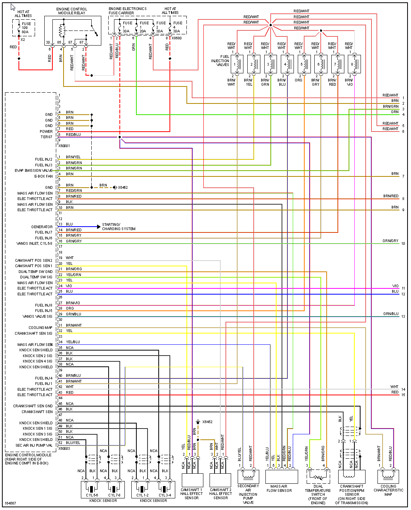
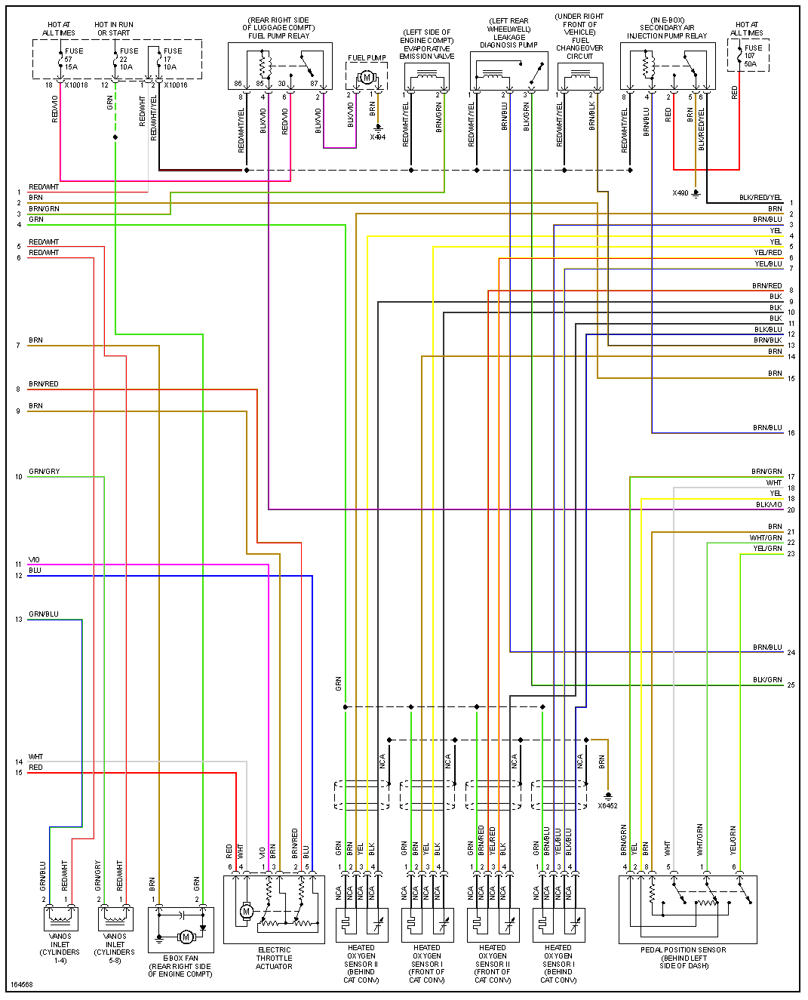
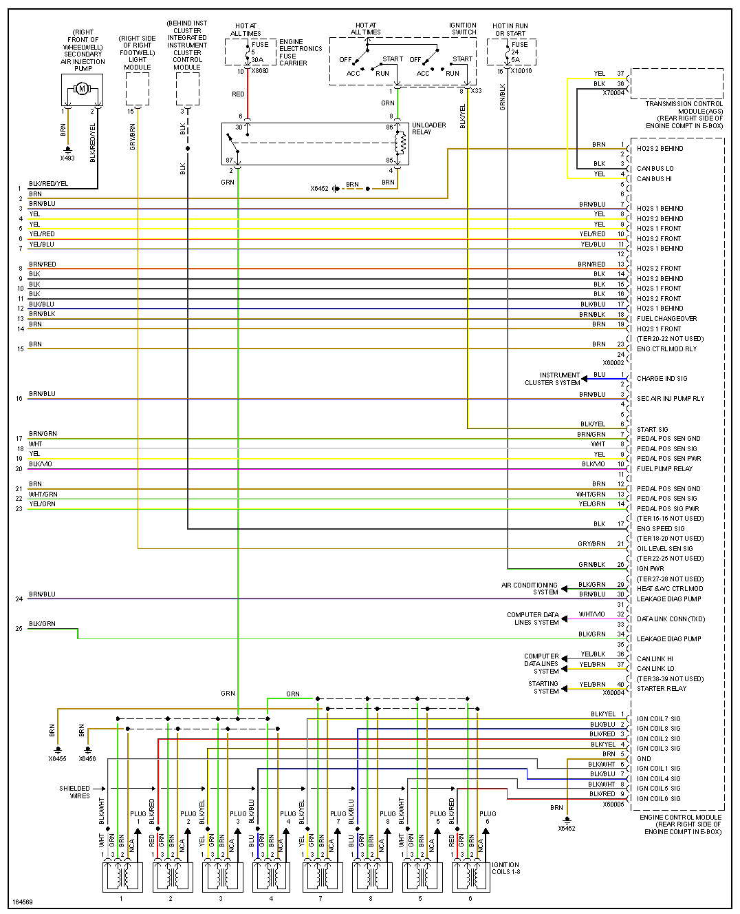

[BMW 7 Series (E38) - Wikipedia]](<https://en.wikipedia.org/wiki/BMW_7_Series_(E38>))

# 2000 740

| Connector/ Pin Number | OEM Color | Name / Function |
| --------------------- |------- |---------------- |
| 4  | BRN     | GND Ground |
| 5  | BRN     | GND Ground |
| 6  | BRN     | GND Ground |
| 7  | RED     | +12v Hot all times |
| 8  | RED/BLU | +12v Hot all times |
|    |         |           |

| Connector/ Pin Number | OEM Color | Name / Function |
| --------------------- |------- |---------------- |
| 1  | BRN/YEL |           |
| 2  | BRN/GRN |           |
|    |         |           |
|    |         |           |
