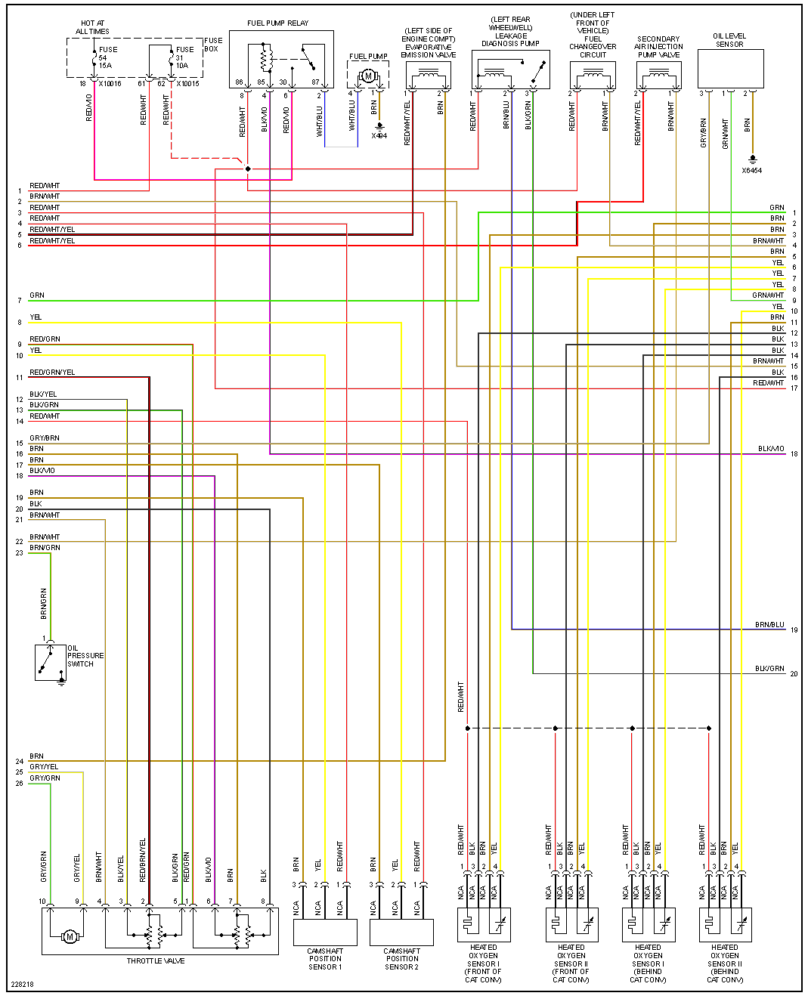
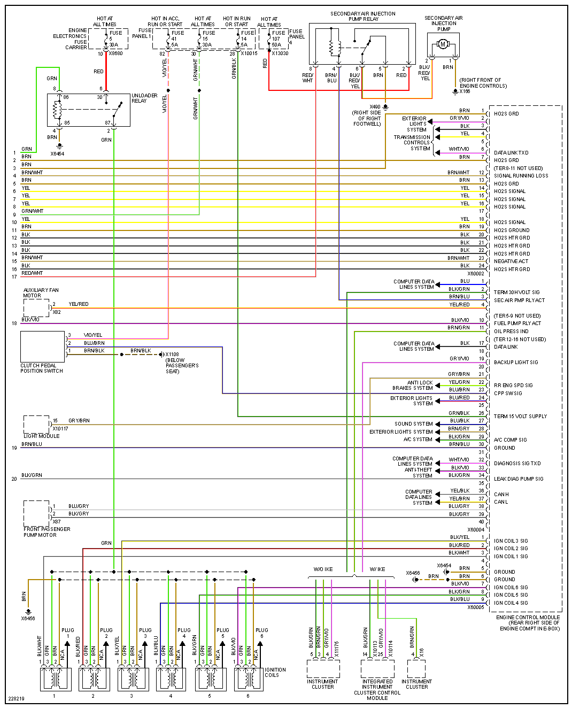
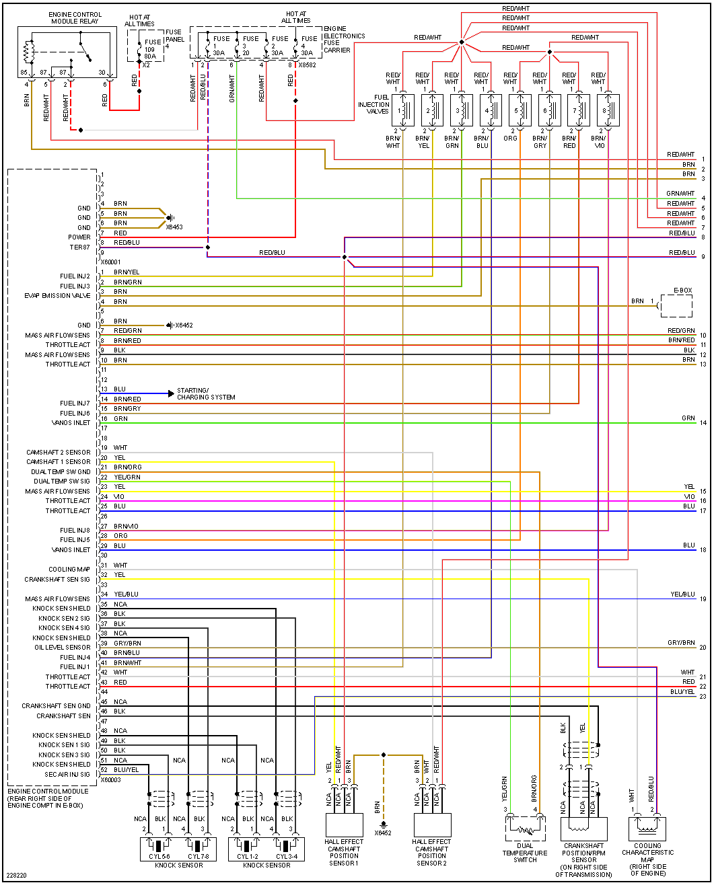
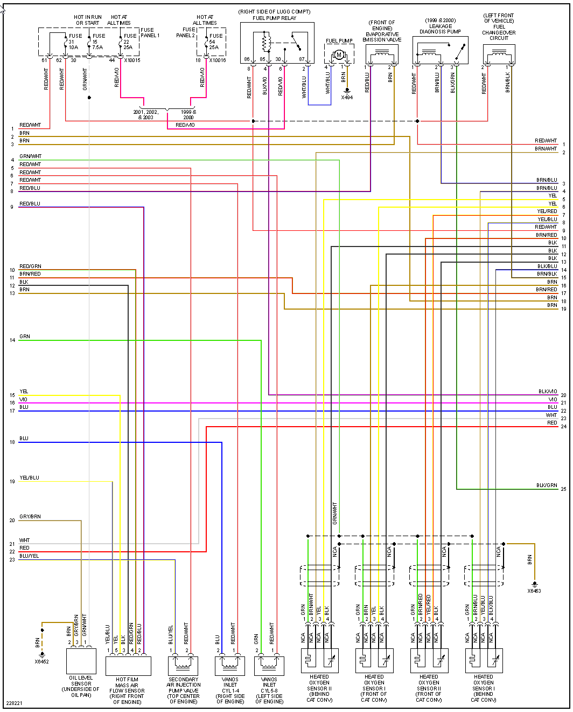

# BMW 5 Series (E39)

[BMW 5 Series (E39) - Wikipedia]](<https://en.wikipedia.org/wiki/BMW_5_Series_(E39>))

## 1999 528

| Connector/ Pin Number | OEM Color | Name / Function |
| --------------------- |------- |---------------- |
| 1 | GRN     | Relay      |
| 4 | BRN     | GND Ground |
| 5 | BRN     | GND Ground |
| 6 | BRN     | GND Ground |
| 7 | RED     | +12v Hot all times |
| 8 | RED/BLU | +12v Hot all times |
|   |         |           |

| Connector/ Pin Number | OEM Color | Name / Function |
| --------------------- |------- |---------------- |
| 1  | YEL     |           |
| 2  | YEL     |           |
|    |         |           |
|    |         |           |

## 2001 540

[BMW M62 - Wikipedia]](<https://en.wikipedia.org/wiki/BMW_M62>)

| Connector/ Pin Number | OEM Color | Name / Function |
| --------------------- |------- |---------------- |
| 4 | BRN     | GND Ground |
| 5 | BRN     | GND Ground |
| 6 | BRN     | GND Ground |
| 7 | RED     | +12v Hot all times |
| 8 | RED/BLU | +12v Hot all times |
|   |         |           |

| Connector/ Pin Number | OEM Color | Name / Function |
| --------------------- |------- |---------------- |
| 5 | BRN     | GND Ground          |
|   |         |           |
