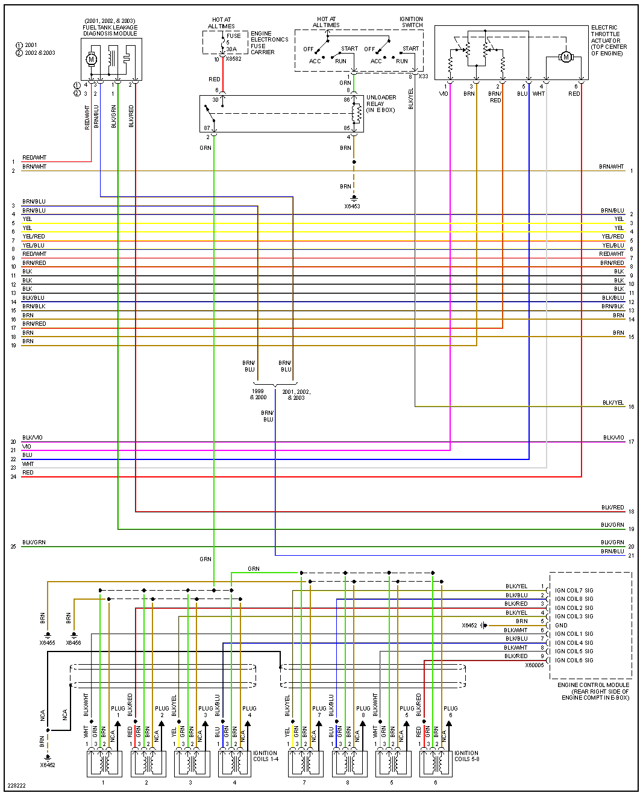

https://en.wikipedia.org/wiki/BMW_5_Series_(E39)

# 2001 540

https://en.wikipedia.org/wiki/BMW_M62

| Connector/ Pin Number | OEM Color | Name / Function | 
| --------------------- |------- |---------------- |
| 4 | BRN     | GND Ground |
| 5 | BRN     | GND Ground |
| 6 | BRN     | GND Ground |
| 7 | RED     | +12v Hot all times | 
| 8 | RED/BLU | +12v Hot all times | 
|   |         |           |
 

| Connector/ Pin Number | OEM Color | Name / Function | 
| --------------------- |------- |---------------- |
| 5 | BRN     | GND Ground          |
|   |         |           |
