# BMW e46

## 325

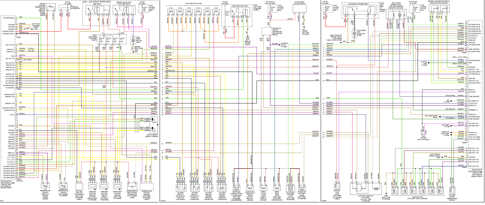

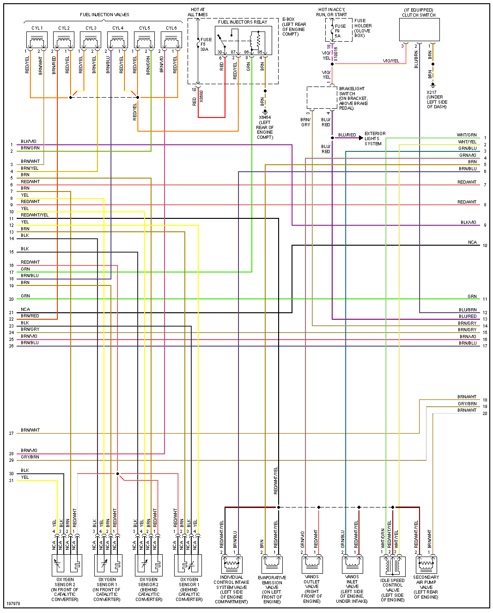

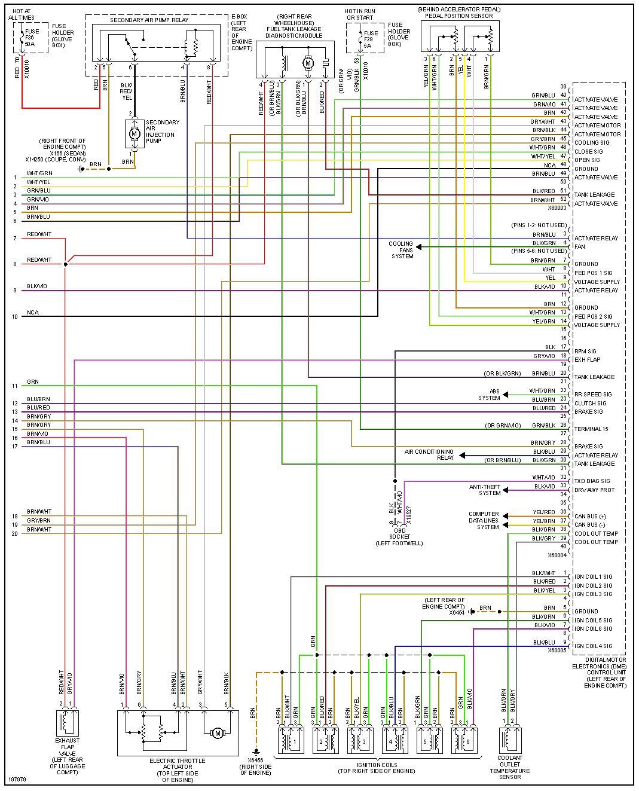

## M3

### 2002 M3

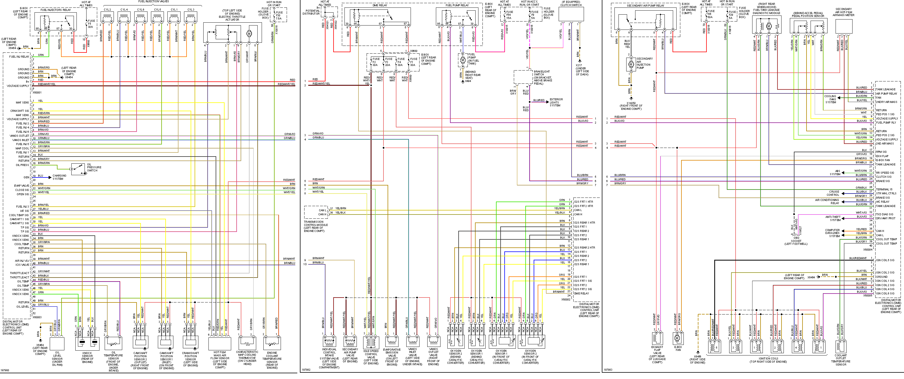

### 2004 M3

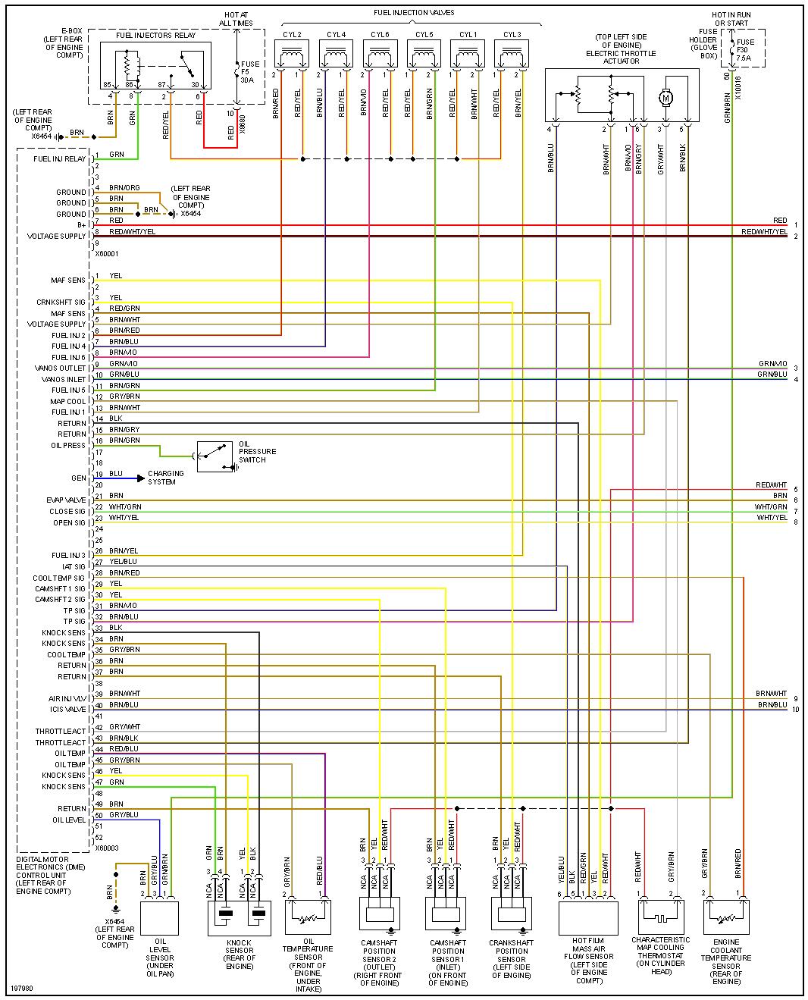

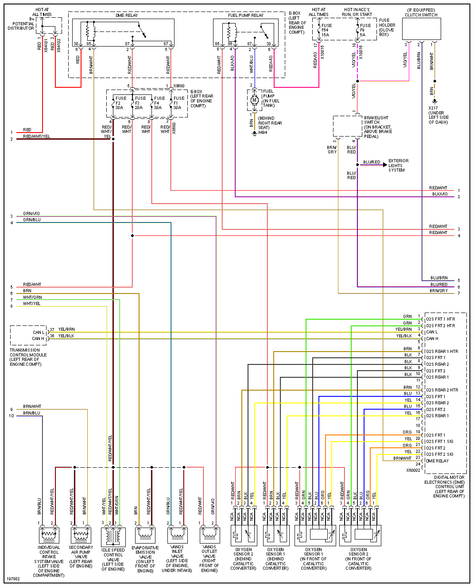

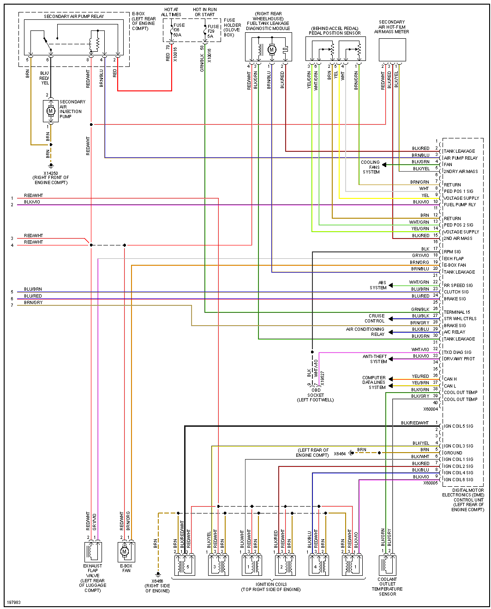

### 2004 330

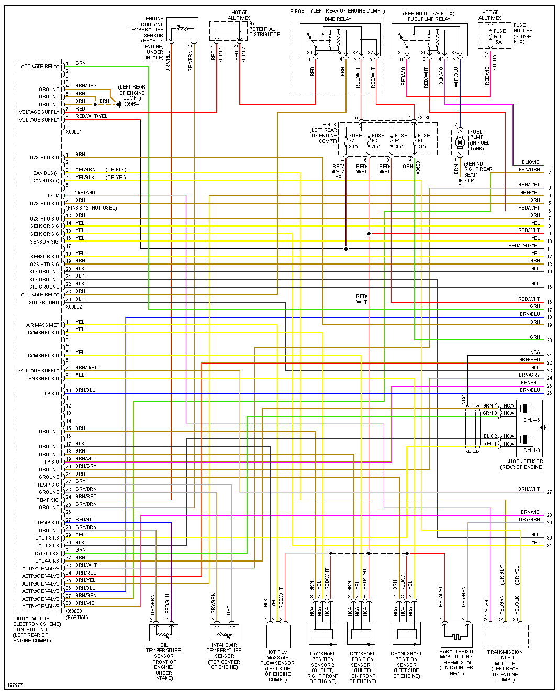

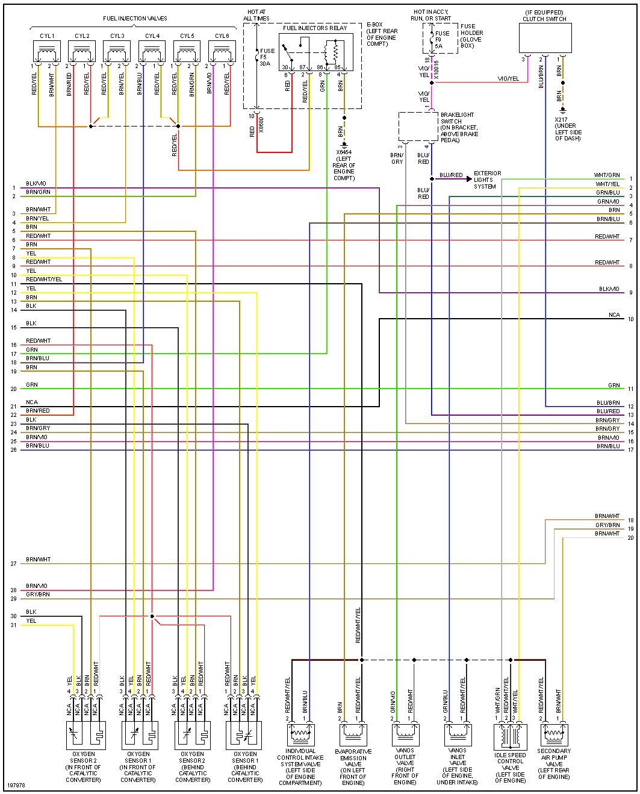

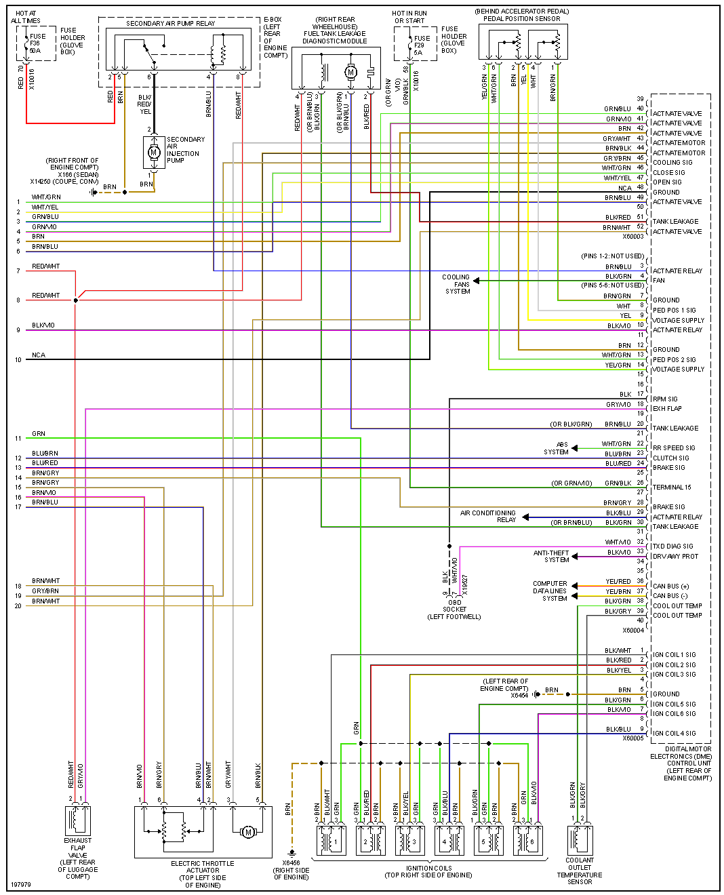

| Connector/ Pin Number | OEM Color | Name / Function |
| --------------------- |------- |---------------- |
| 5 | BRN     | GND Ground |
| 6 | BRN     | GND Ground |
| 7 | RED     | +12v Hot all times |
|   |         |           |

## Trunk

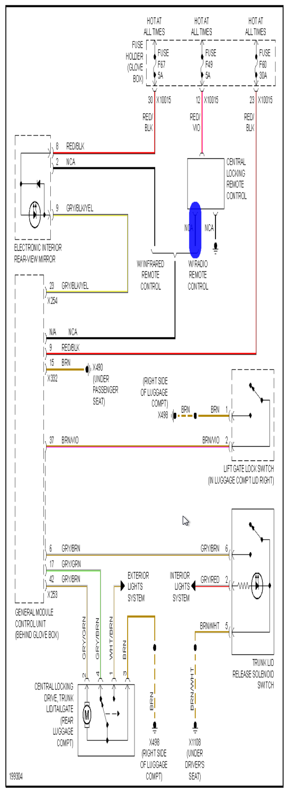

## ECU Pcb

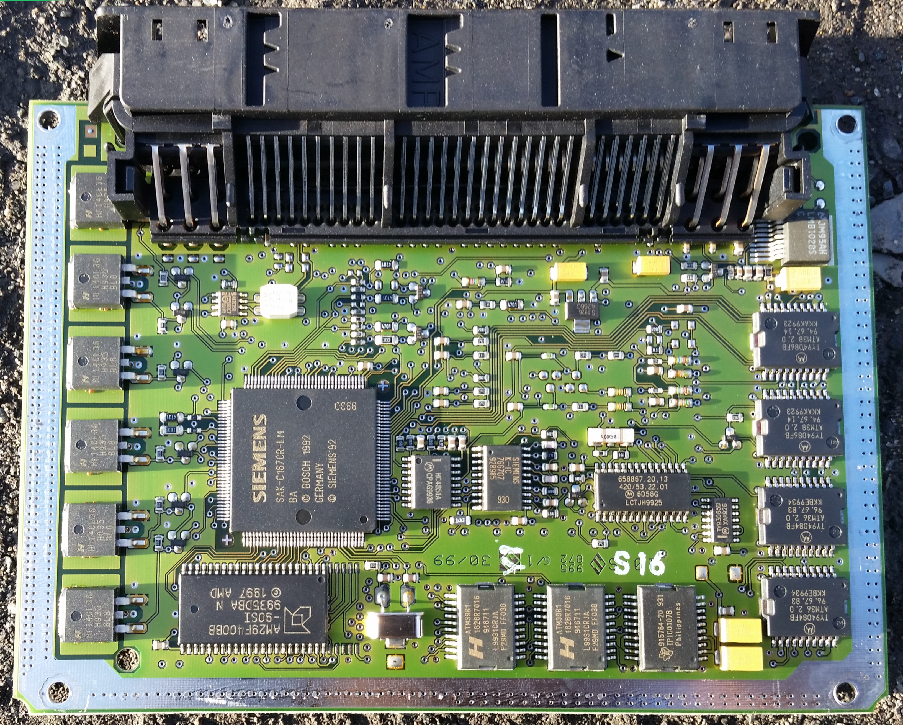

