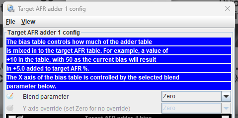

# Blending

Blending is a more powerful version of dual table. Instead of only switching between two tables, blending lets you layer one or more additional **blend tables** on top of a base table and mix them in gradually, controlled by any parameter you choose.

{: style="width: 479px; height: 239px;" }

## How blending works

Several of rusEFI's main tuning tables support blends. Each blend has three parts:

- **A blend table** — the additional correction table to mix into the base table.
- **A blend input** — the channel that drives the blend, such as a sensor value, a switch, gear, or coolant temperature.
- **A blend amount** — a curve that sets how strongly the blend table is applied (from 0% up to 100%) as the blend input changes.

At each moment rusEFI reads the blend input, looks up the blend amount for that value, and mixes that fraction of the blend table into the base table. Because the blend amount is a curve rather than an on/off switch, transitions are smooth, and because the blend input can be almost any channel, you are not limited to a single fixed condition.

## What you can use it for

- Corrections that depend on a sensor or condition — for example fuel or timing changes with [Flex Fuel](Flex-Fuel) ethanol content, or with coolant/intake temperature.
- Per-gear or switchable adjustments (for example a milder "valet" or wet-weather map).
- Any correction that used to need the older dual-table switch, but with more flexibility.

Blends are configured in TunerStudio. Set them up conservatively and confirm the result on a live [log](Logging-Guide).

## Related pages

- [Fuel Overview](Fuel-Overview) — how rusEFI calculates fuel.
- [Flex Fuel](Flex-Fuel) — a common use of blending.
