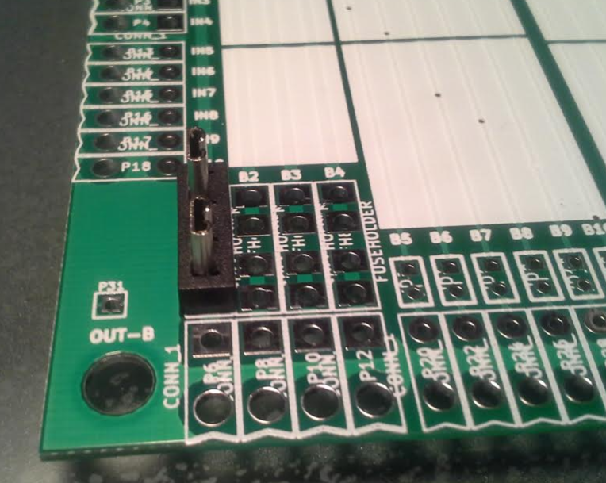

# Summary

This page is a general guide and general outline of how to use the breakout module. The breakout module allows you to replace an engine control unit wire by wire using fuses as jumpers.

## Move a engine control to rusEFI

Uses breakout module noted [here](http://rusefi.com/forum/viewtopic.php?f=4&t=454) This is an example of how you might move the wires, it may not work for you exactly this way, but this at least lays out the general process. For example, some setups connect all fuel channels to one ECU fuel channel. So you might need to do thing differently when trying to move one fuel channel as noted below. Items like that can vary.

### Capture RPM signal

* Cut OEM harness for the crank angle wire(s), put the leads to the breakout module, use the fuse to simple pass the signal through the breakout module, and verify that the OEM engine is operational.
* Connect rusEFI cam and/or crank to breakout module.
* Install 2nd fuse to connect both OEM control unit and rusEFI. Take note that VR signals may be loaded and may be problematic at low RPM with this approach. Or it may simply work. Give it a try and see what happens. If it doesn't start with both connected, try starting the engine with rusEFI jumper removed, then after started install rusEFI jumper.
* Capture crank signals via [dev console](Console.md).
* Either configure rusEFI to use the proper crank decoder, or get a decoder developed from the dev console logs, then configure rusEFI to use the proper decoder.
* See reliable RPM values displayed on the gauge, and noise free crank signals.

### Capture MAP or MAF signal

* Cut OEM harness for the MAP or MAF wire(s), or install a MAP sensor, then put the leads to the breakout module, use the fuse to simple pass the signal through the breakout module, and verify that the OEM engine is operational.
* Connect rusEFI analog signal to breakout module.
* Install 2nd fuse to connect both OEM control unit and rusEFI. Take note that the signal may be loaded and may be problematic with this approach. Or it may simply work. Give it a try and see what happens.
* Capture MAF or MAP signals via dev console.
* See reliable MAF or MAP values displayed on the gauge, and noise free signals.

### Move one fuel channel

* Cut OEM harness for one fuel channel and connect it to the breakout module. With OEM connections, verify the breakout module operates as expected on the OEM setup.
* Connect rusEFI fuel channel to breakout module.
* Remove fuse for OEM fuel channel and put it on rusEFI fuel channel. This can be done with running engine, but keep in mind no fuel means no power on that cyl, it will run a bit rough.
* Connect via TunerStudio, and tune your fuel channel until the engine runs smoothly. (You may be able to connect the rusEFI analog signals to the fuel channels and measure that you are generating the same fuel pulse.)
* Continue until you have fuel control for one channel that matches perfectly for the entire RPM, loads, ect.

### Move one ignition channel

* Cut OEM harness for one ignition channel and connect it to the breakout module. With OEM connections, verify the breakout module operates as expected on the OEM setup. Beware, ignition signals on the primary side of the coil can get in excess of 500V, you need to capture signal level signals, not the primary side of the coil. The coil primary will destroy the discovery. The discovery board needs an igniter to drive the primary side of the coil.
* Connect rusEFI ignition channel to breakout module.
* Remove fuse for OEM fuel channel and put it on rusEFI fuel channel. This should be done when the engine is off. Moving this wire when operational will likely damage the ignition system.  
* Connect via TunerStudio, and tune your ignition channel until the engine runs smoothly. (You may be able to connect the rusEFI analog signals to the  channels and measure that you are generating the same fuel pulse.)
* Continue until you have fuel control for one channel that matches perfectly for the entire RPM, loads, ect.

### Move all fuel and ignition

* Cut and move fuel channels one at a time moving them to rusEFI via break out module.
* Cut and move ignition channels one at at time moving them to rusEFI via breakout module.
* Remove MAP and crank signals from OEM controller.

### Have a rusEFI party

* Party time as you now have rusEFI, save this OEM tune and feel free to share the tune for other developers and other project to reference.
