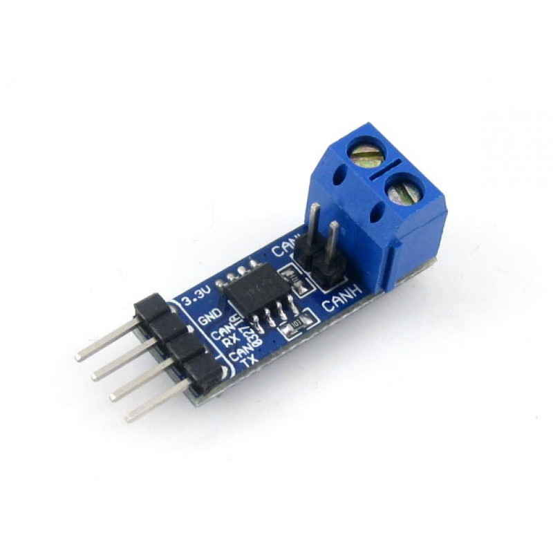

## HOWTO use custom build of rusEFI for CAN bus sniffing

In this HOWTO I will explain how to see raw CAN message flow with less than $30 in hardware & some free software.

## Step 1: shopping cart

1. Get an [STM32F4DISCOVERY](http://www.st.com/web/catalog/tools/FM116/SC959/SS1532/PF252419) micro-controller board - there are 'Order Now' buttons at the bottom of the official page.

2. Get an [SN65HVD230 CAN Board](http://www.wvshare.com/product/SN65HVD230-CAN-Board.htm)

3. Get a "OBD2 16-Pin Male to Female Diagnostic Extension Cable" on eBay

4. Get a microUSB cable (one which comes with any Android phone)

## Step 2: putting hardware together

Cut the OBD extension cord into two pieces, we would need the part with the male connector. Find the wires for pins #6 and #14

Run some wires from these pins to CANH (high) and CANL (low) screw terminals of the can module.

Here is how the end result should look like:

Ignore the white wire - we do not need it.

Run female-female jumper wires to connect TX on the CAN module with pin PB6 on the discovery board. RX on the module to pin PB12. GND to GND. +3v to +3v.

Hardware is ready!

## Step 3: software

1. Download and install [STSW-LINK004 STM32 ST-LINK utility](http://www.st.com/web/en/catalog/tools/PF258168)

2. Firmware: download and unzip [rusefi_can_sniffer.zip](http://rusefi.com/images/forum_posts/CAN/rusefi_can_sniffer.zip)

2. Uploading the firmware: Connect stm32f4discovery to your laptop using a mini-USB cable (one should come with the board), install driver, start St-Link Utility.

click 'Target'>'Program...'

Point the utility to the rusefi_can_sniffer.hex file and hit 'Start'

Close ST Link Utility.

3. Now it's time to connect the micro USB cable. Keep miniUSB cable connected - you should have two USB cables connected. When you do this for the first time your Windows would prompt for drivers, you should download & install [virtual COM driver](http://www.st.com/web/en/catalog/tools/PF257938)

Once the driver is installed, you can verify serial connectivity by opening your Device Manager - we are expecting to see a Virtual COM Port.

Remember the number of the COM port.

4. Download and launch [Putty](http://www.chiark.greenend.org.uk/~sgtatham/putty/download.html) telnet application.

Now connect the obd connector to your vehicle and you should see the CAN messages flowing in putty.

