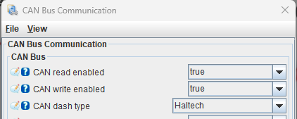
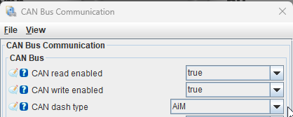

# CAN Bus

CAN is the wiring most rusEFI features use to talk to anything that is not the engine itself — dashboards, wideband controllers, transmission controllers, and in several cases the tuning laptop. It is two wires, and once it is run, several features share it because they use different message IDs.

## What CAN is used for

| I want to | Page |
|---|---|
| Show engine data on a dash or gauge cluster | [CAN Broadcast for Dashboards and Gauges](CAN-Broadcast-for-Dashboards) |
| Connect TunerStudio over CAN instead of USB | [TunerStudio over CAN](TS-over-CAN) |
| Tune or log wirelessly | [CANbus to WiFi adapter](can2wifi) |
| Read a wideband oxygen sensor | [rusEFI Wideband Controller](rusEFI-Wideband-Controller) |
| Run a factory automatic transmission | [Transmission Control](Transmission-Control) |
| Drive GDI injectors through an external module | [GDI status](GDI-status) |
| Change calibrations over CAN | [Calibration via CAN](rusEFI-calibration-via-CAN) |
| Flash firmware over CAN | [Firmware Update via CAN](Firmware-update-via-CAN) |

Wiring, termination and bus speed are covered on [CAN Broadcast for Dashboards and Gauges](CAN-Broadcast-for-Dashboards) — a CAN bus needs a 120 ohm terminator at each end, and both ends must agree on speed. For everything else on the communications side, see the [communications index](Pages-Communications).

## Overview of CAN usage and IDs used by rusEFI

Note: We support OBD2 pretty much exclusively for gauges/dashes/apps/etc, not real diagnosis!

* rusEFI WBO two-way communication [0xEF50000](https://github.com/mck1117/wideband/blob/master/for_rusefi/wideband_can.h) 0x190
* rusEFI WBO bootloader
* rusEFI gauge broadcast 0x200 default base see [DBC](https://github.com/rusefi/rusefi/blob/master/firmware/controllers/can/rusEFI_CAN_verbose.dbc)
* rusEFI vehicle-specific communication
* rusEFI ECU bootloader OpenBLT TX 667h, RX 7E1h
* rusEFI CAN GPIO
* rusEFI [TS over CAN](TS-over-CAN) 0x100 0x102
* rusEFI GDI comms [0xBB20 0xBB30](https://github.com/rusefi/libfirmware/blob/master/can/can_common.h)
* rusEFI bench-test protocol 0x770000 base address

[Calibration via CAN](rusEFI-calibration-via-CAN)

[Firmware Update via CAN](Firmware-update-via-CAN)

## Identify rusEFI over UDS

Firmware built with `EFI_UDS=TRUE` responds to a read-only identity query on
standard CAN IDs 0x7E0 (request) and 0x7E8 (response), at the configured CAN
speed. This option defaults to disabled and is enabled for the M74.9 board.
The request uses UDS ReadDataByIdentifier (0x22), with private DID 0xF1A4:

| Frame | Eight data bytes (hex) |
|---|---|
| Request, 0x7E0 | `03 22 F1 A4 00 00 00 00` |
| Response, 0x7E8 | `07 62 F1 A4 72 45 46 49` |

The four identity bytes are ASCII `rEFI`. Both frames fit a single ISO-TP
frame. No session change, authentication, reset, or power cycle is required.
The response identifies firmware only; it does not promise a particular
bootloader, programming method, or application readiness. Silence does not
rule out older rusEFI firmware, and passive CAN traffic is not a reliable
identity check. Other UDS services and DIDs remain board-specific.

## Third-party Dashboards

See [CAN Broadcast for Dashboards and Gauges](CAN-Broadcast-for-Dashboards) for how to stream engine data to a dashboard or gauge over CAN (rusEFI verbose broadcast + DBC, dashboard presets, OBD2, and phone/tablet dashes over Bluetooth).

## OpenBLT

USB

``BootCommander.exe -s=xcp -t=xcp_rs232 -d=COM15 -b=19200 rusefi_update.srec``

PCAN

``BootCommander.exe -t=xcp_can -d=peak_pcanusb -c=0 -b=500000 -tid=1667h -rid=17E1h rusefi_update.srec``

## Hardware options

[rusEFI CANbus to WiFi adapter](can2wifi) - a first-party wireless bridge for tuning and logging over Wi-Fi (translates TunerStudio TCP to IsoTP over CAN).

[PCAN-USB](https://www.peak-system.com/PCAN-USB.199.0.html?&L=1) with some cable [PCAN-Cable OBD-2](https://www.peak-system.com/PCAN-Cable-OBD-2.273.0.html?&L=1) or [PCAN-Cable 3](https://www.peak-system.com/PCAN-Cable-3.290.0.html?&L=1)

[fake looking like Vasya](https://rusefi.com/forum/viewtopic.php?f=13&t=2243)

[custom China](https://rusefi.com/forum/viewtopic.php?f=13&t=2209)

[Korlan instructions](https://rusefi.com/forum/viewtopic.php?p=43654#p43654)

FW images & legacy PCAN driver see <https://github.com/rusefi/rusefi_external_utils/tree/master/CAN>

## ELI5 CAN sniffer

Actually not just sniffer (receive) but plain bi-directional CANbus device 

Problem: there is no perfect USB dongle

* SLCAN is text protocol, meaning it has limited maximum throughput (CANable line of devices)
* GS_USB is binary protocol without that performance latency, but Windows drivers are a mess, right? (think candleLight)
* say PCAN has nice Windows DLL but legit devices start at around $200
* well, technically J2534 has plain CANbus - but I am still very confused about 64 bit Windows J2534 DLLs

## Built-in SLCAN sniffer: bus identity

On boards with the second USB serial port, the **CAN Bus sniffer** settings
include **Include CAN bus in trace**. It is checked for new/default tunes;
existing tunes keep their legacy setting. Reconnect the sniffer after changing
it because the trace format is fixed for each open connection.

When checked, the sniffer uses the
[Elmue CANable channel prefixes](https://netcult.ch/elmue/CANable%20Firmware%20Update/):

| Bus | Example: ID 0x123, data AA BB |
| --- | --- |
| CAN1 | `t1232AABB` |
| CAN2 | `&t1232AABB` |
| CAN3 | `$t1232AABB` |

Each line ends with a carriage return. The prefixes also apply to extended-ID
and RTR frames and the ECU's transmitted frames.

**Uncheck this option for standard SLCAN clients such as SavvyCAN and slcand**,
which do not understand these prefixes. With it unchecked, frames from the
enabled buses are merged without bus identity.

The updated rusEFI console displays CAN1/CAN2/CAN3 and exports them as
`can0`/`can1`/`can2` in candump files. Legacy traffic is labeled `Bus unknown`
and exported as `canUnknown`. CAN MCP packets expose the zero-based bus as
`busIndex`, or `null` when unknown. Our clients use the read-only `I` query
(`I0` legacy, `I1` channel prefixes) before opening the sniffer.

This option affects trace output only. PC transmit commands still use the
configured **Sniffer Tx CAN bus**.
