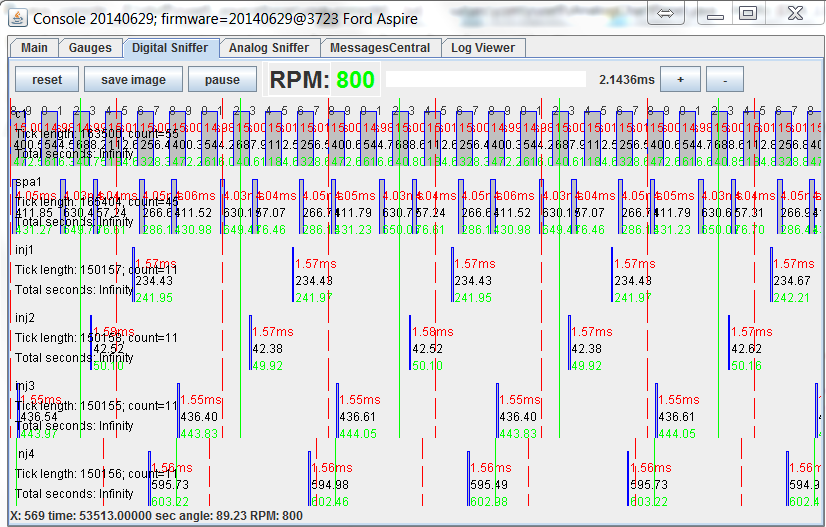

# rusEFI Dev Console - Overview

rusEFI Dev Console is a handy development and debugging tool. The dev console is written in java and it talks to the ECU firmware. The console allows firmware monitoring and configuration. Here are some pictures of what it looks like when it operating correctly.

To get the console working follow the below procedure, which assumes you have loaded the rusEFI firmware.

* Either power externally, or connect the "programming" USB cable as shown below. This will provide power to the Discovery board.
* Connect the micro USB cable, see "console" cable shown below. When you do this for the first time, on a Windows PC, you will be prompted for drivers. You should download & install the drivers from [ST website](http://www.st.com/web/en/catalog/tools/PF257938). #: 
* When the driver is installed & the board is connected via the micro USB cable, you can verify serial connectivity by
  * '''Windows''' - opening your Device Manager - we are expecting to see a Virtual COM Port
    
  * '''Linux'''
    * ''Ubuntu (11.10)'' - plug in the "console" USB cable, then check the message log with this command.

      ```shell
      $ dmesg
      ...
      [10572.620088] usb 5-1: new full speed USB device number 5 using uhci_hcd
      [10572.797239] cdc_acm 5-1:1.0: This device cannot do calls on its own. It is not a modem.
      [10572.797285] cdc_acm 5-1:1.0: ttyACM0: USB ACM device
      ```

    * In this case, the newly plugged in USB is register to ttyACM0, which you can find on /dev/ttyACM0
* If you don't already have the Dev Console, get it [http://rusefi.com/build_server/rusefi_bundle.zip](http://rusefi.com/build_server/rusefi_bundle.zip) (part of the same bundle)
* Note: rusEFI Dev Console requires java 1.8 or later!
* When you launch the Dev Console, it will ask you to select which serial address it should use. However you can specify that when you launch it by specifying a command line parameter as noted below.
  * Windows
    `java -jar rusefi_console.jar COM15`
  * Linux (ubuntu 11.10)
    `java -jar rusefi_console.jar /dev/ttyACM0`
* You got it to open, great! Now install gray jumper wire as noted above between pins PD1 and PC6.
* Select "digital sniffer" in the dev console and you should see the simulated signal.
* Install the blue jumper wire as noted between pins PD2 and PA5.

* You should see the crank signals as noted in the "sniffer" tab.


Update: there is also a lazier way to self-stimulate now, you would not need the jumper wires. That's the "enable self_stimulation" command you invoke via the dev console. The downside? Do not forget to undo it at some point with "disable self_stimulation"

At this point, the Dev Console should be up and running. Play around with it and see what you can learn. Also note, it as some functionality as noted below.

* If used together with the build-in position sensor emulator, the console allows some level of testing on the bench, without a real engine or any additional hardware. The most useful feature is the plain signal sniffer - both real inputs and generated signals can go into it and this is actually quite handy. Another useful feature is the text log.
* You can use the console to invoke rusEFI commands and control the internal flow using the 'Messages Central' tab


## Gauges


## Digital Chart



Green line is a border of engine cycle. Please note that the angle within current engine cycle is displayed in the bottom left corner - the angle is from 0 to 720 in case of a four stroke engine.

Red line is just absolute time scale. One line per second? Per 100ms? Something like that. TODO.

## Log Viewer
