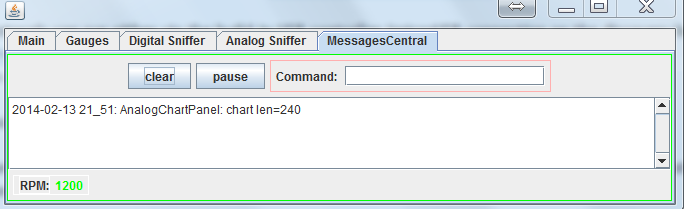
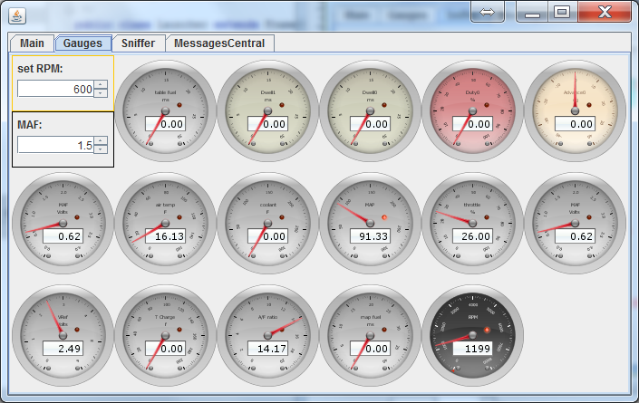
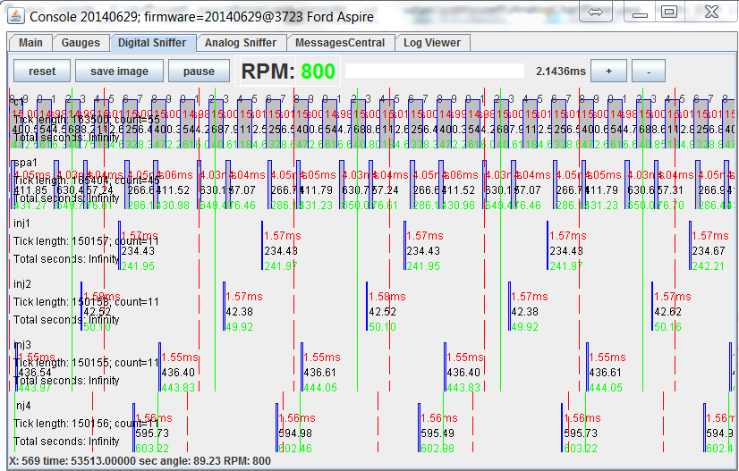

# rusEFI Console - Overview

rusEFI updater, previously known as rusEFI Console is a PC application to update rusEFI firmware and calibrations.

* If you don't already have the Dev Console, get it [🆕rusEFI_Universal_Updater🆕](https://rusefi.com/installer/rusEFI_Universal_Updater.exe)

At this point, the Console should be up and running. Play around with it and see what you can learn. Also note that it has some functionality as listed below.

* If used together with the built-in position sensor emulator, the console allows some level of testing on the bench, without a real engine or any additional hardware. The most useful feature is the plain signal sniffer - both real inputs and generated signals can go into it and this is actually quite handy. Another useful feature is the text log.
* You can use the console to invoke rusEFI commands and control the internal flow using the 'Messages Central' tab

## Gauges

## Configuration errors

When the Config Error indicator is active, the console retrieves the ECU's explanation and displays it in an overlay on any tab. Click Close to dismiss the overlay and correct the tune. Closing it does not clear the ECU error. The same message stays dismissed until the error clears and returns or the ECU reconnects; a different error message is displayed again.

## Digital Chart

The green line is the border of an engine cycle. Please note that the angle within the current engine cycle is displayed in the bottom left corner - the angle is from 0 to 720 in case of a four stroke engine.

The red line is the absolute time scale - one line every 20 ms.
