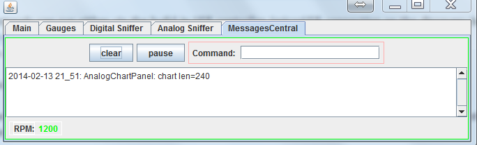
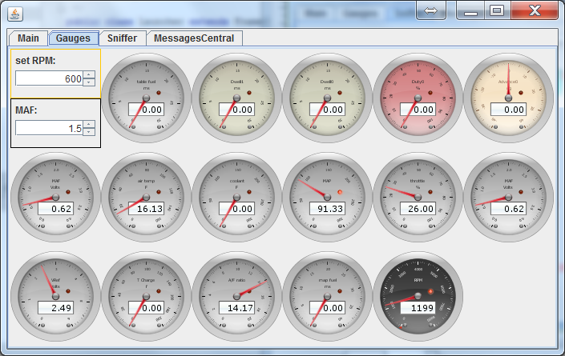
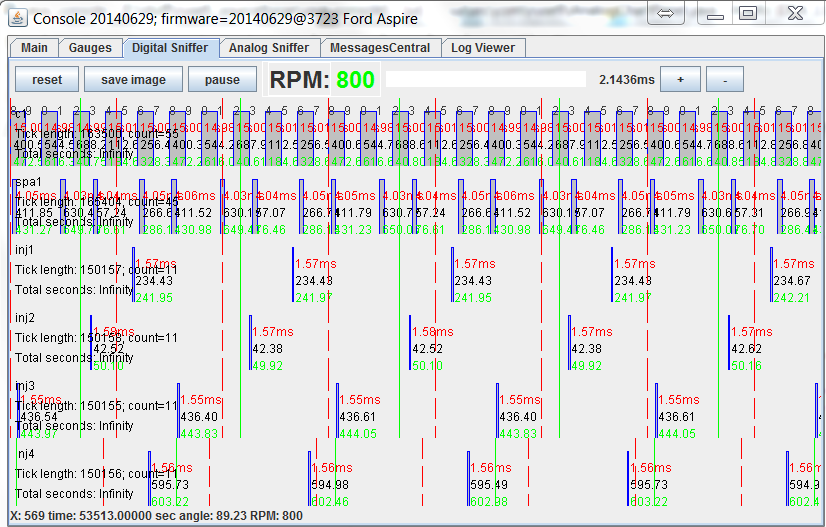

# rusEFI Console - Overview

rusEFI updater, previously known as rusEFI Console is a PC application to update rusEFI firmware and calibrations.

* If you don't already have the Dev Console, get it [🆕rusEFI_Universal_Updater🆕](https://rusefi.com/installer/rusEFI_Universal_Updater.exe)

At this point, the Console should be up and running. Play around with it and see what you can learn. Also note that it has some functionality as listed below.

* If used together with the built-in position sensor emulator, the console allows some level of testing on the bench, without a real engine or any additional hardware. The most useful feature is the plain signal sniffer - both real inputs and generated signals can go into it and this is actually quite handy. Another useful feature is the text log.
* You can use the console to invoke rusEFI commands and control the internal flow using the 'Messages Central' tab


## Keyboard shortcuts

Choose **Shortcuts** in the main menu bar (or press **F1**) to open the keyboard reference. The window is non-modal: leave it open while using the Console. Its text scrolls vertically and covers table selection/editing, commands, Lua editing, charts, menus, and logging. Click back in the Console before using its shortcuts. Press **Esc** in the reference window to close it.

Hover over buttons and command fields for shortcut hints. Some menus and buttons also show underlined shortcut letters when you press **Alt**, depending on the operating system. Shortcuts are currently fixed rather than configurable.

In tuning tables, use the arrow keys to move between cells and **Shift+arrows**
to extend the selection. **Enter** or **F2** starts editing the active value cell;
**Enter** accepts the value and **Esc** cancels. **Tab** and **Shift+Tab** accept
an edit and move to the next or previous value cell, wrapping between rows and
skipping the axis column. Invalid numbers remain in the editor until corrected
or cancelled. The active value cell's X and Y scale labels have a subtle
background highlight. Axis labels and read-only comparison tables cannot be edited.

With a value cell selected, the **mouse wheel over the grid** moves the active
cell up or down in the same column and keeps it visible. Movement stops at the
first and last rows. Wheel navigation is ignored while editing a cell.

## Gauges

Use **Grid Size** to choose the number of rows and columns. Right-click a gauge
to change its selection or switch to live graphs.

**Save Layout...** saves the visible grid to a `.gauges` file, including gauge
selections, graph mode, refresh periods, and scale settings. **Load Layout...**
replaces the current grid with a saved layout. The loaded layout is also kept
in Console preferences for the next session. Gauge names refer to definitions
in the connected ECU's firmware INI, so use a layout with compatible firmware.
Detached gauge windows are managed separately and are not included in the file.



## Configuration errors

When the Config Error indicator is active, the console retrieves the ECU's explanation and displays it in an overlay on any tab. Click Close to dismiss the overlay and correct the tune. Closing it does not clear the ECU error. The same message stays dismissed until the error clears and returns or the ECU reconnects; a different error message is displayed again.

## Digital Chart



The green line is the border of an engine cycle. Please note that the angle within the current engine cycle is displayed in the bottom left corner - the angle is from 0 to 720 in case of a four stroke engine.

The red line is the absolute time scale - one line every 20 ms.

## Binary logging

Use **Binary Logging > Start** to choose a `.mlg` data log and **Stop** to finish recording. **Ctrl+S** in the main Console window toggles these actions: it opens the file chooser when idle, stops recording when active, or cancels a pending tune capture. Starting requires an ECU connection. Ctrl+S controls logging; use **File > Save Tune** to save a tune.

The **Save tune** checkbox beside Start/Stop is checked by default. When checked, the console reads a fresh ECU tune before recording and saves it in the same folder as the data log, using the computer's local date: `YYYY-MM-DD.msq`. An unchanged tune reuses the existing file; changed tunes use `_1`, `_2`, and so on. Existing tune files are preserved. Uncheck **Save tune** before starting to record only the data log.

The same MSQ is also embedded inside the `.mlg` file using TunerStudio's starting-tune format, so sharing the log includes its tune. The ECU MCP tool `extract_tune_from_log` can recover it as an `.msq` without an ECU connection or INI file. It also reads tunes embedded by TunerStudio. Unchecking **Save tune** disables both the embedded tune and the separate MSQ snapshot.

Tune capture runs in the background. Stop or disconnect cancels a pending start. If the tune cannot be read or saved, the console reports the error and does not start data logging. The snapshot represents the tune at recording start; later tune edits are captured when the next recording starts.

## SLCAN Sniffer

The universal updater automatically shows the **SLCAN Sniffer** tab when the connected
ECU's firmware INI advertises CAN sniffer support. Open the tab to scan for the second
USB serial port and view CAN traffic. The tab updates when you disconnect or change boards.
Boards need firmware and a matching INI with CAN sniffer support enabled.

### MCP capture through the built-in sniffer

The CAN MCP server can capture the same traffic through the secondary USB serial port:

```sh
java -jar java_console/mcp_can/build/libs/mcp_can-all.jar --backend slcan --port /dev/ttyACM1
```

Use a port such as `COM5` on Windows. Omit `--port` to discover the first SLCAN port;
use an explicit port when multiple ECUs are attached. Close the SLCAN tab before letting
MCP open that port. The normal ECU console connection uses the other serial interface.

Build with `./gradlew :mcp_can:fatJar` from the rusEFI repository root. The existing
`connect`, `read_packets`, `wait_for_packet`, and `status` tools work with SLCAN.
PCAN remains the default backend when `--backend slcan` is omitted.

Configure bus selection and bitrate in the ECU tune. Enable `canSnifferN_read` to capture
