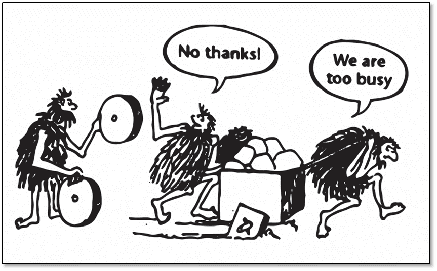

# Contributors: Please Work Smart

In our reality we have to really work smart, not work hard.

Any repetitive user support request must be addressed strategically.

* Is it a usability issue which has to be documented?

* Is it something to document on wiki the once instead of explaining more than once?

