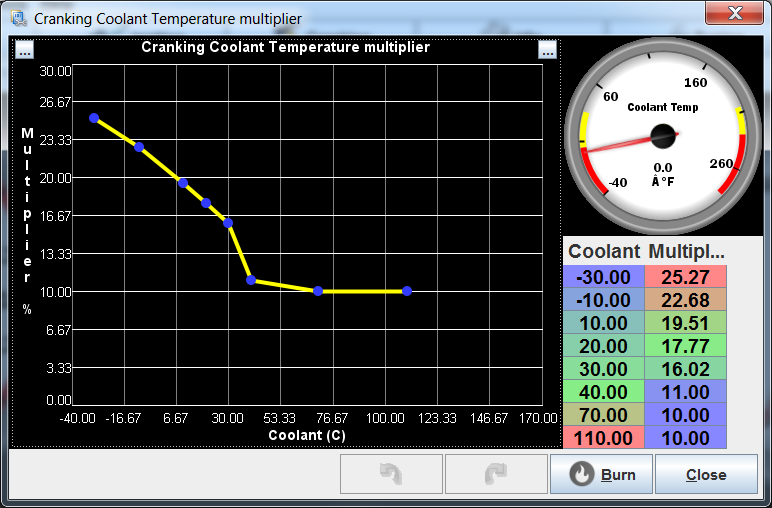

# Cranking

In order to get an engine running, it first needs to be rotated at sufficient speed to achieve good compression of the air/fuel mixture. Cranking the engine simply means turning the engine's crankshaft.

<i>Side note</i>: <u>Starter Motor</u>

<table markdown="1"><tr markdown="1"><td markdown="1">

</td><td markdown="1">Unless you have a small engine with a pull start, a kick start, or an old car with a crank in front, you most likely have an electric starter.  

You can control the starter using several rusEFI firmware features:  

- Start-Stop Button Control  
- Starter Disable Relay Control

</td></tr></table>

Cranking mode is defined as any RPM value below the 'Cranking RPM limit' setting. During cranking, special fuel and timing logic is applied.

>  *Hint: If you have a fresh new engine ready for cranking, and you want to prepare the configuration for the first start, please first see: [How to Start an Engine](HOWTO-Start-An-Engine).*

## Cranking Settings

In TunerStudio, the Cranking Settings are accessed from the top menu:

The settings are divided into several sections:

- [General settings](#general-cranking-settings)
- [Fuel settings](#fuel-settings)
- [Ignition settings](#ignition-settings)
- [Advanced Cranking Settings](#advanced-cranking-settings)
- [Priming fuel pulse settings](#priming-fuel-pulse)
- [Post-cranking fuel enrichment settings](#after-start-enrichment)

rusEFI has a separate cranking control strategy for your first couple of engine revolutions - usually, you want more fuel, different timing and simultaneous injection to start an engine. An engine can start rich, as long as it's not too rich and you have the cranking timing angle set close enough to the optimum.

>  *Hint: Click on the screenshot below to see more info on the particular settings:*

## General Cranking Settings

### Cranking Settings: Cranking RPM Limit

*This sets the RPM limit below which the ECU will use cranking fuel and ignition logic - typically 350-450 RPM.*  

## Fuel Settings

### Cranking Settings: Injection Mode

*This is the injection strategy during engine start. See [Fuel Control Overview](Fuel-Overview) for more detail.*

*Available options are: "Simultaneous", "Sequential", "Batch", "Single Point".*

- *It is suggested to use "Simultaneous".*

### Cranking Settings: Fuel Source for Cranking

*You can try two different strategies for the fuel math on cranking.*
*Available options are "Fixed" and "Fuel Map".*

- *In "Fixed" mode, you can manually set the fixed pulse duration (in ms) in the next text field.*

- *In "Fuel Map" mode, the "Running" fuel math is used for cranking.*
    >  *Hint: Please make sure your running fuel tables are extended into the low RPM range for cranking.*

## Ignition Settings

### Cranking Settings: Timing Advance Mode

*This allows you to either set a fixed advance or to use a separate advance table for cranking conditions, which allows the cranking advance to be RPM-dependent.*

### Cranking Settings: Fixed Cranking Advance

*Ignition advance angle used during engine cranking: 5-10 degrees will work as a base setting for most engines.*

### Cranking Settings: Fixed Cranking Dwell

*The specified dwell will be used during cranking even if a separate advance table is used.*

## Advanced Cranking Settings

### Cranking Settings: Flood Clear

*When enabled, if the throttle pedal is held above 90% no fuel is injected while cranking to clear excess fuel from the cylinders.*  

### Cranking Settings: Faster Engine Spin-up

- *Smarter cranking logic. When enabled, the ignition and fuel injection will start right after the first sync point of the primary [trigger wheel](All-Supported-Triggers).*

- *Please be aware that this mode currently works only for certain trigger wheel types (e.g. 60-2, 36-1).*

### Cranking Settings: Use Advance Corrections for Cranking

*This enables the various ignition corrections during cranking (IAT, CLT, FSIO and PID idle).*

### Cranking Settings: Separate Flex-fuel cranking table

*This enables a separate fuel multiplier table for ethanol fuel. Only enabled if a flex fuel sensor is configured in "Sensors" -> "Fuel" -> "Flex".*

## Priming Fuel Pulse

### Duration at -40C degrees

*Priming pulse used for wall wetting before cranking.

*The priming pulse has a tunable curve in TunerStudio, so you can set a priming pulse fuel mass for a given coolant temperature.*

*The priming pulse makes a big difference when you have a long distance from the injector to the engine valve.*

*See also isFasterEngineSpinUpEnabled*

## After-start enrichment

*A multiplier table to enrich for some number of engine cycles after start, depending on the coolant temperature*

---

## How does it work?

During cranking, two curves control the amount of fuel injected:
"cranking coolant temperature multiplier" and "cranking duration multiplier".
  
A cold engine usually requires more cranking fuel; cranking fuel usually tapers down during cranking since more fuel is needed in the beginning and not really needed later.

If you have flooded your engine, i.e. got too much fuel on your spark plugs, "Flood Clear" is recommended - i.e. cranking with wide-open throttle without any fuel squirted into the cylinders in order to ventilate your cylinders.

As of April 2019 "base fuel pulse" is deprecated, "1" is recommended.

On a typical 4-cylinder engine with 200 cc/min injectors and sequential injection, base fuel should be about 1ms.

For 1.6 Honda cranking settings see [this image](Images/TS/TunerStudio_ignition_settings.jpg) (note that "base fuel" = 1 is recommended these days, with a corresponding change to cranking temperature multiplier)
