# What is Cranking?

In order to get an engine running, it first needs to be rotated at sufficient speed. This gets the fuel pumped up to the cylinders and ignited and enables the engine to run on its own power. Cranking the engine simply means turning the engine's crankshaft that rotates the engine to power itself.


<!-- This would be rendered as a collapsable section. from 'details' to closing 'details' -->

<details><summary><i>See also</i>: <u>Starter Motor</u></summary>

<table><tr><td>


</td><td> The electric starter motor or cranking motor is the most common type used on gasoline engines and small diesel engines. 

You can control the starter using several rusEFI firmware features:
* [Start-Stop Button Control](Start_Stop_Button)
* [Starter Disable Relay Control](Starter_Block_Relay)

</td></tr></table>

</details>

Cranking mode is defined as any RPM value below the 'cranking RPM' setting. During cranking, special fuel and timing logic is applied. 

<!-- this magic '>' make a one line quote block --> 

>  *Hint: If you have a fresh new engine ready for cranking, and you want to prepare the configuration for the first start, please first see: [First Engine Start](First-Engine-Start).*


# Cranking Settings

In TunerStudio, the Cranking Settings are accessed from the top menu:


The settings are divided into several sections:
* [General settings](#general-cranking-settings)
* [Priming fuel pulse settings](#priming-fuel-pulse)
* [Fuel settings](#fuel-settings)
* [Ignition settings](#ignition-settings)
* [IAC settings](#iac-settings)
* [Post-cranking fuel enrichment settings](#post-cranking-short-time-fuel-enrichment)

rusEFI has a separate cranking control strategy for your first couple of engine revolutions - usually, you want more fuel, different timing and simultaneous injection to start an engine. The engine would start rich, as long as it's not too rich, as long as you have a close-enough cranking timing angle. 

>  *Hint: Click on the screenshot below to see more info on the particular settings:*

<table border="0"><tr><td width="362" height="609" background="Images/cranking/settings_back.png" valign="top"> 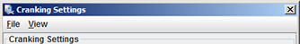
  <a href="#cranking-rpm-limit" title="Cranking RPM limit"></a>
  <a href="#enable-cylinder-cleanup" title="Enable cylinder cleanup">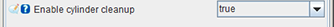</a>
  <a href="#enable-faster-engine-spin-up" title="Enable faster engine spin-up"></a>
  <a href="#duration-at--40c-degrees" title="Duration at -40C degrees">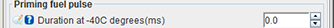</a>
  <a href="#falloff-temperature" title="Falloff temperature">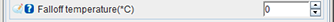</a>
  <a href="#injection-mode" title="Injectiton mode">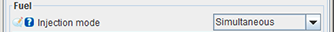</a>
  <a href="#fuel-source-for-cranking" title="Fuel Source For Cranking">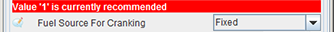</a>
  <a href="#base-fuel-pulse-width" title="Base Fuel Pulse Width"></a>
  <a href="#advance" title="Advance">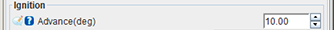</a>
  <a href="#use-separate-advance-table-for-cranking" title="Use separate Advance Table for cranking"></a>
  <a href="#use-advance-corrections-for-cranking" title="Use Advance Corrections for cranking"></a>
  <a href="#use-fixed-cranking-dwell" title="Use fixed cranking dwell">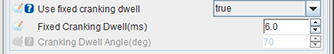</a>
  <a href="#cranking-iac-position" title="Cranking IAC position">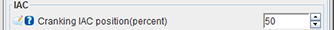</a>
  <a href="#after-cranking-iac-taper-duration" title="After cranking IAC taper duration"></a>
  <a href="#override-iac-multiplier-for-cranking" title="Override IAC multiplier for cranking"></a>
  <a href="#post-cranking-short-time-fuel-enrichment" title="Post-cranking short-time fuel enrichment">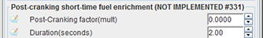</a>
  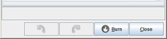
</td>
<td valign="top">

## General Cranking Settings
### Cranking RPM limit
*This sets the RPM limit below which the ECU will use cranking fuel and ignition logic, typically this is around 350-450 rpm.* <details><summary>More...</summary>
In rusEFI Console, you can use command ```set cranking_rpm X``` to change this value.</details>

### Enable cylinder cleanup
*When enabled, if the throttle pedal is held above 90% then no fuel is injected while cranking to clear excess fuel from the cylinders.*

### Enable faster engine spin-up
*Smarter cranking logic. When enabled, the ignition and fuel injection will start right after the first sync point of the primary [trigger wheel](All-Supported-Triggers).*
*Please be aware that this mode currently works only for certain trigger wheel types (e.g. 60-2, 36-1).*

</td></tr></table>


## Priming Fuel Pulse
### Duration at -40C degrees
*Prime injection pulse uses for Wall wetting before cranking. You can set-prime pulse for the cold engine (-40 celsius degree) and set the hottest temperature for use this setting.*

*We use interpolation from smaller CLT to biggest CLT, to make line function for pulse width and interpolate pulse width from bigger(we set it in settings) to zero(when CLT>= falloff temperature).*

*Prime pulse make a big weight when you have a long-distance from the injector to the engine valve.*
<details><summary>More...</summary>

See also isFasterEngineSpinUpEnabled

rusEFI Console command:
```set cranking_priming_pulse X```

</details>

### Falloff temperature

*This sets the temperature above which no priming pulse is used. The value at -40 is reduced until there is no more priming injection at this temperature.*

## Fuel Settings
### Injection mode
*This is the injection strategy during engine start. See Fuel/Injection settings for more detail.*

*Available options are: "Simultaneous", "Sequential", "Batch", "Single Point".*

* *It is suggested to use "Simultaneous".*

### Fuel Source for cranking

*You can try two different strategies for the fuel math on cranking.*
*Available options are: "Fixed" or "Fuel Map".*

* *In "Fixed" mode, you can manually set the fixed pulse duration (in ms) in the next text field.*

* *In "Fuel Map" mode, the "Running" fuel math used for cranking.*
    >  *Hint: Please make sure your running fuel tables are extended into the low RPM range for cranking.*

### Base fuel pulse width

*Base duration of the fuel injection during cranking, this is modified by the multipliers for CLT, IAT, TPS ect, to give the final cranking pulse width. Used only if "Fuel Source for cranking" option is set to "Fixed".*

<details><summary>More...</summary>

To adjust cranking fuel, use ```set cranking_fuel XXX``` command, where XXX is the number of total fuel squirt duration in milliseconds. See also [Console Commands - Fuel Control](Dev-Console-Commands#fuel-control)

</details>

## Ignition Settings
### Advance
*Ignition advance angle used during engine cranking, 5-10 degrees will work as a base setting for most engines.*

*rusEFI Console command:
```set cranking_timing_angle X```*

### Use separate Advance Table for cranking

*This activates a separate advance table for cranking conditions, which allows the cranking advance to be RPM dependant.*

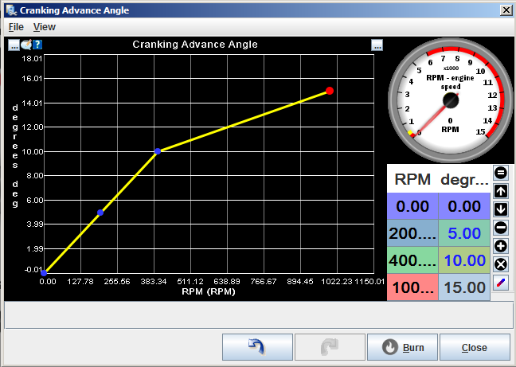

### Use Advance Corrections for cranking

*This enables the various ignition corrections during cranking (IAT, CLT, FSIO and PID idle).*

### Use fixed cranking dwell

*If set to true, will use the specified duration for cranking dwell. If set to false, will use the specified dwell angle. Unless you have a really good reason to, leave this set to true to use duration mode.*

*rusEFI Console command:
```set cranking_charge_angle X```*

## IAC Settings
### Cranking IAC position
*This is the IAC position during cranking; some engines start better if given more air during cranking to improve cylinder filling.*

### After cranking IAC taper duration
*This is the duration in cycles that the IAC will take to reach its normal idle position; it can be used to hold the idle higher for a few seconds after cranking to improve startup.*

### Override IAC multiplier for cranking
*This setting overrides the normal multiplication values that have been set for the idle air control valve during cranking. If this setting is enabled the "IAC multiplier" table in the Cranking settings tab needs to be adjusted appropriately or potentially no IAC opening will occur.*


## Post-cranking short-time fuel enrichment

>  *Warning: Currently not implemented!*

---

# How does it work?
During cranking, two curves control the amount of fuel injected:
"cranking coolant temperature multiplier" and "cranking duration multiplier".
  
A Cold engine usually requires more cranking fuel; cranking fuel usually tapers down during cranking since more fuel is needed in the beginning and not really needed later.

If you have flooded your engine, i.e. got too much fuel on your spark plugs, "Cylinder Cleanup" is recommenced - i.e. cranking with wide-open throttle without any fuel squirted into the cylinders in order to ventilate your cylinders.

As of April 2019 "base fuel pulse" is deprecated, "1" is recommended.


Typical 4 cylinder engine with 200 cc/min injectors, sequential injection, base fuel = 1ms.


For 1.6 Honda cranking settings see [this image](https://rusefi.com/forum/download/file.php?id=4536) (note that "base fuel" = 1 is recommended these days, with a corresponding change to cranking temperature multiplier) 
