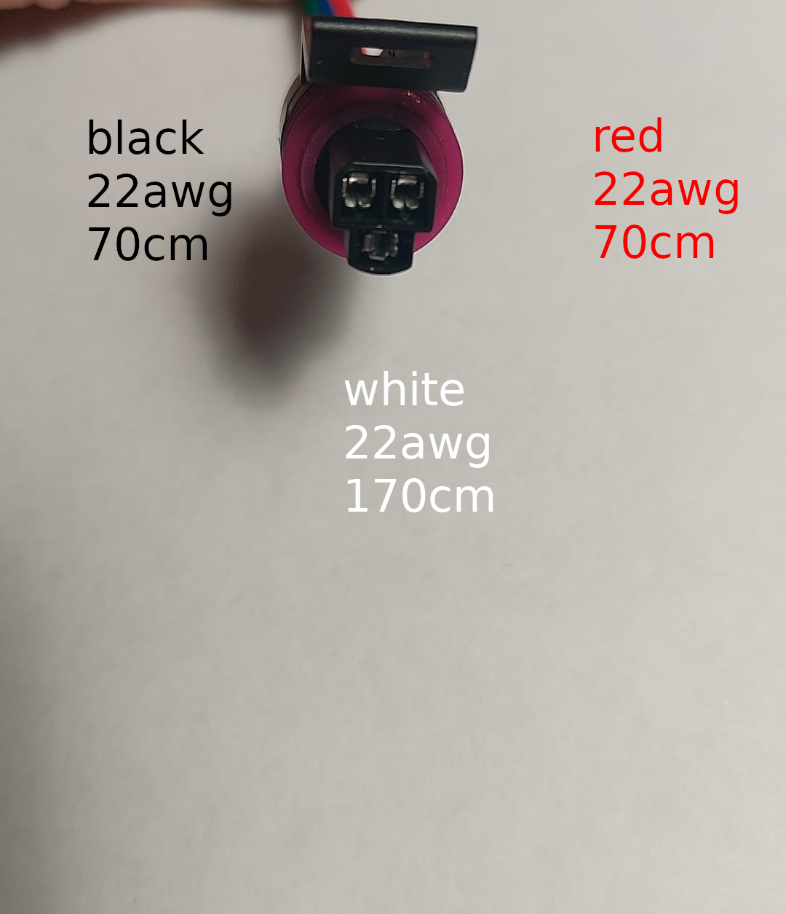
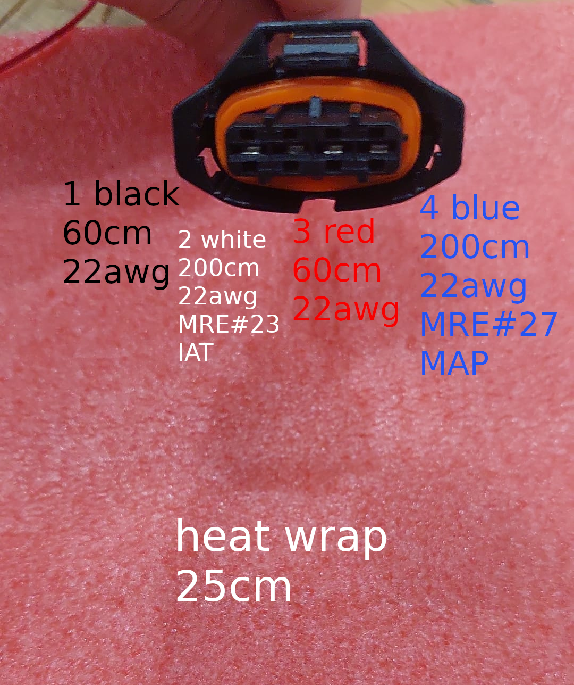
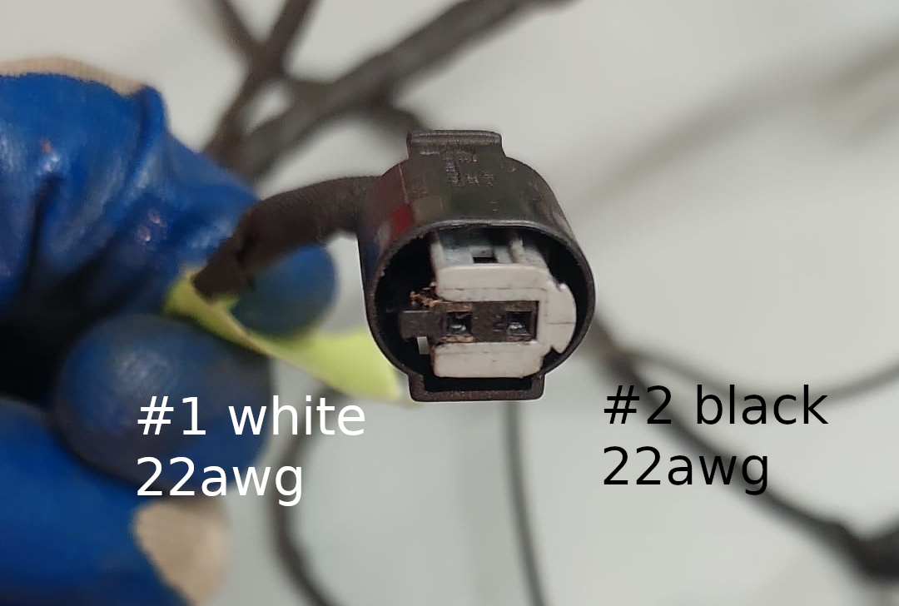
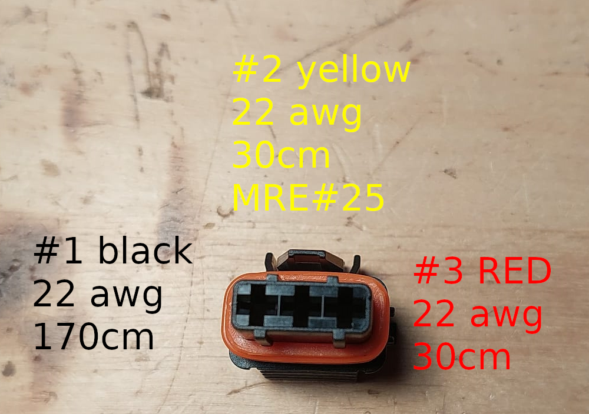
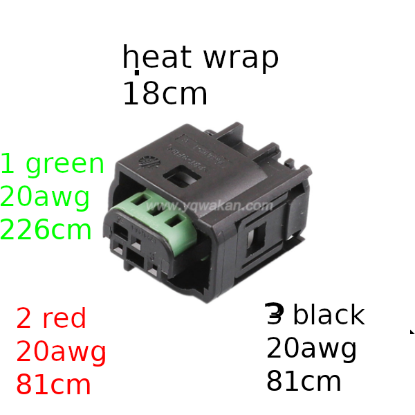
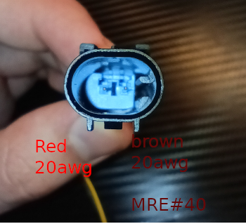
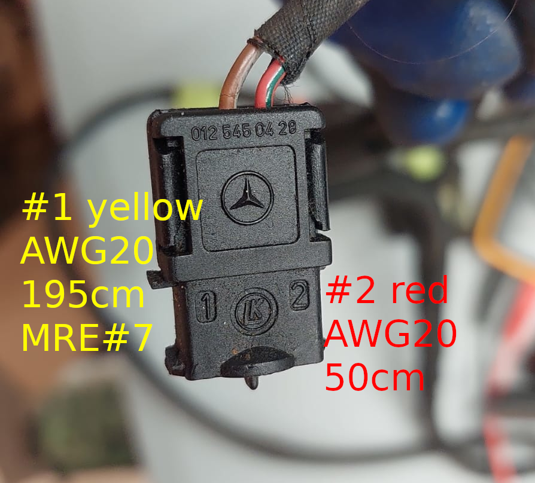

# Notes on fully custom M111 Engine Harness

M111 engines

* Converted to VAG coil-on-plug (red or black your choice)
* Converted to Honda pedal cable position sensor (more reliable choice)
* Added 3 pin fuel pressure sensor
* Added wastegate solenoid plug
* Uses 99+ crank position sensor plug

See also [HOWTO-M111-on-microRusEFI](HOWTO-M111-on-microRusEFI)

## Sensors subassembly

## Actuators subassembly

TODO supercharger clutch

