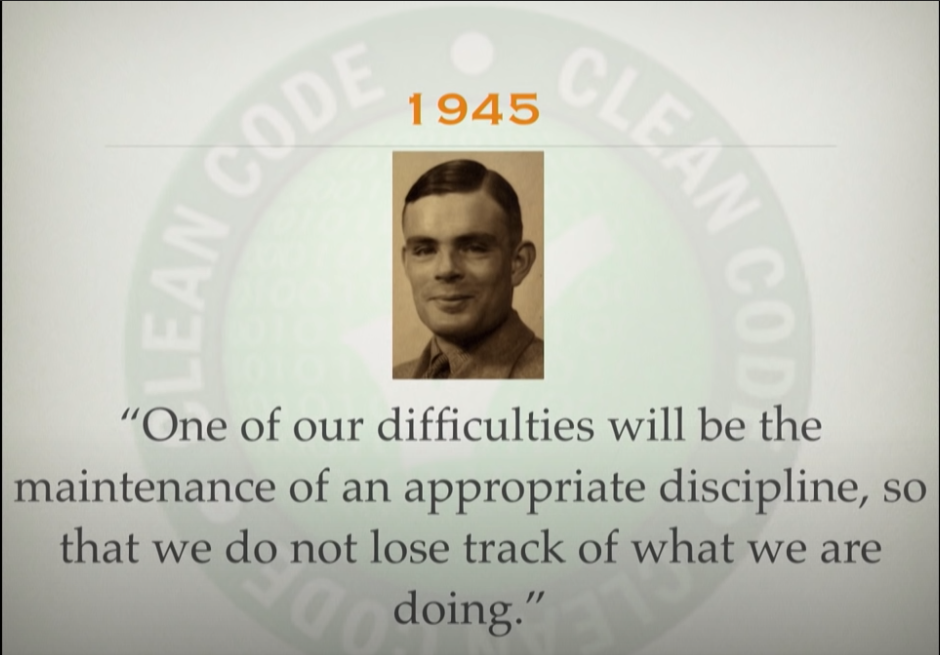

# D is for... **DISTRACTION**

One of the major things rusEFI struggles with is the developers and contributors getting sidetracked by interesting shiny things. 
When this happens we can loose a Dev for several days while he plays with a quantum capacitor or tries to implement crypto mining on the spare CPU cycles. 

While in essence this is not a bad thing, it does mean that progress slows right down. With enough distraction then progress grinds to a halt. 

It is due to these distractions (and the fact that some times out Devs also have lives!) that rusEFI has a lot of features that are partially implemented and require further work to finish them off. 

What this means is we politely request that people try not to ask easily answered questions to the Devs and keep feature requests to a minimum for now. 

There are details of our plans for fuel strategy improvements [at this link](Roadmap-Fuel) as well as a comprehensive list of existing features and ones that are in development [here](Dev-Status.md)
If your idea does not already appear there then consider making a Github ticket but please have a think if that feature would really add to rusEFI and if it needs to be done ASAP. If not then please tag the ticket as a future feature and low priority. 

Most simple questions can be answered by [searching the wiki](HOWTO-Search-on-rusEFI-wiki) or by [searching the forum](https://rusefi.com/forum/search.php)

  