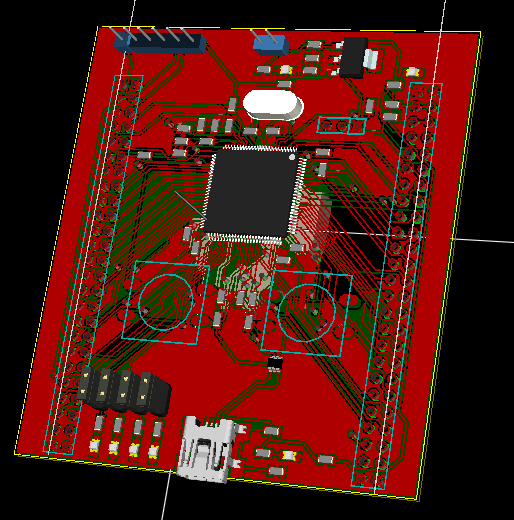
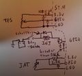
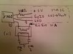

# Dev Hardware Guidelines

    **This is a **DEVELOPERS** manual. For the user manual please see [Hardware](Hardware)**

## Summary

This page is a general guide for hardware items and
suggestions on how to design and work with things like a PCB layout.  

---

## Basic principles

We are developing hardware using [KiCad EDA Suite](http://www.kicad-pcb.org/)
Our file repository for hardware is [here](https://github.com/rusefi/rusefi/tree/master/hardware)
For now we are developing hardware as individual functional modules. While all individual modules are in-depended from each over, the use the share the same component library which is located at [https://github.com/rusefi/kicad-libraries](https://github.com/rusefi/kicad-libraries)

## Collaboration process

Since patch files do not work well for hardware projects, our collaboration process is pulling whole folders from the SVN where board author would develop them into the central SVN which is the unified repository. That's a poor man workaround over the lack of free SVN hosting with directory user permissions.

## Naming convention

Name capacitors with uF and pF only. So 100nF is a no go while 0.1uF is good.
This works better with filter/sort operations in spread sheets.
Also start the name with 0.1 instead of .1.

Resistors should be listed like this 100R or 2k2

## General suggested environment

- Allow an ambient temperature from -40C to +85C (-40F to 185F) AEC Q100 Grade 3  
- Voltage regulators that are compatible with ISO 7637-2 and ISO16750-2 (100V repetitive pulses via 50ohm impedance, 18 V for 60 min, 24V for 60s to all relevant inputs, withstand a reversed voltage for 60s, 500V rms (50 Hz to 60 Hz) for 60s, ect).  
- Voltage regulators that follow Maxim's suggestions here (cold cranking down to 4V for up to 40mS)  
- Reverse polarity protection as noted in this video (P-MOSFET style)  
- Humidity allowed up to 100% (water resistant enclosure, perhaps fully potted)  
- Sensor inputs are capable of human body model ESD (100 pF 1.5 k ohm 500V to 1kV class 1B or better)  
- All sensor inputs can survive a sustained short to 12V or GND. (fused as required)  
- All sensor inputs should float either full scale or min scale when a wire is not connected. The normal operation of the sensor should not hit the full scale or min scale. This allows for full or min scale to be an error indicator.  
- All sensor GND references fuse protected by such a dead short to 12V can be repaired, without replacing the entire PCB.  
- Should be able to maintain crank angle accuracy of .2 degrees up to at least 6kRPM. When above .2 degree tolerance, it should be noted somewhere so that tuning people know when there might be a tolerance issue.  
- Native ignition drivers should be min 400V, 20A, and 300mJ SCIS energy. Higher rating for any of these parameters is better.  
- When high side drive is provided with the ability to provide more than 20mA, current sensing and limiting should be implemented to prevent the possibility of electrical fire. See VND5E025AK for an example of a chip that has this feature.  
- Take AEC Q100 into consideration. See freely published documents found [here](http://www.aecouncil.com/AECDocuments.html)

---

## Connectors

- Connectors should be keyed such that it is difficult to accidentally swap connectors  
- Connectors should be able to carry the max possible load with one pin, ensuring no doubling up pins to get increased current ratings. It is OK to double up pins to decrease connector resistance for a lower voltage drop.  
- Connectors should survive the currents passed when inputs are shorted to GND or 12V as noted above in the suggested environment.  
- GND(s) should be properly sized such that 99% duty on the fuel injectors will not raise the GND voltage and prevent the MOSFET's from operating correctly.  
- Suggested to use twisted pair PVC wire as a minimum for signal wires; silicon jackets are more costly, but also much better.  
- Suggested to use the "Tin Commandments" found here  

---

## PCB design rules

- See [PCB Design Rules](PCB-Design-Rules)

---

## Links to specific hardware projects

### - [Frankenso](Hardware-Frankenso)

### - Brain board

  
The brain board can be the off the shelf STMDiscoveryF4. However the Discovery has several circuits like the analog microphone circuits which change how a particular pin is loaded. We have noticed that this pin loading cause the injector circuits to vary pulse widths. Because of this we have developed a stripped down version of the Discovery board without the extra circuits. Both boards have the same general specifications, same clock rates, same IO headers with the same pin outs, ect.

Forum thread about this PCB found [here](http://rusefi.com/forum/viewtopic.php?f=4&t=381), also see:
[Current pin out](https://docs.google.com/spreadsheet/ccc?key=0Arl1FeMZcfisdGpIZVBGMWFIQXdycnVNOWRjRG5YNnc)

---

Links to misc schematics
J701 NEON engine schematics  
  
[120px-TPS-INJ-IAT_schematic.jpg](Images/TPS-INJ-IAT_schematic.jpg)

  
[120px-IGN.jpg](Images/IGN.jpg)

Found in this thread [link](http://rusefi.com/forum/viewtopic.php?f=3&t=360&start=52)

---

## Misc

[CAN Sniffer](CAN-Sniffer)

[Mini Cooper 2003](Mini-Cooper-2003)

[Saturn Ion 2004](Saturn-Ion-2004)

[Hyundai Elantra 2004](Hyundai-Elantra-2004)

[176122-6 ECU connector board](http://rusefi.com/forum/viewtopic.php?f=4&t=507)

[Our first ECU connector breakout board](http://rusefi.com/forum/viewtopic.php?f=4&t=3)

[Migration breakout board includes fused jumpers to move wires](http://rusefi.com/forum/viewtopic.php?f=4&t=454)

[Ignition modules A couple ignition (igniter) modules found in this thread.](https://rusefi.com//forum/viewtopic.php?f=4&t=286)

[2003 dodge Neon test mule](https://rusefi.com/forum/viewtopic.php?f=3&t=696)

[Connector boards](OEM-connectors)
