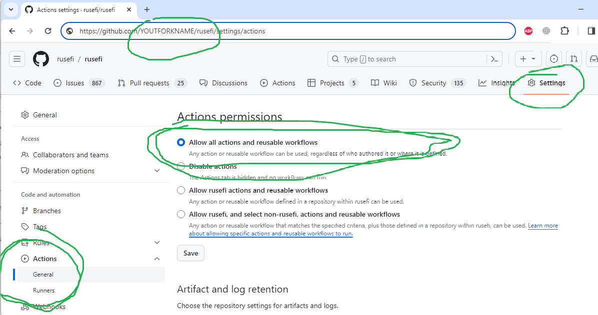

# Developer Quick Start

TL,DR: github process, github actions, GCC, gtest, java.

rusEFI is an open source internal combustion engine control unit primarily running on stm32f4/f7 microcontrollers.

Well, really the first step is to fork https://github.com/rusefi/rusefi and then make sure you have github actions enabled (see below)

``` shell
git clone --recurse-submodules https://github.com/rusefi/rusefi
misc/actions/ubuntu-install-tools.sh
cd firmware
./setup_linux_environment.sh
make
```

## Embedded firmware

See https://github.com/rusefi/rusefi/blob/master/firmware/readme.md

STM32F407 firmware including pre-compiled PC application to send commands: [rusEFI Firmware bundle](https://rusefi.com/build_server/rusefi_bundle_f407-discovery.zip)

See also <https://github.com/rusefi/rusefi/blob/master/firmware/setup_linux_environment.sh>

## Unit Tests

We are heavy in CI/CD so [Dev Quality Control](dev-hardware-quality-control) and https://github.com/rusefi/rusefi/blob/master/unit_tests/readme.md

## GitHub Actions

We rely on github actions heavily. We commit manual changes while github actions are commiting auto-generated stuff if needed.

Note the green icon for happy continues integration, note commits by actions-user.


Make sure that your fork has Actions enabled:



## See Also

- [Test-Driven Bugfixing](TDB-Test-Driven-Bugfixing)
- [Communication](Communication)
- [Please Work Smart](Contributors-please-work-smart)
- [Console Implementation](Dev-Console-Implementation)
- [How To Compile Firmware](HOW-TO-Build-Firmware-From-Source)
