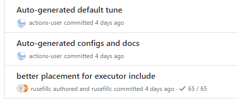
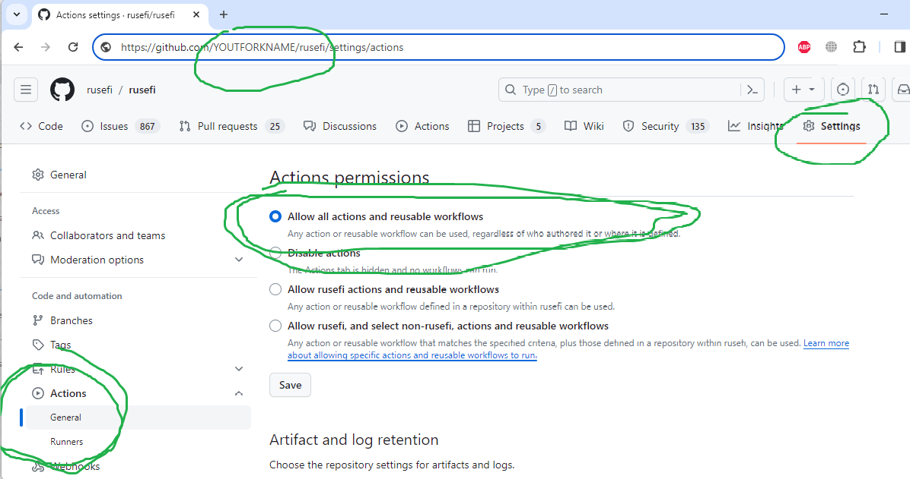

# Developer Quick Start

rusEFI is an open source internal combustion engine control unit primarily running on STM32F4/F7 microcontrollers.

To develop the firmware yourself, the first step is to fork [the GitHub repository](https://github.com/rusefi/rusefi), then make sure you have [GitHub Actions enabled](#github-actions) on your fork.

There are a few scripts to help you get up-and-running quickly on a Debian or Ubuntu-based system:

``` shell
git clone --recurse-submodules https://github.com/rusefi/rusefi
misc/actions/ubuntu-install-tools.sh
cd firmware
./setup_linux_environment.sh
make
```

## Embedded Firmware

See [the firmware README](https://github.com/rusefi/rusefi/blob/master/firmware/readme.md).

The [rusEFI Firmware bundle](https://rusefi.com/build_server/rusefi_bundle_f407-discovery.zip) includes STM32F407 firmware and a pre-compiled PC application to send commands.

## Unit Tests

We use CI/CD heavily; see https://github.com/rusefi/rusefi/blob/master/unit_tests/readme.md

For current test coverage, see [the coverage report](https://rusefi.com/docs/unit_tests_coverage/).

## Hardware Continuous Integration

rusEFI has run hardware continuous integration (HW CI) on STM32F4 boards since 2015. Physical jumper wires loop outputs back into inputs so the tests exercise real hardware.

See the [local HW CI setup guide](https://github.com/rusefi/rusefi/blob/master/.github/workflows/hw-ci/how_to_local_hwci.md) for prerequisites, building, flashing, and running the tests. The [HW CI workflow](https://github.com/rusefi/rusefi/blob/master/.github/workflows/hardware-ci.yaml) defines the runner labels and test suites.

### F7 Nucleo

For the F767-Nucleo, connect **PD2 <=> PA6**. Powering the board from VIN rather than the ST-Link USB connection is recommended.


### STM32F407G-DISC1

Connect the following jumper wires on the F4-Discovery:

* **PD1 (output) <=> PC6 (input)**
* **PD2 (output) <=> PA5 (input)**

The wiring is also documented in [HwCiF4Discovery.java](https://github.com/rusefi/rusefi/blob/master/java_console/autotest/src/main/java/com/rusefi/HwCiF4Discovery.java).

The console can detect connected rusEFI hardware and invoke the F4-Discovery test suite:

```shell
java -jar rusefi_console.jar functional_test
```

### Proteus F4

See [ProteusAnalogTest.java](https://github.com/rusefi/rusefi/blob/master/java_console/autotest/src/main/java/com/rusefi/proteus/ProteusAnalogTest.java) for the external power supply, jumper, resistor, and capacitor connections needed for analog tests.

## GitHub Actions

We rely on GitHub Actions heavily. We commit manual changes while GitHub Actions are committing auto-generated stuff if needed.

Note the green icon for happy continuous integration; note commits by actions-user.



Make sure that your fork has Actions enabled:



## Pull Requests basics

* rebase good, merge commit bad. We would have loved to prohibit PRs with merge commits if only we know a way
* PRs based on your fork's master branch do not work here 🔴 NEVER COMMIT TO MASTER EVEN IF YOU FORK 🔴

## Pull Requests should be atomic

Please create small, feature-specific branches on your fork. Submit one PR per fix or feature.
Please do not submit a massive "kitchen sink" PR from your fork that fixes three bugs, adds two features, and reformats the entire codebase.
We will likely reject it because it’s impossible to review. It forces us to accept all your changes or none of them.

## Hostile Forks

Free Open Source Software is a two-way street: it's not OK not to PR your sweet progress.
Be also believe that it's morally questionable to intentionally make forks incompatible.
We believe that it's morally questionable for forks to be private.
We doubt that anyone is benefiting from community fragmentation.

## See Also

- [Test-Driven Bugfixing](TDB-Test-Driven-Bugfixing)
- [Communication](Communication)
- [Please Work Smart](Contributors-please-work-smart)
- [Console Implementation](Dev-Console-Implementation)
- [How To Compile Firmware](HOW-TO-Build-Firmware-From-Source)
