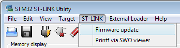
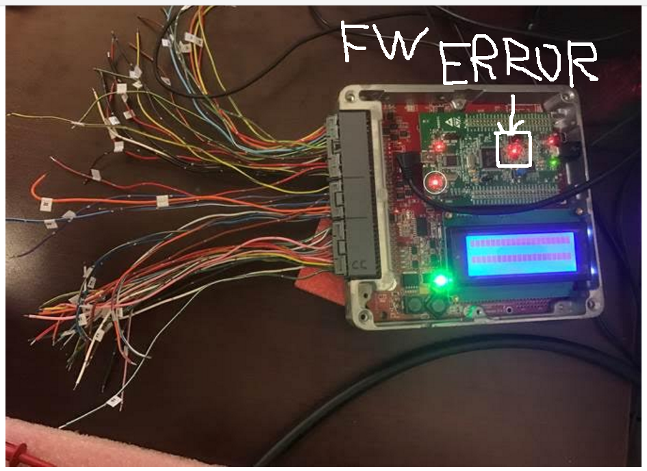

### Install firmware on Frankenstein, Frankenso, and Discovery

1. Connect the stm32f4discovery ('brain board') to the IO board, place jumpers like XYZ, then connect to a PC with a mini-USB cable. Mini-USB cable is used to power and to program the brain board. See below procedure found [here](http://rusefi.com/forum/viewtopic.php?f=5&t=210&start=23)

2. Before loading rusEFI firmware - if you have one of the newer Rev D STM32 discovery boards - you need to update discovery's firmware. That's in the "Firmware" dialog of ST Link utility, as shown in this picture. 

* To upload the binary image into the microcontroller you will need to download & install [STM32 ST-LINK utility](http://www.st.com/st-web-ui/static/active/en/st_prod_software_internet/resource/technical/software/utility/stsw-link004.zip). (this is both the utility and the driver) Once installed it will look like this.

* You should click '''Target --> Program...''' , browse to the rusefi.bin you have downloaded and hit Start button like this

* After you have programmed the chip, you should click '''Target --> Disconnect''' and hit the '''black button''' on the discovery board '''to reset''' the firmware. After you hit the reset button, you should expect all four LEDs to blink once and then you should see just the '''blue LED blinking'''. If all is good, proceed to the Dev Console below.

## LEDs

blue LED: communication status. This LED blinks constantly. Slower blinking if you use serial console or USB is disconnected, faster blinking if USB console is connected

green LED: blinking while engine is running, constant ON while cranking and OFF if engine is stopped

red LED: constant ON in case of firmware FATAL error. Many people confuse red LED with orange LED. The red LED is located closer to the black reset button.

orange LED: warning: blinking in case of trigger input decoding warning or other firmware warning, or in case of serial bus exchange. Orange LED is located closer to the main chip.

## Power via 12V supply

* Verify the LED TODO is bright, this indicates the STM is being powered.
* Verify you can still connect via Java console program
* Verify with Tunerstudio that you can connect, then set the simulation blah to blah and your STM should start generating a signal on pin Blah. 
* Install jumper TODO, this will connect the simulated crank angle signals to the input decoding signal. At this point you should the the RPM varying on the Java Console.
* Take your best stab at making look up tables and such via TS.

### Communication mode
microUSB channel is more sensitive to noise but it's faster

See also [Tunerstudio Connectivity](Tunerstudio-Connectivity)

### Configuration reset
Grounding PD6 resets saved configuration to default state - see [this forum post](http://rusefi.com/forum/viewtopic.php?f=5&t=373&p=9571&hilit=PD6#p9571)

### Board Testing mode

Grounding PB0 enables board testing mode. See [Hardware Test Mode](Hardware-Test-Mode)

