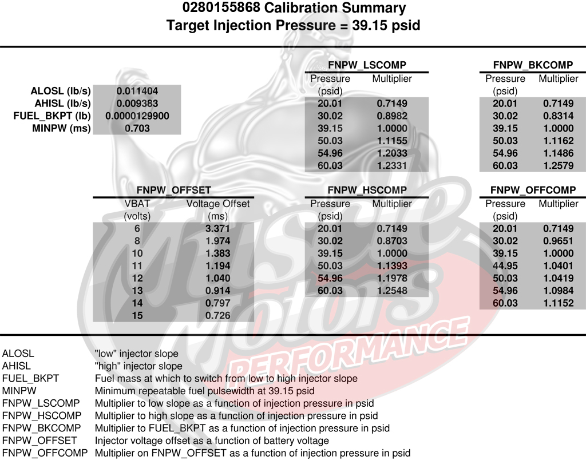

# 2003 Dodge Neon

[1995-2005 Neon T350/T350HD Transaxle Cross-Reference Guide](http://www.neons.org/forumdodge/trans.htm)

Bosch 0280-155-976 injectors

## NGC Chrysler ECU

152 pin connector (x4 38 pin)

[2003 Dodge Neon - Forum](http://rusefi.com/forum/viewtopic.php?f=3&t=696)

## Plug 1

38 pin

Plug color: black

| pos | b pos  | color | desc                       | type       |
| --- | ------ | ----- | -------------------------- | ---------- |
| 1   | \*     | \*    | Not Used                   | \*         |
| 2   |        |       | Not Used                   |            |
| 3   |        |       | Not Used                   |            |
| 4   |        |       | Not Used                   |            |
| 5   |        |       | Not Used                   |            |
| 6   |        |       | Not Used                   |            |
| 7   |        |       | Not Used                   |            |
| 8   |        |       | Not Used                   |            |
| 9   | black  |       | Ground                     | Ground     |
| 10  |        |       |                            |            |
| 11  | red    |       | Hot in start & run         | Input, 12v |
| 12  |        |       | Hot in start & run         | Input, 12v |
| 13  | green  |       | Vehicle Speed Sensor       | Input      |
| 14  |        |       | Brake Fluid Level Switch   | Input      |
| 15  |        |       |                            |            |
| 16  |        |       |                            |            |
| 17  |        |       |                            |            |
| 18  | black  |       | Ground                     | Ground     |
| 19  |        |       |                            |            |
| 20  |        |       | Low Oil Pressure switch    | Input      |
| 21  |        |       |                            |            |
| 22  |        |       | Ambient Temperature Sensor |            |
| 23  |        |       |                            |            |
| 24  |        |       |                            |            |
| 25  |        |       |                            |            |
| 26  |        |       |                            |            |
| 27  | orange |       | TPS power                  | Output +5  |
| 28  |        |       |                            |            |
| 29  |        |       | Hot all times              | Input, 12v |
| 30  |        |       | Hot ? when exactly         | Input, 12v |
| 31  |        |       |                            |            |
| 32  |        |       |                            |            |
| 33  |        |       |                            |            |
| 34  |        |       |                            |            |
| 35  |        |       |                            |            |
| 36  |        |       |                            |            |
| 37  |        |       |                            |            |
| 38  |        |       |                            |            |

## Plug 2

38 pin

Plug color: orange

| pos | b pos  | color         | desc                                    | type                  |
| --- | ------ | ------------- | --------------------------------------- | --------------------- |
| 1   | \*     | \*            | Not Used                                | \*                    |
| 2   |        |               |                                         |                       |
| 3   |        |               |                                         |                       |
| 4   |        |               |                                         |                       |
| 5   |        |               |                                         |                       |
| 6   |        |               |                                         |                       |
| 7   |        |               |                                         |                       |
| 8   |        |               |                                         |                       |
| 9   | red    | DarK BlIe/TAN | Coil \#2                                | Ouput                 |
| 10  | orange |               | Coil \#1                                |                       |
| 11  | white  |               | Injector \#4                            |                       |
| 12  | orange |               | Injector \#3                            |                       |
| 13  | green  |               | Injector \#2                            |                       |
| 14  | blue   |               | Injector \#1                            |                       |
| 15  |        |               |                                         |                       |
| 16  |        |               | Manifold Tuning Valve                   | Output                |
| 17  |        |               | O2 Heater                               |                       |
| 18  |        |               | O2 Heater                               |                       |
| 19  | white  |               | Generator/Alternator Field              | Output, high-side (?) |
| 20  | green  |               | ECT Signal                              | Analog Input          |
| 21  | blue   |               | Throttle Position Signal TPS            | Analog Input          |
| 22  |        |               | Not Used                                |                       |
| 23  | white  |               | MAP signal                              | Input, analog         |
| 24  | black  |               | knock sensor return                     | Ground                |
| 25  | green  |               | knock sensor signal                     |                       |
| 26  |        |               | Not Used                                |                       |
| 27  |        |               | Sensor Ground (CKP, CMP, MAP, CLT, VSS) | Ground                |
| 28  | orange |               | Idle Air Control solenoid return        | Output, low side      |
| 29  | orange |               | 5V supply                               | Output 5v             |
| 30  | blue   |               | Intake Air Temperature Signal IAT       | Input                 |
| 31  |        |               | O2 1/1 signal                           | input                 |
| 32  |        |               | O2 return                               | Ground                |
| 33  |        |               | O2 1/2 signal                           | input                 |
| 34  | green  |               | Camshaft Signal (CMP) Hall-Effect       | Input                 |
| 35  | blue   |               | Crankshaft Signal (CKP) Hall-Effect     | Input                 |
| 36  |        |               | Not Used                                |                       |
| 37  |        |               | Not Used                                |                       |
| 38  | green  |               | Idle Air Control solenoid               | \+12 supply           |

## Plug 3

38 pin

White

| pos | b pos  | color | desc                                    | type             |
| --- | ------ | ----- | --------------------------------------- | ---------------- |
| 1   |        |       |                                         |                  |
| 2   |        |       |                                         |                  |
| 3   | white  |       | Automatic Shut Down Relay (main relay?) | Output, low-side |
| 4   |        |       |                                         |                  |
| 5   |        |       |                                         |                  |
| 6   | green  |       | Radiator Fan relay                      | Output, low side |
| 7   |        |       |                                         |                  |
| 8   |        |       |                                         |                  |
| 9   |        |       |                                         |                  |
| 10  |        |       |                                         |                  |
| 11  |        |       | A/C clutch rel                          |                  |
| 12  |        |       |                                         |                  |
| 13  |        |       |                                         |                  |
| 14  |        |       |                                         |                  |
| 15  |        |       |                                         |                  |
| 16  |        |       |                                         |                  |
| 17  | black  |       | Sensor Ground (TPS IAT)                 | Ground           |
| 18  |        |       |                                         |                  |
| 19  |        |       | ASD power                               | Input, +12v      |
| 20  |        |       |                                         |                  |
| 21  | orange |       | Clutch interlock/Down                   |                  |
| 22  |        |       |                                         |                  |
| 23  |        |       |                                         |                  |
| 24  |        |       | A/C SW SENS                             |                  |
| 25  |        |       |                                         |                  |
| 26  | blue   |       | Clutch Up signal                        |                  |
| 27  |        |       |                                         |                  |
| 28  |        |       | ASD power                               | Input, 12v       |
| 29  |        |       |                                         |                  |
| 30  |        |       |                                         |                  |
| 31  |        |       |                                         |                  |
| 32  |        |       |                                         |                  |
| 33  |        |       |                                         |                  |
| 34  |        |       |                                         |                  |
| 35  |        |       |                                         |                  |
| 36  |        |       |                                         |                  |
| 37  | white  |       | Fuel Pump Relay                         | Output, low side |
| 38  |        |       | Starter Relay                           | Output, low side |

## Plug 4

38 pin

Automatic transmission control plug.

| pos | b pos | color | desc | type |
| --- | ----- | ----- | ---- | ---- |
| 38  |       |       |      |      |

## Diagrams

### ECU

### Starting

### Charging

### Cooling

### A/C

