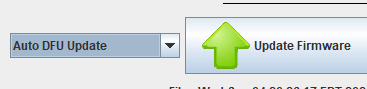

# F7 Requires Full Erase

While most rusEFI units support incremental firmware update while keeping settings intact, we are facing an unexplained issue with some F7 Proteus units. Those units require a full erase prior to software update.

## OpenBLT Approach

## Older approach before OpenBLT

1. Enter DFU using one of these options:
    1. In rusEFI console, use "switch to DFU mode"
    2. Open the case, power the ECU while holding the "PROG" button to enter manual DFU

2. In rusEFI console, use "Full Erase Chip"

3. Manual DFU programming using rusEFI console as usual

## Related pages

- [How to Update Firmware](HOWTO-Update-Firmware) - main firmware update procedure (Windows and Linux, OpenBLT and DFU).
- [HOWTO DFU](HOWTO-DFU) - DFU (Device Firmware Update) mode: auto vs. manual, drivers, and troubleshooting.
- [HOWTO Flash using STM32CubeProgrammer](HOWTO-flash-using-Stm32CubeProgrammer) - advanced / last-resort flashing via STM32CubeProgrammer (DFU or ST-Link).
- [Hardware Validation Failed](HARDWARE-VALIDATION-FAILED) - diagnosing the "HARDWARE VALIDATION FAILED" startup error.
- [4chan F7 Initial Programming](4chan-F7-initial-programming) - one-time initial programming for AlphaX 4chan F7 boards.
