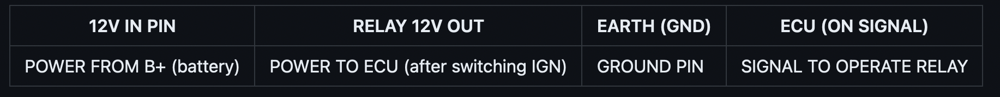
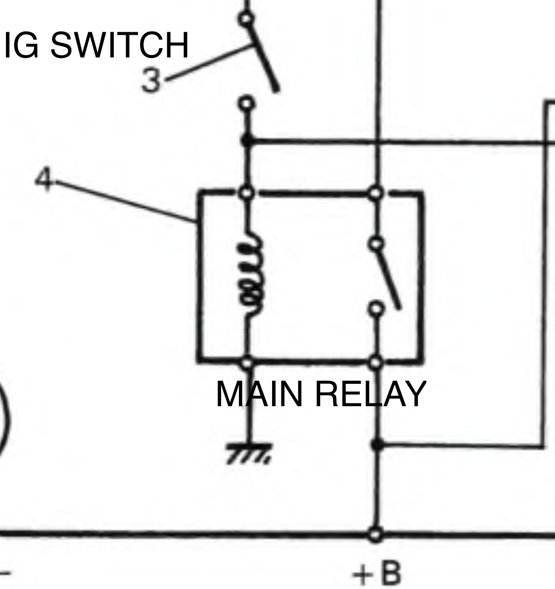
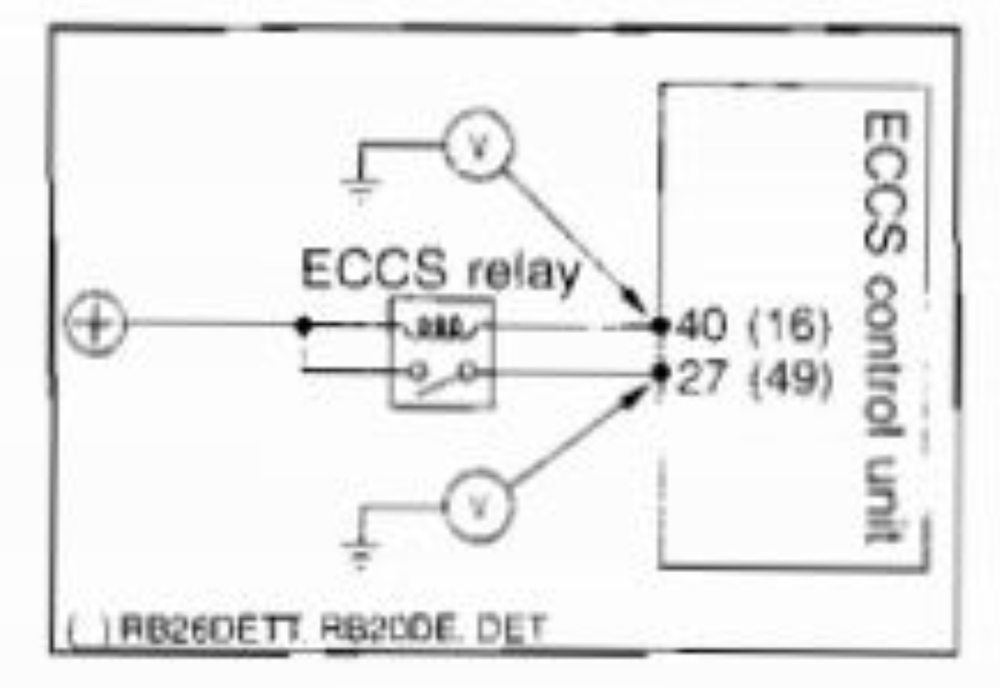
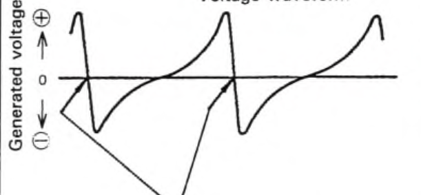
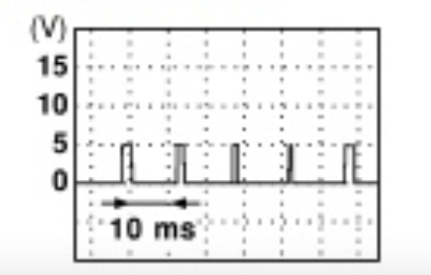

# Wiring & Connectivity Overview

This page contains general information about how to hook up to your rusEFI ECU. It's not intended to be a guide to a specific ECU model - rather, how to figure out what you're going to need to run the different kinds of hardware you'd find in an engine bay.

**WARNING: The exact implementation of these pins is ECU-specific!**  
You should always consult the documentation on your particular hardware. The information here is presented for planning purposes only - to help you figure out which of the hardware variants will suit the sensors and solenoids present on your engine.

## Outputs

### General Purpose

The two main types of outputs are "low side" and "high side."
Low side outputs are used to control things in the engine bay that have one terminal permanently connected to battery voltage. The ECU supplies the ground side of the circuit to turn things on.
High side outputs are used to control things in the engine bay that have one terminal permanently connected to ground. The ECU supplies battery voltage to the circuit to turn things on.
All general purpose outputs are available for conditional on/off control via basic conditions. (insert more details here)

All general purpose outputs can be used by the software PWM system. The software PWM system can provide approximately 1% duty steps at up to 1 kHz (10us steps, 1ms cycle). Software PWM can operate at different speeds for different outputs; there is a lot of flexibility. Please note the max current for your specific ECU outputs!

### Fuel Injectors

Only saturated (high impedance, >8 ohms) port injectors are supported. All hardware variants are built around the concept of one ECU pin controlling one fuel injector. The use of multiple injectors on one ECU output must be very carefully evaluated to avoid overloading the drivers. One injector may also be used for all cylinders ("single point"). A pair of injectors can be wired together and fired simultaneously - for example, four pairs of injectors on a V8. It's possible, but not intuitive, to configure two multi-cylinder banks of injectors alternating injection. It is recommended to use one injector per cylinder. Staged injection with multiple injectors per cylinder is possible in hardware but the software is not yet ready.

You do **not** need to wire injectors in a particular way. Cylinder #1 (as numbered by the manufacturer) does not need to be wired to "Injector #1" on the ECU pinout. Neither, for example, does the third injector in the firing order need to be wired to "Injector #3" on the ECU. The firing order and phasing can be adjusted in software. Any injector driver output can be used to drive any injector.

Bottom line: as long as the hardware variant has at least as many injector outputs as your engine has cylinders, you will be able to run one injector per cylinder.

### Coils

Most hardware variants support only logic-level drive for coils. This means that coils which have built-in ignitors will work, for example GM LSx, IGN1A, Denso stick coil, etc. You should consult the documentation for both the coils and the rusEFI hardware you are using to determine whether you can directly wire the coils or an external ignitor/something else is required. Note: coil outputs are among the *least* robust (in terms of tolerating shorts, excessive voltages, etc.) on many hardware variants, including Proteus. Double-check your wiring! uaEFI supports IGBT expansion for dumb coils; kindly read the uaEFI manual for more information.

Like injectors, all coil outputs are interchangeable. Coil outputs do not need to be used sequentially, and firing order and phasing can be adjusted in software. Wasted spark (one coil fires two cylinders) and distributor (one coil mechanically multiplexed among all cylinders) modes are supported in addition to coil-per-cylinder direct fire. Rare "dual distributor" mode is also supported for engines like older BMW V12s and the Toyota 1UZ.
Bottom line: as long as the hardware variant has at least as many coil outputs as your engine has cylinders, you will be able to run one coil per cylinder.

### Idle Air Control Valve

Logic exists in the firmware to use several types of idle control valves to regulate idle.

PWM valves (typically 2-wire) accept a variable duty-cycle square wave to control their position. Any general-purpose output hardware that can handle the electrical load can be configured to control a PWM-style idle valve. Dedicated pins do not need to be allocated for this style of valves. Honda, Nissan, Mitsubishi, Subaru, and Ford often have this type of valve.

Bipolar stepper motors (typically 4-wire) have two coils that are energized in different patterns in order to move the valve open or closed, one step at a time. Bipolar stepper motors require **two H-Bridges** (as on Proteus) to control one bipolar stepper idle valve. Alternatively, a dedicated stepper driver IC can be used or added via a drop-in adapter board. GM and Toyota commonly use these.

[Jeep idle stepper motor - Video](https://youtu.be/z0rFOkAbKDQ) [Stepper motor idle - Video](https://youtu.be/SYNUcmNIgPo)

Unipolar stepper valves are not supported by any rusEFI ECUs. Chrysler commonly used these.

### Drive-by-Wire

Logic exists in the firmware to control a drive-by-wire throttle body, including using it to idle. A single H-bridge is required to control a single DBW throttle body. Multiple DBW throttle bodies can be simultaneously controlled as long as sufficient H-bridge drivers exist to control them. A drive-by-wire pedal (Accelerator Pedal Position / APP) is generally used to provide input from the driver. Want to know more? For more information, read the [ETB Configuration Guide](Electronic-Throttle-Body-Configuration-Guide).

### Main Relay

The main relay is a secondary power switch usually used to power components that use 12v+, such as injectors, ignition coils, and the idle air control valve. It is switched on by the ECU after the accessory circuit is powered on by the ignition switch.
Most hardware variants are set up to provide control over a main relay or auto-shutdown relay. The rusEFI ECU typically has two power feeds. Key-on power is supplied to the ECU in order to power the CPU and logic core of the ECU. High side drivers, H-bridges and other power switches are then powered by a "main relay" that is energized under the control of the ECU. Continuous power from the battery is not required for setting retention.

Various terms are used to describe the main relay by different manufacturers:

- "EFI Relay"
- "ECU Relay"
- "ECCS"

Simple wiring description:

{: style="width: 917px;" }

When wiring your new rusEFI ECU you should check whether the main relay on your car is operated by the OEM ECU or by the ignition switch directly.

If your car's main relay is operated by the ignition switch, with no ECU control, link VIGN and 12V (Switched B+ from your old ECU wire) inputs together for battery voltage to display correctly.

{: style="width: 561px;" }

A main relay operated by the ignition switch is typically referred to as "12v+" or "B+" in diagrams. It's preferred to use the relay output as the source for the voltage reading ("VIGN"). In the case of ignition-operated main relays, it's usually the only power input for the ECU, so it will serve as both 12V+ power to the ECU and as the reference voltage.

To summarize the order of operations with an ignition-switch-operated main relay:

1. The ignition switch is moved to the on position
2. The main relay gets power and turns on
3. The ECU and EFI components get power at the same time

The main relay should make a click sound when the ignition switch is turned on, even when the ECU is missing.

However, if your main relay is switched by an ECU pin, take a free LS (low side) output and replace your old relay operation signal with it.
Feed back VIGN with power returning from the main relay. They're usually labeled in manuals as "ECU POWER" or "ECU 12V".

{: style="width: 631px;" }

As you can see in the ECCS example pin 16 here should be rusEFI lowside
and pin 49 should be your relay power IN (VIGN)

To summarize the order of operations with an ECU-operated main relay:

1. The ignition switch is moved to the on position
2. The ECU gets power from the ignition switch
3. The ECU grounds the main relay
4. The main relay provides power to the EFI components

See also [Delayed Shut Off](Delayed-shut-off)

## Inputs

### General Sensor Inputs

The two basic kinds of general-purpose inputs are "digital" and "analog". Digital inputs only measure an "on" or "off" condition. Analog inputs measure a signal voltage with some degree of precision.

Digital inputs need a resistor to pull them to either ground or the reference voltage in order to ensure they do not pick up interference and trigger falsely. Most digital inputs are configured with a pull-up resistor, but you should double-check your hardware. Switches "turn on" the input by connecting it to ground. When the switch is open, the pull-up resistor ensures that the hardware can see the difference. Most ECU implementations have basic protection circuitry to allow inputs to see battery voltage without damage, but you should double-check your ECU. Most switches in an engine bay such as power steering pressure switches, AC pressure switches, brake pressure switches, many PRNDL switches on automatic transmission shifters, oil pressure switches, and diagnostic enable switches are wired so that the other end connects to ground. This makes digital inputs ideal for monitoring most on-off type switches.

### Thermistors

Thermistor inputs have an internal pull-up to 5V to make connecting to sensors like coolant temperature and air temperature easier. The resistance varies according to hardware; Proteus, for example, uses 2.7k resistors. When using a thermistor input, one terminal of the sensor is connected to the ECU and the other end of your sensor should be connected to sensor ground. Note: many single-wire thermistors used for coolant temperature have metal threads which make contact with the cylinder head/block, providing the other terminal without a wire.

See [Temperature Sensing](Temperature-Sensing)

### Analog Voltage Inputs

Analog Voltage inputs have a weak pull-down to sensor ground (varies according to hardware: 500k on proteus) and are intended for things like MAP or TPS sensors that drive a voltage. On most hardware implementations (double check your hardware!), these inputs are also protected against excessive voltage. The combination of an internal pull-down resistor and built-in protection means that analog inputs can safely double as "active high" inputs, where battery voltage indicates that a switch is high.

### VR (Variable Reluctance) Sensors

VR sensors typically have two wires and this type of waveform:

{: style="width: 306px;" }

The two wires from your VR sensor should go to your rusEFI VR+ and VR- pins.
Some ECU brands call these "NE+" and "NE-".

### Hall Effect Sensors

Hall effect sensors have a square-shaped wave and typically three wires.
They are powered by either 5V or 12V power and ground and have a signal as a third pin.

{: style="width: 270px;" }

### Optical Sensors

Typically found in Nissans and they have a 360 degree wheel as a secondary trigger with small slits according to the number of cylinders.
Wiring is typically very simple on these: (Trigger Second, Trigger Main, 12v+, GND)
They're powered by 12V and output 5V signals.
rusEFI doesn't support the Nissan 360 trigger.
Aftermarket trigger wheels ("Optical Disc") are available if you plan on installing on a Nissan.

### Knock Sensors

Some ECU variants have a provision for knock sensors.

In regards to Knock Sensor quality of signal, a shielded cable (2 core) is recommended.

- KNOCK goes to (KNOCK_IN_RAW) signal IN
- Shield and GND of sensor goe to Sensor GND

Doing it this way is preferred to get the best performance from your ECU input and sensor.
