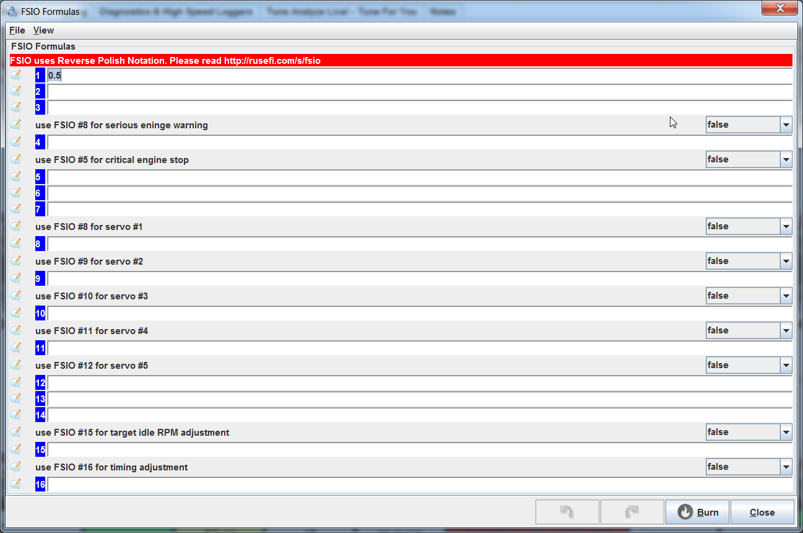

rusEFI console now has build-in decoder of RPN form, for example:

```decode_rpn "0 fsio_analog_input 20 > 0 10 if"```

Would return "Human form is "if((fsio_analog_input(0) > 20), 0, 10)"
"

and

```decode_rpn "0 fsio_input 20 > 0 10 if"```

It would show a filing to parse message with a list of some known functions.


See [legacy wiki](https://rusefi.com/wiki/index.php?title=Manual:Flexible_Logic)