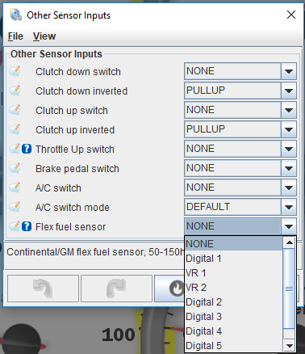

# Flex Fuel

## Sensor and Wiring

The following sensors are known to work:

GM part numbers:

13577379 - SENSOR (short tube)

13577394 - SENSOR (long tube)

13352241 - HARNESS

The pinout is shown below:

## Sensor Setup

Connect your sensor to a digital input on the ECU. Then, pick the pin in TunerStudio at `Sensors -> Misc sensors -> Flex fuel sensor`.

(technical details - we expect a pull-up on the ECU, about 3K, somewhere from 1K to 5K)

## Fueling Setup

In `Fuel -> Injection Configuration`, configure `Stoichiometric ratio` and `E100 stoichiometric ratio`. Unless you're doing something very weird, 14.7 and 9.0 are the correct values respectively (pure gas has a stoichiometric ratio of 14.7:1, and pure ethanol 9.0:1).

That's it! The firmware will now automatically vary the fuel's stoichiometric ratio based on ethanol content.

**It's recommended to switch to lambda mode (`File -> Vehicle Projects -> Project Properties -> Settings -> Lambda Display`), as the target lambda table is multiplied by the current stoichiometric ratio to get the target air/fuel ratio.**

