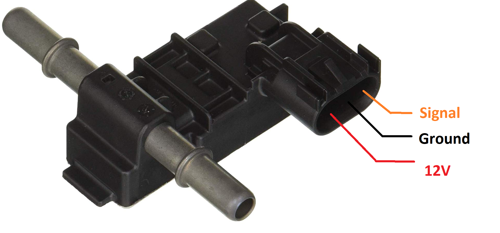
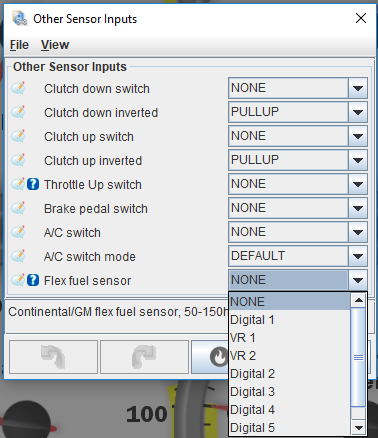
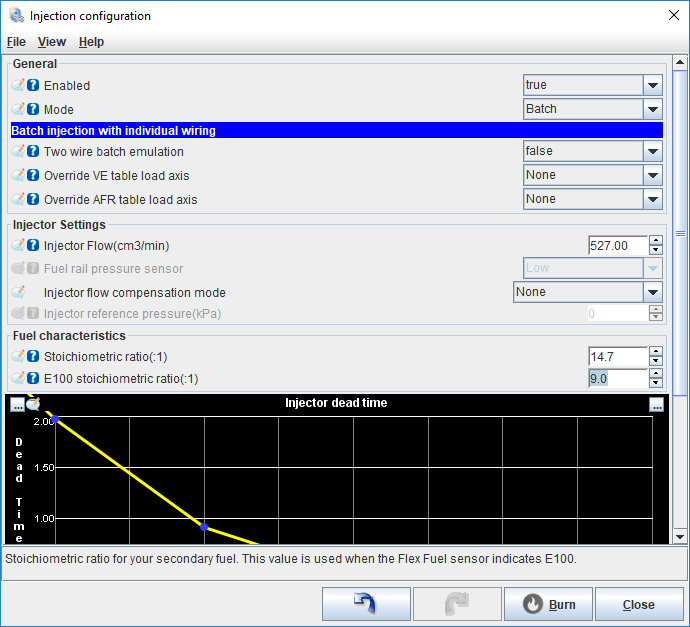

# Flex Fuel

## Sensor and Wiring

The following sensors are known to work:

GM part numbers:

13577379 - SENSOR (short tube)

13577394 - SENSOR (long tube)

13352241 - HARNESS

The pinout is shown below:

## Sensor Setup

Connect your sensor to a digital input on the ECU. Then, pick the pin in TunerStudio at `Sensors -> Misc sensors -> Flex fuel sensor`.

(technical details - we expect a pull-up on the ECU, about 3K, somewhere from 1K to 5K)

## Fueling Setup

In `Fuel -> Injection Configuration`, configure `Stoichiometric ratio` and `E100 stoichiometric ratio`. Unless you're doing something very weird, 14.7 and 9.0 are the correct values respectively (pure gas has a stoichiometric ratio of 14.7:1, and pure ethanol 9.0:1).

That's it! The firmware will now automatically vary the fuel's stoichiometric ratio based on ethanol content.

**It's recommended to switch to lambda mode (`File -> Vehicle Projects -> Project Properties -> Settings -> Lambda Display`), as the target lambda table is multiplied by the current stoichiometric ratio to get the target air/fuel ratio.**

## Cold start and transient corrections

Ethanol needs noticeably more fuel than gasoline, especially when the engine is cold, so rusEFI can also adjust cold-start and transient fuelling by ethanol content:

- **`flexCranking`** — described in the firmware as: "Enable flex-fuel compensation for engine start. When on... cranking coolant multiplier and priming pulse mass each come from a 2D table over coolant and ethanol %" (`crankingFuelFlexTable` and `primeFlexTable`).
- **`flexFuelTransientComp`** — "Enable flex-fuel transient fueling compensation (acceleration enrichment and wall wetting tau/beta) based on ethanol content and coolant temperature".

Enable these if you run high-ethanol blends and want good cold starts and throttle response across the ethanol range.

## Reading ethanol content

The flex fuel sensor is a frequency-output type. In the firmware `flexSensorPin` is described as a "Continental/GM flex fuel sensor, 50-150hz type" — the signal frequency encodes the ethanol percentage, which rusEFI then uses for the corrections above.

## Technical sources

- Configuration field definitions: `firmware/integration/rusefi_config.txt` — `flexSensorPin`, `stoichRatioSecondary`, `flexCranking`, `crankingFuelFlexTable`, `primeFlexTable`, `flexFuelTransientComp`.
