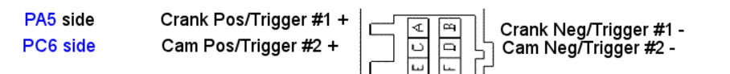

## Typical Hall

For example, Mazda distributor sensors.

See [Frankenso Default Pinout](Hardware-Frankenso#default-pinout)

Use Trigger #1 N for first sensor signal & Trigger #2 N for second trigger with 1K pull-up configuration

Leave Trigger #1 P & Trigger #2 P wires disconnected

## Bench testing Mazda Hall

Test 1.1: Expected resistance between +5v wire and Trigger #1 N wire: 1K (See [Frankenso Default Pinout](Hardware-Frankenso#default-pinout))

Test 1.2: Expected resistance between +5v wire and Trigger #2 N wire: 1K

Test 1.3: ground/unground Trigger #1 N wire, should see event counter in `triggerinfo` go up

Test 1.4: ground/unground Trigger #2 N wire, should see event counter in `triggerinfo` go up

Goto board info: [Frankenso VR Input](Hardware-Frankenso#vr-input)

PS: technically MAX9926 is not really needed for Hall processing, two channels on the op-amp would do the job just fine and Frankenso has all the jumpers provisioned to make this happen on channels #9 and #11. See [Frankenso Cam/Crank Input](Hardware-Frankenso#camcrank-input)
