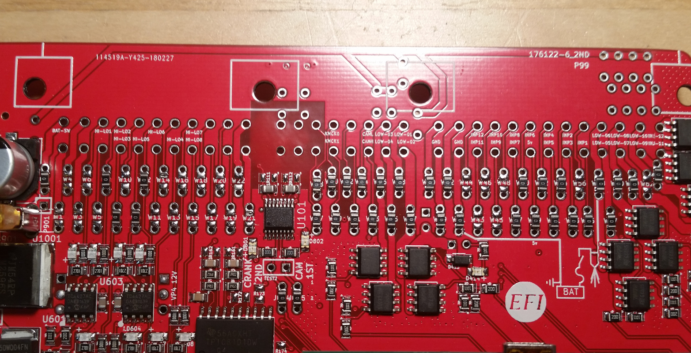
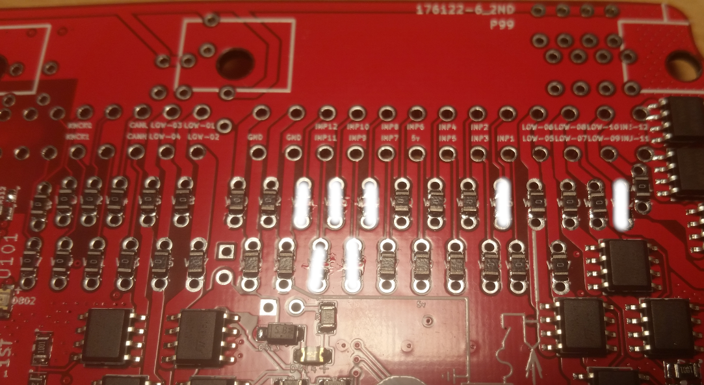
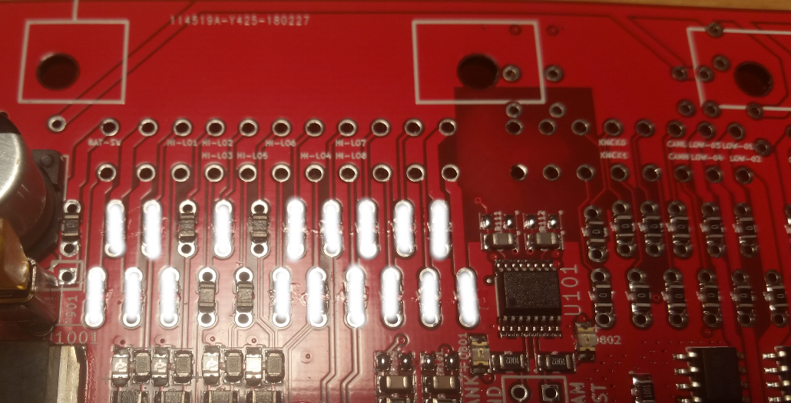

## LEGACY CONTENT, please use BeerMoneyMotorsports Miata ECU

[Frankenso Board Technical Details](Hardware-Frankenso#default-pinout)

# Board Jumper Wires

| # & Color | From | To | Function |   |
|------|------|----|-------|---|
| #1 White L=75mm    | 3E plug / top of W43  |               | crank angle sensor   |   |
| #2 Yellow L=75mm   | 3G plug / top of W45  |               | crank angle sensor   |   |
| #3 White L=160mm   | 1E plug / top of W5   | bottom W62    | check engine MIL     |   |
| #4 Red L=90mm      | 2F plug / top of W28  | top of W49    | external MAP +5v power     |   |
| #5 Green L=90mm    | 2E plug / top of W27  | bottom W47    | external MAP signal      |   |
| #6 Black L=60mm    | 2N plug / top of W36  | top of W40    | external MAP ground      |   |
| #7 Blue L=75mm     | 2I plug / top of W31  | W52           | external wide band oxygen sensor signal |
| #8 Black L=60mm    | 2M plug / top of W35  | top of W39    | external wide band oxygen sensor ground      |
| #9 Green L=120mm   | 1Q plug / top of W17  | bottom of W46 | A/C switch input |
| #10 Red L=120mm    | 1J plug / top of W10  | bottom of W57 | A/C relay output  |
| #11 Yellow L=120mm | 1V plug / top of W22  | bottom of W48 | clutch pedal switch  |
|      |      |    |       |   |
|      |      |    |       |   |
| 30V 0.5A Schottky Diode (for example RSX051VYM30FHTR)     | top of ?    | bottom of ?   | Idle Air Valve fly-back diode      |   |
|      |      |    |       |   |
-----------------------------------

[Frankenso analog](Hardware-Frankenso#analog-inputs)

| Analog        | ECU pin |MCU pin |  pull-up | pull-down |   |
|------|------|----|-------|---|---|
| Coolant (stock)       | 3Q | PC2 |  2.7K | n/a      |   |
| Intake Air (stock)    | 3P | PC1 |  2.7K | n/a      |   |
| Vane Air Flow (stock) VAF MAF | 3O | PA0 |  n/a  | 500K     |   |
| Narrow Band O2 (stock)| 3N | PC3 |  n/a  | 500K  |
| Wide band oxygen (from middle plug) | W52   | PC3   |   n/a    | 500K  |
| TPS ??? A/T harness only!    | 3M     |    |       |   |
| Neutral switch     | 1V     | PA3   | 10K     | n/a  |
| A/C switch     | 1Q     | PA6   | 10K     | n/a  |
| Throttle up     | 1N     |    | 10K      | n/a  |
|      |      |    |       |   |
| MAP (from middle plug)  | 2J      | PA4   |   n/a    | 500K  |
| Stop Light Switch  green wire   | 1O rerouted     |    |       |   |
|      |      |    |       |   |

-----------------------------------

[Frankenso MazdaMiataNA6 pnp](Frankenso-MazdaMiataNA6-pnp)

