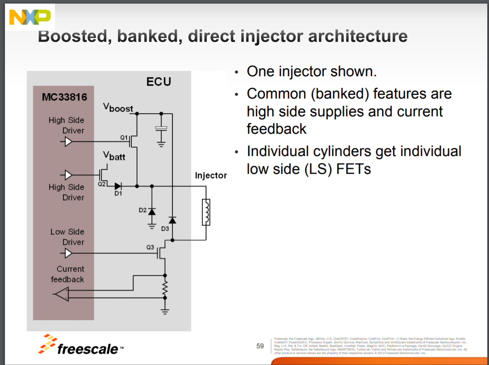
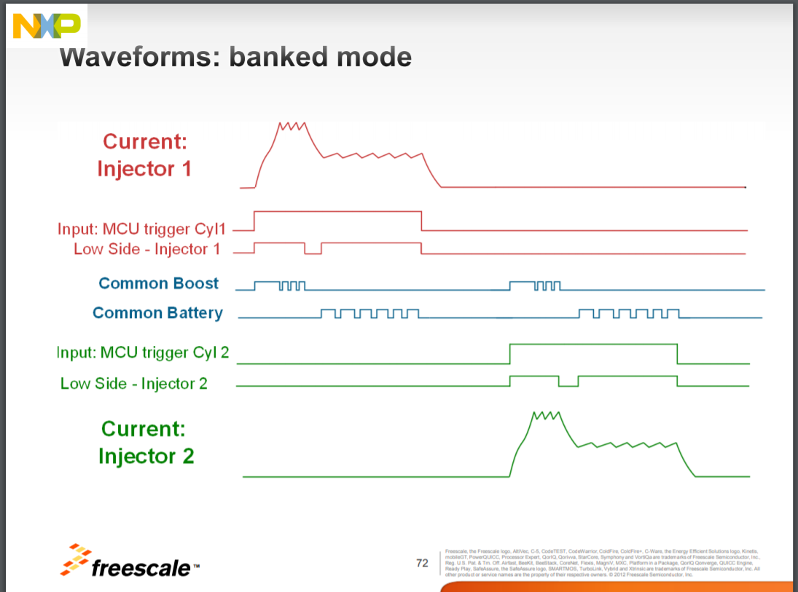

TL,DR: we had car [starting/idling - Video](https://youtu.be/JB2RnAJJSOk) using a [plywood board - Forum](https://rusefi.com/forum/download/file.php?id=6429) we have postponed GDI progress until funding or qualified contributor joins the game.

[Forum thread for test mule](https://rusefi.com/forum/viewtopic.php?f=3&t=1631)

[Forum thread for dev board](https://rusefi.com/forum/viewtopic.php?f=4&t=1337)

[Test Mule Wiring Diagram](VolkswagenPassatB6) runs on rusEFI GDI!

Gasoline Direct Injection requires a few additional components on top of port injection:

1) High voltage injection control - we have [rusEFI GDI dev board](MC33816-PT2001-dev-board) which [has clicked injector on a bench - Video](https://www.youtube.com/watch?v=MI0gJ4th9Tg).

2) High pressure fuel pump solenoid control - we have a basic implementation

3) Target fuel pressure logic - we have nothing, but could be as easy as adding a simple table?

See also [BMW injector driver](https://rusefi.com/forum/viewtopic.php?f=4&t=1564)

See also [rusEFI injector driver](https://github.com/rusefi/rusefi-hardware/tree/main/GDI-4ch)

TODO: try INJECTOR DRIVE MODULE IDM-2
2013 13 HYUNDAI GENESIS
39175-3C000
2014 Hyundai Azera
39172-3С010
