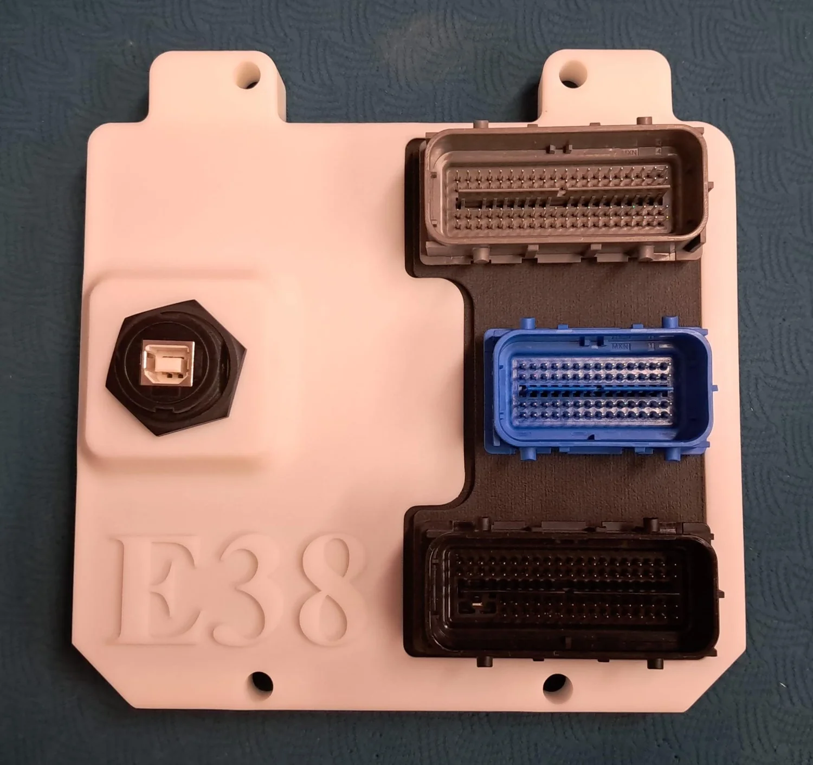

# GM E38

A standalone compatible with GM E38 pinout [💲available at the rusEFI store💲](https://www.shop.rusefi.com/shop/p/pnp-e38)

{: style="width: 1500px; height: 1414px;" }

## Information

[⏩ Interactive Pinout ⏪](https://rusefi.com/docs/pinouts/GM-E38/)

[stable](https://rusefi.com/fw-private/lts/lts-25ambrosia/rusefi_bundle_pnp-e38_obfuscated_public.zip)

[firmware dev snapshot](https://rusefi.com/fw-private/rusefi_bundle_pnp-e38_obfuscated_public.zip)

https://github.com/rusefi/e38-e67-customer-support

🔴Community support ONLY 🔴 https://www.facebook.com/groups/rusEfi 🔴 [Discord](Discord)🔴

## Specs

* The blue connector is auxiliary
* Dual 4.9 LSU WBO controller on the aux connector
* x3 low-side aux outputs
* x3 aux analog inputs
* x2 digital inputs (flex or buttons)
* Second CAN bus on aux connector
* (alpha version) direct OEM dash control without BCM
* (alpha version) direct cruise control input without BCM
* (alpha version) 6L80 integration support

## Connectors

* 56-position housing "blue" Molex 34576-0703 0345760703
* Depinning tool GM-38125-213 0.64mm DIA Pick Tool SIM to Molex 63813-1400

## FAQ

*__Q:__ The 3 connector ECU is E67, right?*  
__A:__ The black and grey connectors hook to the e38 harness. The blue connector is auxiliary, with WBO and second CANbus, etc.
