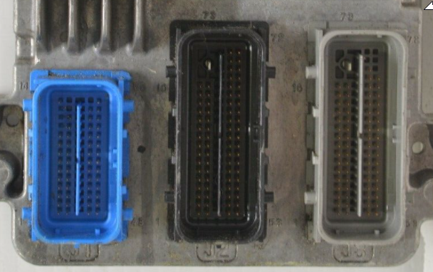

[Schematics rev b](Hardware/Hellen/hellen-gm-e67-b-schematic.pdf) [iBom rev b](https://rusefi.com/docs/ibom/hellen-gm-e67-b-ibom.html)

[Issue Tracker](https://github.com/rusefi/hellen-gm-e67-issues)


https://github.com/rusefi/proteus-gm-e67




mx123 molex. 56 pin blue 31386-2020. 73 pin black 31387-2014. 73 pin grey 31387-2002


# Alternator

[OEM-Docs/GM/e67-CTSV.Charging.pdf](OEM-Docs/GM/e67-CTSV.Charging.pdf)

[OEM-Docs/GM/e67-CTSV-GeneratorControl.pdf](OEM-Docs/GM/e67-CTSV-GeneratorControl.pdf)

[OEM-Docs/GM/e67-TBSS.Charging.pdf](OEM-Docs/GM/e67-TBSS.Charging.pdf)

# Vehicles

[LS9 crate](OEM-Docs/GM/ls9-crate-engine-control-system-19354338.pdf)


[2007-Impala-5.3](OEM-Docs/GM/e67-2007-Impala-5.3-ECU.pdf)

[2008 XLR V STS 4.4 NA ECU.pdf](OEM-Docs/GM/e67-2008-XLR-V-STS-4.4-NA-ECU.pdf)

[2008-XLR-V-STS-4.6-NA-ECU.pdf](OEM-Docs/GM/e67-2008-XLR-V-STS-4.6-NA-ECU.pdf)

[2009-Corvette-LS9-SC-ECU.pdf](OEM-Docs/GM/e67-2009-Corvette-LS9-SC-ECU.pdf)

[2011-Colorado-5.3-GM-OEM-ECU.pdf](OEM-Docs/GM/e67-2011-Colorado-5.3-GM-OEM-ECU.pdf)

[2013-CTS-6.2-Supercharged-ECU-LSA-ENGINE.pdf](OEM-Docs/GM/e67-2013-CTS-6.2-Supercharged-ECU-LSA-ENGINE.pdf)


Gen IV V8, V6, L4 E67 ECM – Stream E67
```
V8 Cars
08	Buick Allure	5.3L
08-09	Buick Lacrosse	5.3L
06-09	Buick Lucerne	4.6L
06-07	Cadillac CTS-V	6.0L
08-15	Cadillac CTS-V	6.2L
06-09	Cadillac DTS	4.6L
06-10	Cadillac STS	4.4L, 4.6L
06-09	Cadillac XLR	4.4L, 4.6L
12-15	Chevrolet Camaro	6.2L
10-13	Chevrolet Corvette ZR1	6.2L
07-09	Chevrolet Impala SS	5.3L
07	Chevrolet Monte Carlo SS	5.3L
13-15	Holden HSV GTS (S/C)	6.2L
07	Pontiac Grand Prix	5.3L
V6 Cars
06	Chevrolet Impala	3.9L
09	Chevrolet Impala	3.5L
06	Chevrolet Malibu	3.9L
08-11	Chevrolet Malibu	3.5L, 3.6L (not DI)
12	Chevrolet Malibu LTZ	3.6L
06-08	Chevrolet Monte Carlo	3.9L
07-08	Chevrolet Monte Carlo	3.5L
06-09	Pontiac G6	3.6L, 3.9L (not DI)
07-09	Pontiac G6	3.5L
07-09	Saturn Aura	3.6L (not DI)
06-07	Chevrolet Cobalt	2.4L
06-07	Chevrolet HHR	2.2L, 2.4L
08	Chevrolet Malibu	2.4L
08-09	Chevrolet Malibu – Hybrid	2.4L
07	Pontiac G5 GT	2.4L
06-07	Pontiac G6	2.4L
06	Pontiac Pursuit	2.4L
06-07	Pontiac Solstice	2.4L
06-07	Saturn Aura	2.4L
08-09	Saturn Aura – Hybrid	2.4L
06-07	Saturn Ion	2.2L, 2.4L
07	Saturn Sky	2.4L
SUV’s
08	Buick Enclave	3.6L (not DI)
07	Buick Rainier	5.3L
09	Cadillac Escalade – Hybrid	6.0L
07-09	Cadillac SRX	4.6L
08-09	Chevrolet Tahoe – Hybrid	6.0L
07-09	Chevrolet Trailblazer (4.2L 08-09 only)	4.2L, 5.3L, 6.0L
07-08	GMC Arcadia	3.6L (not DI)
07-08	GMC Envoy (4.2L 08-09 only)	4.2L, 5.3L, 6.0L
08-09	GMC Yukon – Hybrid	6.0L
08-10	Hummer H3	3.7L, 5.3L
08	Isuzu Ascender	3.6L (not DI)
07-09	Saab 9-7X (4.2L 08-09 only)	4.2L, 5.3L
07-08	Saturn Outlook	3.6L (not DI)
07-08	Saturn Vue	2.4L, 3.6L (not DI)
08-09	Saturn Vue – Hybrid	2.4L
Vans
06-07	Buick Terraza	3.9L
06-08	Chevrolet Uplander	3.9L
06-08	Pontiac Montana	3.9L
06-07	Saturn Relay	3.9L
Trucks
08-12	Chevrolet Colorado	2.9L, 3.7L, 5.3L
08-12	GMC Canyon	2.9L, 3.7L, 5.3L
08-09	Isuzu i-Series	2.9L, 3.7L
Non Production Vehicles
07-15	GM Performance Parts E67 ECM	6.0L, 6.2L, 7.0L
```
