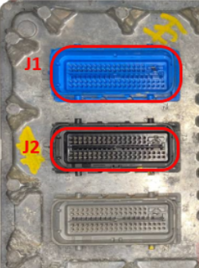
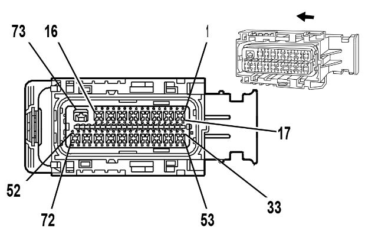

# GM

## gen 4

https://rusefi.com/docs/pinouts/GM-E38 Tahoe

https://rusefi.com/docs/pinouts/GM-E40

https://rusefi.com/docs/pinouts/hellen/hellen-gm-e67/

## 2.0T Ecotec LNF

https://rusefi.com/docs/pinouts/GM-LNF HHR

https://rusefi.com/docs/pinouts/GM-LNF-adapter/

https://en.wikipedia.org/wiki/GM_Ecotec_engine#2.0_LNF_(Z20NHH_Opel)

Bosch E69 is related to med9.6?

## E39A

[List of Global A platform vehicles](https://static.nhtsa.gov/odi/tsbs/2022/MC-10210348-9999.pdf)

Older inline-4 & older v6

https://rusefi.com/docs/pinouts/GM-E39A/

https://rusefi.com/docs/pinouts/E39A-adapter/

https://github.com/rusefi/rusefi_documentation/blob/master/OEM-Docs/GM/2014-Chevrolet-Malibu-2.5.pdf

https://github.com/rusefi/rusefi_documentation/blob/master/OEM-Docs/GM/2014-Chevrolet-Camaro-v6.pdf

## TCU

https://rusefi.com/docs/pinouts/GM-E87-TCU/

https://rusefi.com/docs/pinouts/GM-E87-TCU-adapter/

## E80

Newer inline-4

https://rusefi.com/docs/pinouts/GM-E80/ Cadillac ATS

https://rusefi.com/docs/pinouts/E80-adapter/ [e92 to adapter](https://docs.google.com/spreadsheets/d/1_wUjXXJFAyX8e0OT-bTLkIpIPQHrQ8_PcXhwK9kR0n0)

https://github.com/rusefi/rusefi_documentation/blob/master/OEM-Docs/GM/2017-Cadillac-ATS-Sedan-RWD-20T.pdf

https://github.com/rusefi/rusefi_documentation/blob/master/OEM-Docs/GM/2020-Chevrolet-Camaro-2.0T.pdf

## E82

Newer v6

https://rusefi.com/docs/pinouts/GM-E82/

## E92

v8

https://rusefi.com/docs/pinouts/GM-E92/

https://rusefi.com/docs/pinouts/E92-adapter/

https://rusefi.com/docs/pinouts/E92-blue-adapter/

https://en.wikipedia.org/wiki/GM_Ecotec_engine#Generation_III

[E38](GM-E38)

[E67](GM-E67)

[Gen 3 LS](Gen-3-LS)

[Gen 4 LS](Gen-4-LS)

[Gen 5 LS](Gen-5-LS)

## E99

https://rusefi.com/docs/pinouts/GM-E99/

Global B

12724875 2024 CT5

49 blue 0345760303

49 black 0345760103
