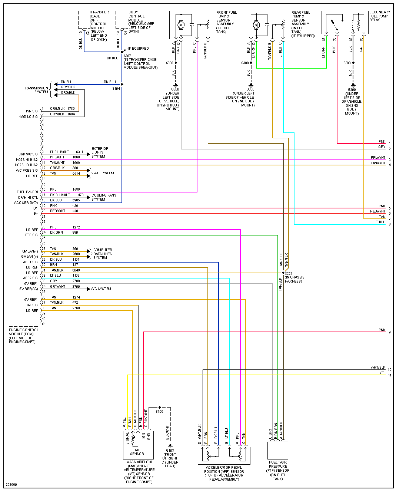
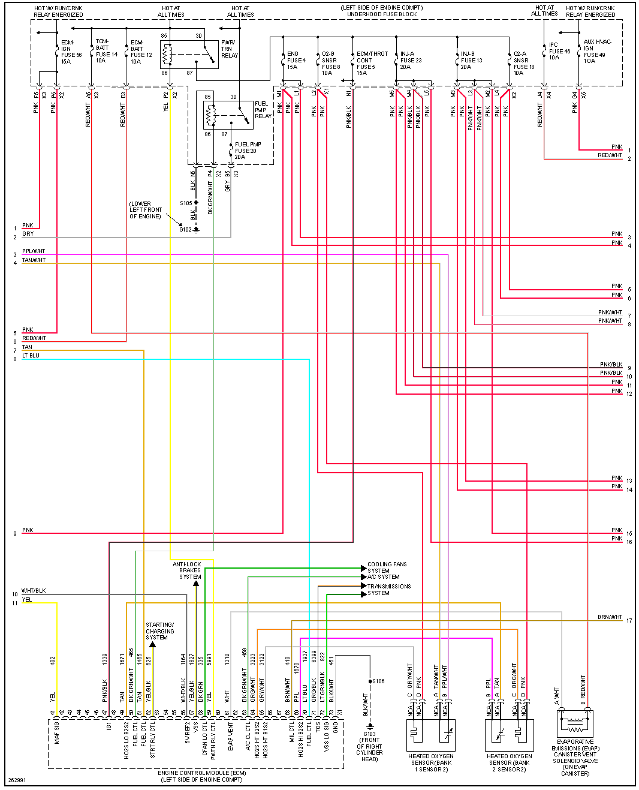
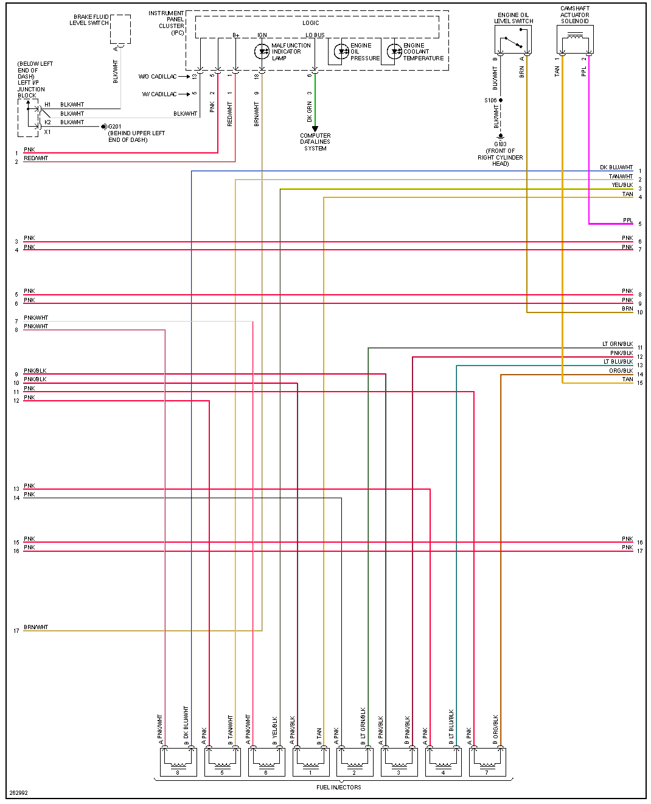
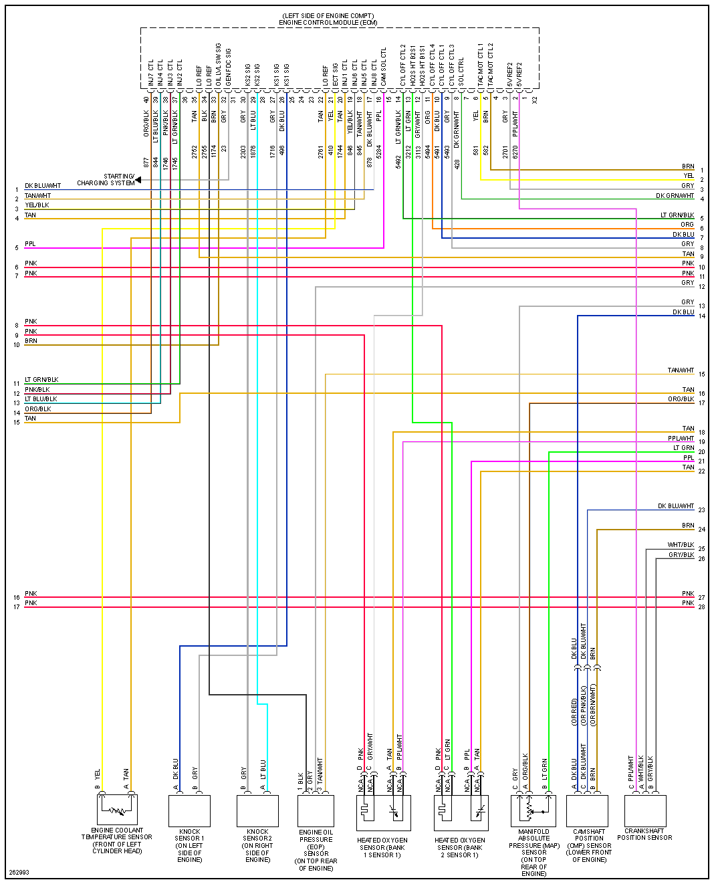
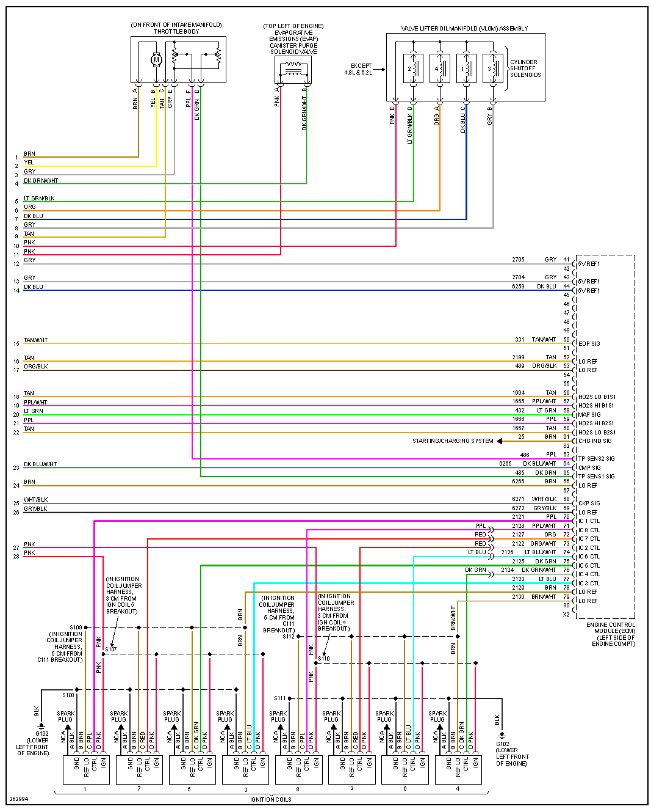

# Gen 4 LS

<https://github.com/rusefi/rusefi/wiki/GM-E38>

<https://github.com/rusefi/rusefi/wiki/GM-E67>

73+80   e38 ECM, used 07-14 trucks/suv

<https://www.maxxecu.com/webhelp/wirings-pluginecu-chevrolet_corvette_c6_e38_ecm.html>

<https://lt1swap.com/E38%20ECM%20Connector%20Pinouts.htm>

x+y+z E67 ECM used 2007+ envoy, trailblazer, saab 97x, rainier, impala ss, and others

<https://www.lt1swap.com/pcm_identification.htm>

E38 and E67 are very comparable in terms of processor speed, OS design, etc.

E67 was the "high IO" version, E38 simpler version

All PowerPC. There are early (2006-2009) and late (2010-2013) models of each which have incompatible / smaller-larger processors and cannot run the same OSes obviously. Early and late ECMs are plug and play with each other

If I had to make an educated guess, GM used the E67 for their GMPP (GM Performance Parts) control packs because they had more of them left over. The E38 was the more popular application by far.

## e67

<https://github.com/rusefi/rusefi/wiki/GM-E67>

## e38 2007 Tahoe 5.3

See also [Gen-5-LS](Gen-5-LS)
