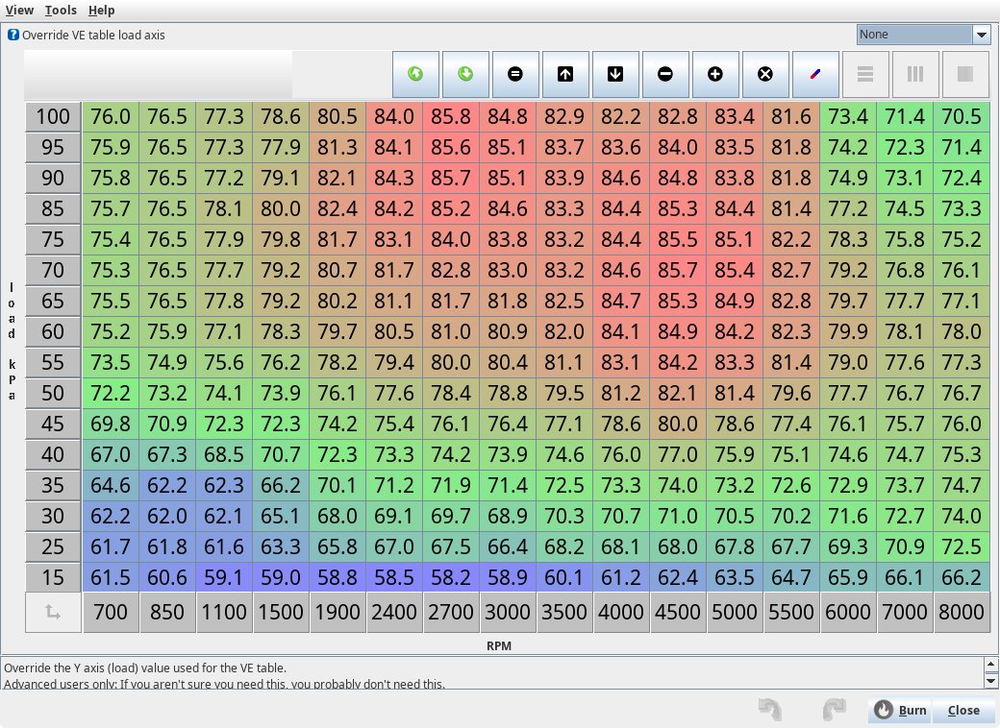
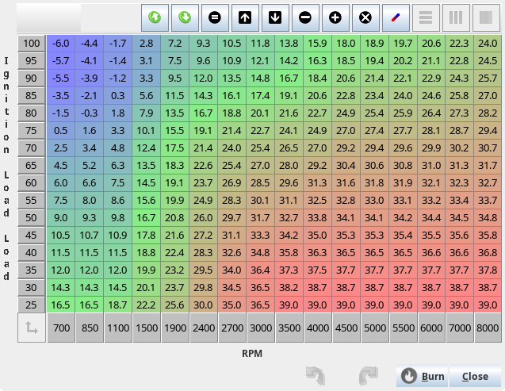

# Get Tuning with TunerStudio and your rusEFI ECU

Tuning is a subject too complex to be dealt with exhaustively in a short wiki page; the purpose of this page is to give you some pointers.

This tutorial assumes that you will be using the Speed Density fuel strategy, which is good for peak power applications.

## Prerequisites

* You have followed the [Performing the First Start On a New rusEFI Install](HOWTO-Start-An-Engine) guide and have set your timing.
* You have gotten your engine to run, or at least sputter, using your rusEFI ECU.
* You have a PC which is running TunerStudio, and can connect it to the ECU.
* Your engine is attached to a dyno or is in a vehicle which is capable of driving on the road, track, or a dyno.
* All the main inputs and outputs needed to make an engine run are functioning correctly.

Inputs:

* [Trigger Inputs](Trigger-Configuration-Guide) (crank and cam(s))
* Manifold Air Pressure sensor*
* [Coolant Temperature](FAQ-Basic-Wiring-and-Connections#thermistors)
* [Intake Air Temperature](FAQ-Basic-Wiring-and-Connections#thermistors)
* [Wideband O2 Sensor](Wide-Band-Sensors)

*If you are using a Mass Air Flow sensor, the fuel-related sections of this guide are not for you, but other sections may be helpful.

Outputs:

* Fuel pump (if controlled by the ECU)
* [Ignition coil(s)](FAQ-Basic-Wiring-and-Connections#coils)
* [Fuel Injectors](FAQ-Basic-Wiring-and-Connections#fuel-injectors)
* [Idle Air Control Valve](FAQ-Basic-Wiring-and-Connections#idle-air-control-valve) or [Electronic Throttle Body](Electronic-Throttle-Body)

## Getting the Engine to Idle

This section assumes that you have a wideband O2 sensor installed and getting reasonable readings.
If your idle is rough and low, way too high, or oscillating wildly, the most likely issue is that your idle control is not set properly. Open the main idle control dialog under "Idle" -> "Idle Settings" and change the first setting to "Manual" (circled in yellow). This will allow you to manually control your idle setting. Then use the slider (circled in purple) to change your idle RPM.

If this doesn't do anything, chances are that your idle control has an issue and you need to do some troubleshooting of the hardware and basic settings.

Try to get your idle between 800 and 1200 RPM. Make sure it's not fluctuating much.
If you can change your idle to some degree with the idle control, but can't really get it right, chances are either your engine is running with a terrible air-fuel ratio or your ignition timing is way off.

### Adjusting the Idle Air-fuel Ratio

If your AFR is too high (probably > 15 for gasoline), you need to increase the amount of fuel delivered to the engine. If it's too low (typically < 10 for gasoline), you need to reduce the amount of fuel.

The quick and dirty trick is to tell your ECU that your injectors are smaller or larger than they really are. You can do this under "Fuel" -> "injection Settings" -> "Injector Settings". If you do this, remember to undo it when you are ready to properly tune your fuel table.

The proper way to achieve the correct AFR is by adjusting the Volumetric Efficiency table. Open the "Fuel" -> "VE" table. The region of this table relevant to idling is near the lower left-hand corner.

The x-axis is RPM, and the y-axis is the engine load (typically Manifold Air Pressure or Air Mass). With the engine running, TunerStudio will display a little dot indicating which VE cell your engine is currently running in. Please note that your engine will almost never be using a value precisely in the center of a cell. It will usually interpolate between four neighboring cells. It's usually a good idea for rough-tuning to change a whole set of 3x3 cells or so at once. Maybe even 4x4 cells. We can worry about fine-tuning later. It is also recommended to use fairly significant changes for rough tuning. If the engine is running lean, add maybe 20%. If it's too rich, lean it out by 20%. Don't be shy. So, if your AFR is too high, let's say 16, mark the 9 cells around where the engine is running right now and multiply their values by 1.2. You can do this by selecting all 9 cells with your mouse and then hitting the asterisk key on your keyboard. Or, if your AFR is too low, multiply by 0.8 to reduce the amount of fuel injected by 20%.
Don't worry about getting this "just right" for now. All we want is a fairly smooth idle. We don't really care if it's rich or lean. 1200 RPM and an AFR of 10.5 works.

Note that if you end up running the engine super-rich for extended periods of time, you should change the oil. You will likely have a substantial amount of fuel that has been washed into the oil. Fuel is not a great lubricant.

## Fuel tuning

### Some quick theory

Most people who use an aftermarket ECU are looking to get around the track faster. This section assumes you are looking for fast track times. This commonly means you are looking for minimal fuel consumption when you are maintaining or decreasing speed, then max power when you are at higher engine loads. Each person will prefer a different power vs. fuel efficiency balance at a given RPM and load. The below graphic shows how you vary horsepower as you change AFR.

For an example of a light load, let's say you have a V8 in a Miata and you are approaching a turn. In this scenario, you might have a load of around 20%. You don't need much power and you want to minimize fuel consumption, in order to get the most out of the fuel in the tank, so in this region your tuning table should have a target AFR of about 16. On the other hand, when you are at 80% to 100% load you likely want all the power you can squeeze from your engine. You'll want this part of the map to be something closer to 11.5 to 12.5. Between light load and wide-open throttle, you'll want a variety of AFRs based on your driving habits, race events, personal preferences, etc. You will take your best stab to guess what is the optimal way to get to the finish line fastest.

However, if you have a four-cylinder Miata, then your load under the light load scenario described above might be about 40% instead of 20%. If your four-cylinder Miata has a turbo, it could be around 30%. Different engine and vehicle combinations will require a tuning table that is adjusted differently at different points.

The tuning tables are mostly for tuning steady state conditions. There is also a bunch of tuning to deal with short-term dynamic conditions, cold engine conditions, etc. Everyone has a different tuning preference for a variety of reasons, some good, some not so good. This tutorial is going to make some suggestions; keep in mind there are going to be many different opinions and different reasons for doing things differently. This tutorial is just a suggestion, and will suggest you first start with a warm engine and tune the load table such that you get the AFRs that you are looking for, then tune the wall wetting, then tune the cold start conditions.

### Manual Tuning

Open TunerStudio and guess at your VE table; it will probably look similar to the one below:

Guess at your spark table; it will look something like this:

Once you have a guess that seems to keep things running, tune the fuel table by running TunerStudio and looking at your WBO2 AFR. Find a long hill, put it in high gear and put your foot to the floor. Keep adjusting the cell to keep your AFR at about 11.5 to 12.5. Doing this on a dyno is better as you don't really care about this range of AFR, you care about max power which is at an unknown AFR. Somehow adjust this for full load and keep an eye on your AFR. If you can't get the AFR in the 11.5 to 12.5 range, it likely means your fuel pump is not providing enough fuel. Once you achieve your desired AFR at full load, repeat for medium load, low load, etc, until you have a fuel table that you are happy with.

Once fuel is good, do the same with spark; adjust for max power and if possible tune with a knock sensor. If you detect knock, stop advancing, and back away by perhaps 2 to 4 degrees. Don't get too close to the absolute limit, as variations in temperature, pressure, carbon buildup, etc, could change this limit. Once spark is adjusted, go back and redo fuel, then again back to spark; keep doing this until they are both perfect.

### Auto-tuning via TunerStudio

*Requires a registered version of TunerStudio.*

But before we get to the exciting subject of tuning, there is the slightly more boring subject of target AFRs. These are defined in the table found at "Fuel" -> "Target AFR". To start with, having a value of 14 in all cells is probably good enough.

You can get a bit more creative and use something like this:

Eventually, you'll want something more like this:

Let's talk about stoichiometry:
A stoichiometric mixture of fuel and gas is where every oxygen molecule gets fully burned by the fuel and all the fuel is burned by the oxygen. So there's no excess oxygen and no excess fuel. If you have excess oxygen, the mixture is lean. If you have excess fuel, the mixture is rich. With regular gasoline, the stoichiometric mixture is about 14.7. This means you need 14.7 pounds of air to burn 1 pound of fuel. This is what a wideband O2 sensor displays.
Rich is safer than lean. Rich mixtures tend to burn more slowly and cooler. Lean mixtures burn hotter and faster, so there's more potential damage to your engine from running lean than from running rich. Also lean mixtures are more difficult to ignite than rich mixtures. While you may have trouble getting your engine to run nicely at an AFR of 15.7 (one point more than stoichiometric), your engine will run fine all day at an AFR of 13.7.
All this is to say that it's better to start out too rich than to start out too lean.

The auto-tuning procedure is similar to the manual tuning method, but instead of adjusting the VE cells manually, you set the desired AFR in a table, drive the vehicle, and TunerStudio will adjust the cells to achieve the AFR that you have targeted. While it is effective, peak power can be obtained using a dyno, not by AFR measurements. Auto-tuning is great for those who don't have a dyno, but if you are looking for peak power, you really need one.

### Wall Wetting Tuning

Once it's operational, you will now want to tune the dynamics in order to achieve faster throttle response.

### Cold Temperature

Once it's working well and reacts well to quick changes in throttle, you'll want to tune cold temperature enrichments so that it starts nice and easy.

### See Also

* [Fuel Overview](Fuel-Overview)
* [Ignition](Ignition)
* [Idle Control](Idle-Control)
* [Some tips on the rusEFI Forum](http://rusefi.com/forum/viewtopic.php?f=2&t=1124&p=21278)

## Share your tune

### Take Notes and Collect Information

We all benefit from sharing the tune, so we would like to suggest that you share it. Sharing your tune allows others to find issues with it or use it as a starting point for their own tunes. By sharing your tune, we can better help you when you are doing your initial configurations. Your tune isn't something you need to protect by keeping it secret, so share it with the world and we all can benefit!

[rusEFI Online](Online) is our preferred tune upload location.

Take notes about your setup, preferably including whatever parameters you can provide, for example:

* Intake components
* Exhaust
* Cam
* Pistons
* Geographical location
