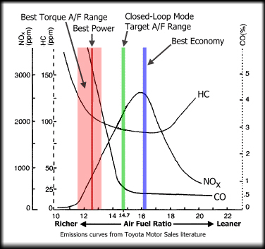
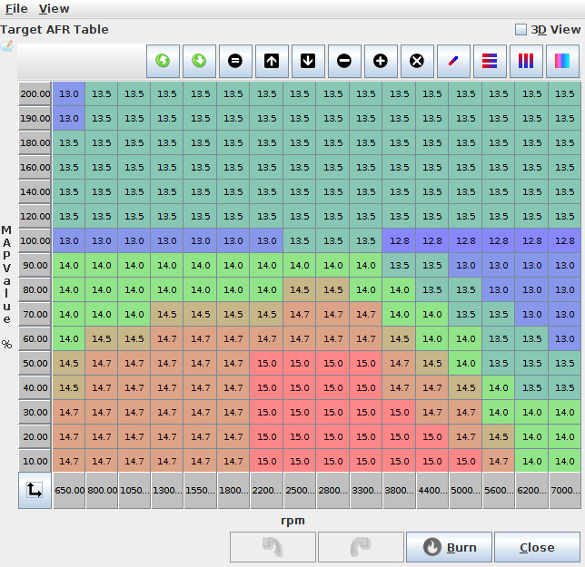
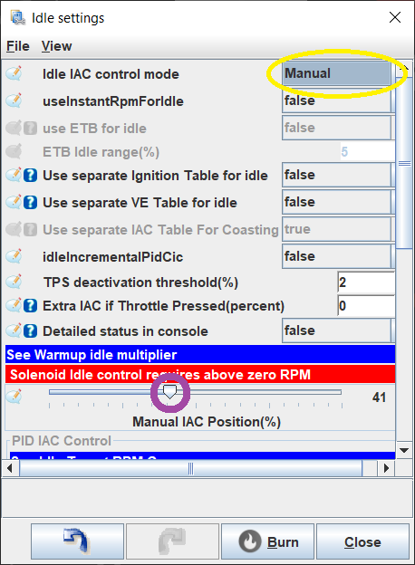
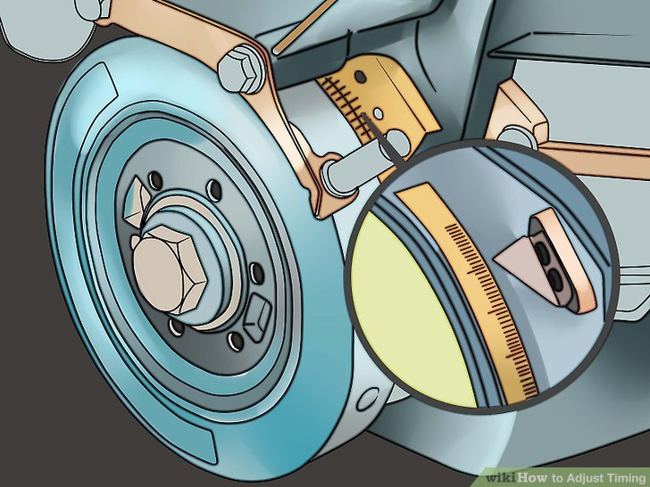
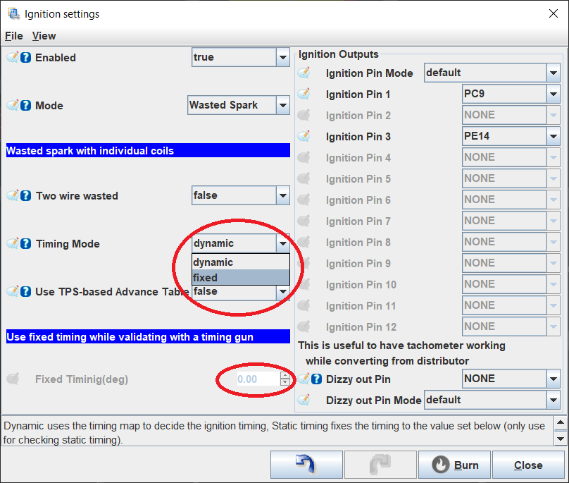

# Get Tuning with TunerStudio and your rusEFI

## Prerequisites

This section assumes

* You have hardware connected to an engine.
* You can connect to the rusEFI board with a USB cable, or some communications stream.
* You have a PC which is running Tuner Studio, and can connect it to the board
* You have calibrated the sensors like TPS, MAP, crank decoder, etc
* WO2 or tail pipe probe to measure your AFR or HP.
* This tutorial assumes that you want speed density, which is good for peak power applications and it's assumed you are tuning the load tables.

## Fuel tuning

### Some quick theory

Most people who do the after market ECU are looking to get around the track faster. This section assumes you are looking for fast track times. This commonly means you are looking for minimal fuel consumption when you are maintaining speed or decreasing speed, then max power when you are at higher engine loads. Every person will be differ in what RPM and loads they want power vs fuel efficiency. The below graphic shows how you vary horse power as you change AFR.

If you have a V8 in a Miata, and you need a lite load perhaps like when approaching a turn, you might have a load around 20%. At this point you have enough power and you want to minimize fuel consumption. Such that you get the most out of the fuel in the tank. Then when you are say 80% or 100% load you want maximum power, as you do not have enough power and you want every Hp you can get. So your tuning table around the 20% would be tuned to have an AFR around 16, while when at 100% load your tune will be tuned for something closer to 11.5 to 12.5, and a variety of AFRs based on your driving habits, race event, personal preferences etc. You will take your best stab to guess what is the most optimal way to get to the finish line fastest.

However if you have a 4 cyl Miata, then your load under the same conditions as noted above would be about 40% instead of 20%, which means your tuning table will be adjusted differently at different points. As well if you have a 4 cyl Miata with a turbo, you might be at around 30% under these same conditions.

The tuning tables are mostly for tuning the steady state conditions. There is also a bunch of tuning to deal with the short term dynamic conditions, as well there is tuning for cold engine conditions, etc. Every one has a different tuning preference for a variety of reasons, some good some not so good. This tutorial is going to make some suggestions and keep in mind there are going to be lots of different opinions and different reasons for doing things differently. This tutorial is just a suggestions, and will suggest you first start with a warm engine and tune the load table such that you get the AFR's that you are looking for. Then tune the wall wetting, then tune the cold start conditions.

## Quick version

### Manual tuning via TS

Open TS, and guess at your fuel table, it will probably look similar to the below.

Guess at your spark table it will look something similar to this

[insert picture]

Once you have a guess that seems to keep things running, tune 100% by running TS and looking at your WO2 AFR, find a long hill put it in high gear and put your foot the the floor. Keep adjusting the cell to keep your AFT at about 11.5 to 12.5. Doing this on a dyno is better as you don't really care about this range of AFR you care about max HP which is at an unknown AFR. Some how adjust this for full load and keep an eye on your AFT. If you can't get the AFT in the 11.5 to 12.5 range, it likely means your fuel pump is not providing enough fuel. Once you know full load, do this for medium load, low load, etc, until you have a fuel table that you are happy with.

Once fuel is good, then do the same with spark, again adjust for max power and if possible tune with a knock sensor. If you detect knock stop advancing, and back away by perhaps 2 to 4 degrees. Don't get to close to the absolute limit, as variations in temperature, pressure, carbon build up, etc could change this limit. Once spark is adjusted, go back and re-do fuel, then again back to spark, keep doing this until they are both perfect.

### Auto tuning via TS

This requires a resisted version of TS. The general procedure here is similar to the manual tune method, but you set the desired AFR in a table drive it around and TS will adjust the cells to get the AFR that it's commanded to get to. While is is effective, peak power can be obtained via dyno, not by AFR measurements, so this is great for those that don't have a dyno, but if you are looking for peak power, you really need a dyno.

### Wall wetting tuning

Once it's operational, you now want to tune the dynamic such that you get faster throttle response.
TBD

### Cold temperature

Once it's working well and reacts well to quick changes in the long pedal, you'll want cold temperature enrichments such that it starts nice and easy.
TBD

### See Also

- [Fuel Overview](Fuel-Overview)
- [Ignition](Ignition)
- [Idle Control](Idle-Control)
- [this forum thread](http://rusefi.com/forum/viewtopic.php?f=2&t=1124&p=21278)

## Share your tune

### Take notes and collect information

We all benefit from from sharing the tune, so we would like to suggest you share it. By sharing it others may notice issues with your tune, as well it can function as a starting point for other which you have likely used when you did your tune. By sharing your tune, we can better help people when they are doing their initial configurations. After all it's not like your tune is something you need to protect and can't share, so we would find it nice if you were to share your tune.

Take notes about your setup, preferably including what ever parameters you can provide, like what you have for intake components, exhaust, CAM, pistons, geographical location, ect. We hope to have a web page form that can be used to simplify the process. For now, we hare hoping you can post it in the forum, or e-mail it to a developer.

### Post on forum or e-mail the tune

Find the forum sub section where people are sharing tunes, then fill out your posting the with the suggested XYZ format. At the time of writing this most of this tuning sharing stuff new and pre-alpha.

Obviously tuning is a subject too complex to be dealt with exhaustively in a short wiki page. So all we can do here is give you some pointers. At this point we assume that you got the engine to run, or at least sputter using your rusEFI. All your main inputs and outputs needed to make an engine run OK are working.

This should be at least:
Inputs:

* Trigger Inputs (crank and cam or cams)
* Mass Airflow Meter* or Manifold Air Pressure sensor
* Coolant Temperature
* Intake Air Temperature
* Wideband O2 sensor would be really great to have too

*Using a Mass Airflow Meter assumes that you have a known MAF transfer function for your specific Mass Airflow Meter

Outputs:

* Fuel pump (if controlled by ECU)
* Ignition coil(s)
* Fuel Injectors
* Idle Air Valve or other Idle Air Controller

Now we need the engine to idle acceptably, so we can check base timing. If your engine idles fine and your Air-fuel-ratio is within the acceptable range (let's say between 11 and 15 or so), continue to the base timing section.

## Getting the engine to idle

This section assumes that you have a wideband O2 sensor installed and you get readings that make some sort of sense.
If your idle is just rough and low, or way too high, or maybe oscillating wildly, the most likely issue is that your idle control is not set right. Open the idle control main dialog under "Idle" -> "Idle Settings" and change the first setting to "Manual" (circled in yellow). This will allow you to manually control your idle setting. Then use the slider (circled in purple) to change your idle rpm.

(If this doesn't do anything, chances are that your idle control has an issue and you need to do some troubleshooting of the hardware of basic settings). Try and get your idle to between 800 and 1200 rpm or so. Make sure it's not fluctuating much.
If you can change your idle to some degree with the idle control, but can't really get it right, chances are either your engine is running with a terrible air-fuel-ratio or possibly your ignition timing is way off.

### Adjusting idle air-fuel-ratio

If your AFR is too high (probably > 15 for gasoline), you need to increase the amount of fuel delivered to the engine. The quick and dirty trick is to tell your ECU that your injectors are smaller than they really are. You can do that under "Fuel" -> "injection Settings" -> "Injector Settings". Alternatively, if your AFR is too low (typically < 10 for gasoline), you need to reduce the amount of fuel delivered. So the quick and dirty trick is to cheat and tell the ECU that the injectors are bigger than they actually are.
If you use this, make sure to remember to undo it when you are ready to properly tune your fuel table.

You can also adjust the AFR the proper way by adjusting the Volumetric Efficiency. Open the "Fuel" -> "VE" table. The area on the left side, towards the bottom contains the cells that are used in the calculation for how much fuel is to be injected with each cycle when idling.

The x-axis is your rpm, the y-axis is your engine load (typically Manifold Air Pressure or Air Mass). With the engine running, TunerStudio will display a little dot indicating which VE cell your engine is currently running in. Please note that your engine will almost never be using a value precisely in the center of a cell. It will usually interpolate between 4 neighboring cells. It's usually a good idea for rough-tuning to change a whole set of 3x3 cells or so at once. Maybe even 4x4 cells. We can worry abotu fine-tuning later. It is also recommended to use fairly significant changes for rough tuning. If the engine is running lean, add maybe 20%. If it's too rich, lean it out by 20%. Don't be shy. So, if your AFR is too high, let's say 16 , mark the 9 cells around where the engine is running right now and multiply their values by 1.2. you can do this by selecting all 9 cells with your mouse and then hitting the asterisk key on your keyboard. Or, if your AFR is too low, multiply by 0.8 to reduce the amount of fuel injected by 20%.
Don't worry about getting this "just right" for now. All we want is a fairly smooth idle. We don't really care, if it's too rich, or too high. 1200rpm and an AFR of 10.5 works. Just don't run it like that for 5 hours*.

(* if you've been running the engine super-rich for extended periods of time, change your oil. You will likely have a substantial amount of fuel that has been washed into your oil now. Fuel is not a great lubricant)

### Adjust base timing

Now that you have a somewhat smooth idle, it's time to adjust your base timing. In order to do this, you must have some sort of timing mark on your crank pulley and some pointer on the engine block. You need to know what the ignition timing is, when the two are lined up.

We are working on the assumption that your ECU has a "safe" spark advance tune already uploaded. This would be a tune that allows the engine to run reasonably well with 93 Octane (US super) fuel without excessive detonation (ping) or pre-ignition, but is not yet optimized for hp or economy.

Borrow your neighbor's timing light and hook it up, following the original instructions for the timing light that your neighbor kept carefully locked away and absolutely grease-free for the last 25 years. Chances are, if the engine is running smoothly, you are within +/- 25 degrees of where you are supposed to be.

In order to get this just right, you need to change your timing from "dynamic" to "fixed". Open "Ignition" -> "Ignition Settings" and set "Timing Mode" to "fixed". Set the "Fixed Tinming(deg)" to whatever the value is when the mark on your crank-pulley lines up.

This is very often 10 degrees or something thereabouts. Now check with your timing light if the marks line up. If they do- great. Your base timing is set. Go ahead and change your timing mode back to "dynamic".
If the marks don't line up, you need to adjust your trigger settings. Go to "Base Engine" -> "Trigger" and adjust "Trigger Angle Offset(deg)" until your timing mark lines up.
Once this is done, don't forget to change your timing mode back to "dynamic" or you will continue to run on fixed timing and give up a ton of horsepower/fuel economy and have some REALLY high exhaust temperatures.

## Time to Tune your VE table with TS AutoTune

This is assuming that you are using the purchase version of TunerStudio with Autotune enabled. If you are planning on tuning your fuel table manually, you probably know what you're doing and don't need to read this wiki.

But before we get to the exciting subject of tuning, there is the slightly more boring subject of target AFRs. These are defined in the aptly named target AFR table. Go to "Fuel" -> "Target AFR" and to start with having a value of 14 in all cells is probably good enough. Or you can go a bit more creative and use something like this.

Let's talk about stoichiometry:
A stoichiometric mixture of fuel and gas is where every oxygen molecule gets fully burned by the fuel and all the fuel is burned by the oxygen. So there's no excess oxygen and no excess fuel. If you have excess oxygen, the mixture is lean. If you have excess fuel, the mixture is rich. With regular gasoline, the stoichiometric mixture is about 14.7. This means you need 14.7 pounds of air to burn 1 pound of fuel. This is what a wideband O2 sensor displays.
Rich is safer than lean. Rich mixtures tend to burn more slowly and "cooler". Lean mixtures burn hotter and faster, so there's more potential damage to your engine from running lean than from running rich. Also lean mixtures are more difficult to ignite than rich mixture. While you may have trouble getting your engine to run nicely at an AFR of 15.7 (one point more than stoichiometric), your engine will run fine all day at an AFR of 13.7.
All this is to say that it's better to start out too rich than to start out too lean.

Now we are assuming at this point that your engine is at least idling and you can hopefully keep it alive if you give it some throttle. Maybe it even runs alright through most of the normal operating range. This would be the case if you received a fuel base map from some engine that is at least similar to your engine.
