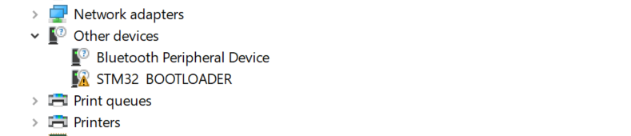

# How to DFU

DFU is Device Firmware Update mode - that's a way to update firmware via the same USB cable you use for rusEFI communication. DFU is a feature of the STM32 factory bootloader and we expect that any rusEFI board can be updated or reset via the same USB connector as the one you use to communicate with your rusEFI ECU. Please let us know if that's not the case!

*Auto DFU* is when rusEFI Console switches your rusEFI device into DFU mode.

*Manual DFU* mode is when you hold the "Program" button while powering your rusEFI in order to switch it into DFU mode. This mode is
used to program brand new STM32 chips which do not have a running version of rusEFI firmware.

[HOWTO DFU video](https://www.youtube.com/watch?v=VdvXYgv_acg)

On a STM32F4 Discovery, entering DFU mode requires putting a jumper between the pins VDD and BOOT0, then powering or resetting the board.

*__Q:__ I have "STM Device in DFU Mode" in Device Manager and rusEFI console does not update firmware. What's wrong?*  
__A:__ As of Oct 2021 rusEFI console uses the "newer" ST DFU driver. You would need to remove the older "STM Device in DFU Mode" driver. Hit "Remove Device" with "Remove Drivers" checkbox. Once you've removed the newer "STM Device in DFU Mode" driver re-install the DFU driver using the rusEFI console driver button. Alternatively install the driver manually from the drivers\silent_st_drivers\DFU_Driver folder.

*__Q:__ What's the meaning of this image?*  

__A:__ This image says that you do not have STM32 Bootloader driver installed.

*__Q:__ Do I need to install STM32CubeProgramer in order to update firmware via DFU?*  
__A:__ No. We have a small portion of STM32CubeProgramer embedded into rusEFI console, even the drivers! Make sure to download a complete fresh bundle, then use the "Install Drivers" button to automatically extract the silent_st_drivers2.exe archive and attempt to auto-install. If automatic driver install did not happen try pointing the Device Manager driver wizard at drivers\silent_st_drivers\DFU_Driver folder within the uncompressed rusEFI bundle.

*__Q:__ I am using the buttons but it simply does not work?*  
__A:__ We have a report of this [on the forum](https://www.rusefi.com/forum/viewtopic.php?p=42317#p42317). For now, please keep trying!

*__Q:__ How do I do this in macOS or Linux?*  
__A:__ rusEFI console firmware functionality currently runs on Windows only.

*__Q:__ Do you have any ST-Link provisions?*  
__A:__ Some boards have Tag-Connect-TC2030 upwards three of those! Some boards have an unofficial (?) ST-Link V2 pinout. Both are intended for software developers while debugging issues, those are not intended for firmware update/recovery.
