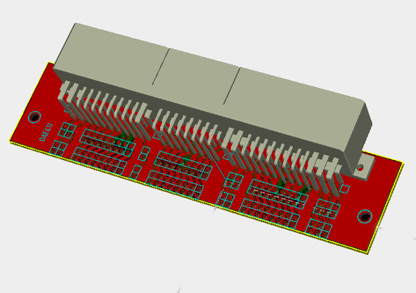

# Get Running With a Wire-in ECU

## Summary

So you either have hardware under way, or are considering getting rusEFI hardware. This manual is intended for those that are using purchased hardware. If you are not, don't worry, we also encourage DIY and like hearing back from those that have. We also encourage people to use the purchased boards as a starting point for a DIY effort, feel free to modify the board we'll likely make suggestions on how to make your effort better.

## Plan the Engine Wiring

The engine will need wires that connect to various sensors and devices. You will need crimp tools, soldering tools, and certain electrical and mechanical skills.

We suggest that before you purchase hardware, that you create a plan with a schematic. Even if the schematic is on a napkin, I suggest you take picture of it with your phone or scan it in and get feedback from members in the forum. We can help steer you to a successful build.

You are going to need to know technical details about below referenced items.

See our partial list of [sensors and actuators](Pages-Sensors-and-Actuators).

### Crankshaft and Camshaft Position Sensors

- Are they Hall or Variable Reluctance (VR) sensors?

See [Triggers](Trigger)

See [VVT Overview](VVT)

### Injectors

- Is it a high or a low impedance injector?
- What is the flow rate?

See [Fuel Injectors](Fuel-Injectors)

### Temperature Sensors

- Oil temperature
- Coolant temperature
- Air intake temperature

- NTC sensor curves

See [Temperature Sensing](Temperature-Sensing)

### Air Mass or Pressure Sensor

Does your engine have a Mass Air Flow (MAF) sensor, a Manifold Absolute Pressure (MAP) sensor, or both?

See [Mass Air Flow Sensor](MAF)

### Lambda Sensor

**A wide band oxygen sensor is required**

See [Wide Band Sensors](Wide-Band-Sensors).

### Throttle Control

See [Electronic Throttle Body](Electronic-Throttle-Body).

### Idle Air Control Valve (IACV)

If you're not using an Electronic Throttle Body (ETB), you will need an Idle Air Control Valve (IACV)

See [Idle Control](Idle-Control)

### Ignition Coils

See the [Vault Of Ignition Parts](Vault-Of-Ignition-Parts) for a few of the ignition coils that have been used with rusEFI.

### Engine Characteristics

- total number of sensors
- number of cylinders
- turbocharged or natural aspiration
- single or dual spark

### ECU Connector(s)

- number of pins
- shape of connector

[OEM connectors](OEM-connectors)

### Start Ordering Components

Once you have a plan, you can start making a bill of materials. You'll likely be purchasing harnesses, wires, connectors, and all sorts of things. You may have to do junk yard runs to get certain hard to obtain items, ect. If you have your rough schematic at arms length, it will really help you know what you need and when you'll need it.

## Preparing your engine

### Physically Locating the Controller

Place some place that is away from hot items like the exhaust. Mount on a piece of steal that can function as a heat sink. Preferably in a dry well ventilated location, were the wires can be easily routed to and from.

### Route the Wires and Harnesses

- Start by drawing our your engine layout. This an be as simple as a sketch on a napkin or pizza box. This is handy as it tracks how many injectors you need, what kind of IAC, TPS, IAT, ect options you need.

- It is recommended you route your wires in two different groups, analog and digital/high power. This helps ensure good signals make it to and from the ECU.

- Wire size and fusing go together. The fuse is used to protect the wire against electrical fire. So the wire you can use depends largely on the upstream fuse you select. High-Z injectors are going to draw about 1A, so you can technically get by with tiny stuff like 24AWG or 22AWG. However that is generally not very strong and is prone to breaking and failure. So you would be well advised to follow the NFPA79's suggestion to use a min of 18AWG, as smaller is easily mechanically damaged. In terms of electrical sizing this is very much over sized, which is only suggested to get more rugged mechanical properties.

- You should always reference the MFG's specifications for the wire you are using, as different insulation's have different properties. Some wire is rated for 30A in 18AWG wire, but that is some really special wire which is rated for such conditions. See this general suggestion for general fusing.
  - 18AWG, no larger than a 15A fuse
  - 20AWG, no larger than a 10A fuse
  - 22AWG, no larger than a 7A fuse
  - 24AWG, no larger than a 3A fuse
 Those fuse sizes are based on [this table](http://www.powerstream.com/Wire_Size.htm) for chassis wiring.

- When selecting a fuse, you can use the below guide to help. Generally you choose the fuse and wire based on what the load needs. If your load is 1A capable, you need wire and fusing that can provide at least 1A. However you don't want too large of a wire as it adds costs, or the wire size might be to large for certain connectors, etc.

    [Littelfuse Fuseology](http://www.littelfuse.com/~/media/automotive/catalogs/littelfuse_fuseology.pdf)

- Take note there is a fatigue issue known as I2t (That's amps squared time) which is a common reason for failures after several cycles.

- If you want to properly select a fuse, you really need a scope with a current measurement probe, then choose the I2t with the suggested method in the PDF. If you do not have such a scope, make sure to have extra fuses on hand just in case it blows a fuse some time down the road.

    [Littelfuse Mini Data sheet](http://www.littelfuse.com/~/media/automotive/datasheets/fuses/passenger-car-and-commercial-vehicle/blade-fuses/littelfuse_mini_datasheet.pdf)

- Check in the forums for additional information. Often members can identify bumps in the road before you hit them. Forum members can also make suggestions that could make things go smoothly.

- If you do something cool, or new, feel free to share in the forums, Discord, Github, e-mail or where ever. It's common that someone doing something new and cool will get more help than someone doing the same old thing.

### Connecting ECU if it's Not Plug-and-Play

- Start by getting junk yard ECU
- Delicately break apart the junk yard ECU salvaging the ECU connector and perhaps the enclosure.

- If you have a connector that has a break out PCB board for it, you probably want to obtain the break out PCB for that harness connector. If not you can simply solder wires direct to the connector. Similar to [this - Forum](http://rusefi.com/forum/viewtopic.php?f=4&t=507)

- It will likely be helpful to get a partial harness from a junk yard, and switch to rusEFI circuit-by-circuit.
- Use junk yard harness to make extension harness. Use the junk yard ECU connector to break out the wire harness to the breakout board. Then from the far side of the breakout board, install the junk yard harness connector. Then connect the original ECU. This should allow you to start and run then engine as normal.

### Prepare Engine Wiring

- Connect TPS, MAP, IAT, and other such analog signals to the IO board.
- Connect 12V system / battery to the IO board connector.
- Calibrate the sensors using TS and Java console as required.
- Crank engine and see RPM's are registering correctly on the Java Console.
- Connect LED to pins TODO, which will blink at TDC. Verify that TDC is correct by shining on a crank wheel like a timing light. PS: actually right now we do not have this - see [this issue](https://github.com/rusefi/rusefi/issues/297) and [this issue](https://github.com/rusefi/rusefi/issues/2732) and [this issue](https://github.com/rusefi/rusefi/issues/3120)
- Connect injectors and ignition as required and see if it will start.

### Test Engine Wiring

Once connected you should test the wires. Especially the power wires like coil wires and injector wires. A poor connection with a slight resistance like .1 ohms can cause an electrical fire, which I'm sure you do not want. Once everything is connected measure both the voltage drop and current from the ECU connector, or where ever is applicably appropriate. Using your voltage and current readings, calculate the ohms, if it's above about .1 ohms fix the issue. Take note that .1 ohms at 1A is about .1watt that that connection will have to dissipate. If you have a 12 cyl, and 12 .1 ohm connections, the connector will have to dissipate 1.2 watts.

### Test Outputs

Both rusEFI Console and TS allow you to test if rusEFI properly controls things like injectors (you would hear the clicks), cooling fan (you would hear it - if needed), fuel pump (you would usually hear it - if needed), ignition coil (that's challenging if you have a distributor)

## Start Your Engine

See [Performing A First Start On A New rusEFI Install](HOWTO-Start-An-Engine)
