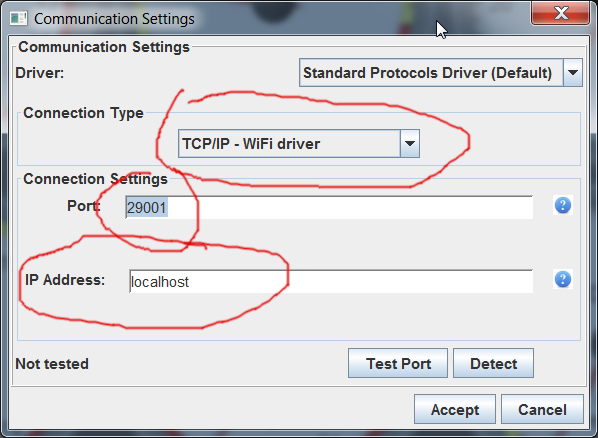

Remote tuning is possible over Internet using rusEFI TunerStudio plugin if rusEFI ECU is connected to the internet.

There are three ways to connect rusEFI to internet:

1) "Broadcast" tab of rusEFI TunerStudio plugin.
2) rusEFI network_connector tool running for instance on Raspberry Pi or similar Single Board Computer
3) [rusEFI Android application](rusEFI-Android.md)

Connecting to remote ECU is a two step process:
First you connect rusEFI TunerStudio plugin to remote controller via Internet, and then you connect TunerStudio to rusEFI TunerStudio plugin locally. IP Address "localhost" Port default value 29001.

