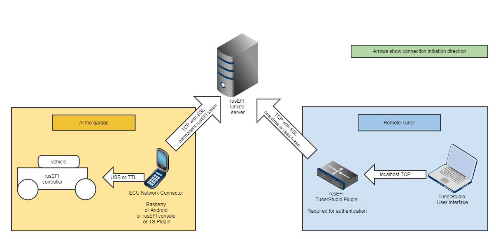

# Remote Tuning

Remote tuning is possible over the internet using the rusEFI TunerStudio plugin if the rusEFI ECU is connected to the internet.

There are three ways to connect rusEFI to the internet:

1. "Broadcast" tab of rusEFI TunerStudio plugin.
2. rusEFI network_connector tool for running an instance on a Raspberry Pi or similar Single Board Computer
3. [rusEFI Android application](rusEFI-Android)

Connecting to remote ECU is a two step process:  
First you connect rusEFI TunerStudio plugin to remote controller via Internet, and then you connect TunerStudio to rusEFI TunerStudio plugin locally.

- IP Address "localhost"
- Port (default value): 29001

