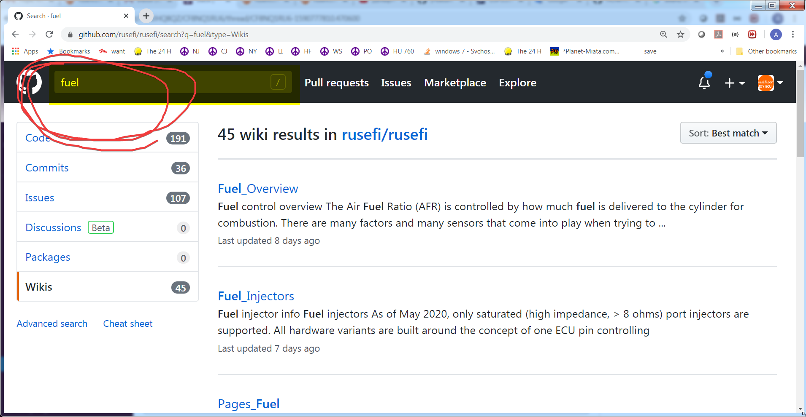

# HOWTO Search on rusEFI Github Wiki

## Search wiki.rusefi.com

[wiki.rusefi.com](https://wiki.rusefi.com/) has a search box of its own - the magnifying
glass in the header of every page. It indexes the wiki down to individual section
headings, so a result takes you to the right part of a page rather than just the top of
it. This is the quickest option and usually the only one you need.

## Search the GitHub mirror

It's weird but it's possible!

[Click here to search on rusEFI wiki](https://github.com/rusefi/rusefi/search?type=Wikis) - type your query in top-left corner of the page.

This searches the copy of the wiki mirrored into the `rusefi/rusefi` GitHub wiki. The
source of these pages lives in
[rusefi_documentation](https://github.com/rusefi/rusefi_documentation) and every change
there is pushed to that mirror automatically, so the two hold the same pages.

## When the wiki does not have it

Plenty of rusEFI knowledge lives outside the wiki:

- **Firmware source, issues and pull requests** - search the
  [rusefi/rusefi repository](https://github.com/rusefi/rusefi).
- **Board pinouts** - these are not in the wiki, they are at
  [rusefi.com/docs/pinouts](https://rusefi.com/docs/pinouts/).
- **Discussion and build threads** - the [forum](https://rusefi.com/forum/) goes back
  further than most of these pages.
- **Ask a person** - see [Support](Support) and [Discord](Discord).

## Related pages

- [Support & Community](Support) - the forum, Discord and how support works.
- [Discord](Discord) - the chat, where most questions get answered fastest.
- [FAQs and HOWTOs](Pages-FAQ-and-HOWTO) - index of the FAQ and HOWTO pages.
- [Info Vaults](Pages-Info-Vaults) - the collected lists and data dumps.
