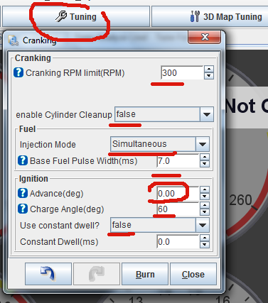
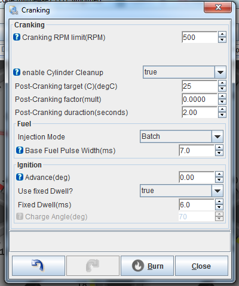

# Performing A First Start On A New rusEFI install

*This page is a work in progress and will be completed in the coming months, please bear with us*

One of the toughest aspects of any new ECU install is the first start of a new engine. It is an issue a lot of users find so hopefully this comprehensive first start guide will help but clarifying the purpose of the settings and providing some best practice procedures.  

Before you can even try to start the engine you have to get some of the basics right:

- You have to have the engine cranking well with the starter, if the engine cranks lazily then fix that first. You need a good strong consistent cranking speed.
- You must have known, good sensors with a correct calibration. Without this you have no hope of getting things to work in the long run so be sure you have a correct working MAP/MAF, CLT, IAT, TPS and Fuel pressure sensor if you have it.  
- You must be sure you have fuel pressure, without a working fuel pump and functional fuel pressure regulator you are not going to get a good start up, if the engine is a dead head fuel line or has a fuel pressure sensor then the same applies and I will address that in the correct section as they are special cases.  
- Idle air: check that your throttle is correctly adjusted with its idle stop, your IAC works or your ETB config is correct for idling the engine.  
- Injectors and ignition coils: Again you need to be sure you have the correct information on your injectors and coils, without this you wont be able to set the dead times, flow rate or dwell correctly.  
- Injectors and ignition coils need to be bench tested to check that each one is wired and set to the correct ECU channel. This is critical, incorrect wiring or channel setting is like having the HT leads in the wrong order. You will fuel and spark the wrong cylinders.  
- Information on your crank trigger wheel is really really important, knowing the number of teeth on the trigger wheel and where the TDC offset is positioned is half the battle, if these are unknown then you will have to get that information before you can start up.  
- Finally, make sure there is fuel in it, the number one non-start issue is a dry fuel tank right up to pro level.  

Cranking - Step one.  

## Verify your crank sensor reads the trigger wheel  

This can be done before setting anything in the ECU and should be the first test done.  
To do this go into TunerStudio and disable the fuel injection and the ignition under each of the settings tabs.  

- Insert picture of each of the settings tabs  
Next go into the high speed logger and simply crank the engine. I recommend the rusEFI console for this job as it has a really good logger in the "engine sniffer" tab.
What you should see is the top row giving grey bars that match your expected trigger pattern. If you see no grey bars then you have no trigger events, this means you need to check your crank sensor works or your trigger channel is correct.
Hopefully you have grey bars showing your crank pattern. If your unsure of the pattern it makes a lot of sense at this point to grab a snapshot of the screen and compare it to the list of rusEFI compatible crank trigger patterns at the link below:
  - Insert link for trigger patterns  

## get tachometer showing correct cranking rpm

Your tuning software should show correct cranking RPM, usually between 150 and 300 with a fully-charged battery.

See also [Trigger](Trigger)

See also [Trigger Hardware](Trigger-Hardware)

## Confirm TDC position

Assuming you have the hardware ready to spark we now need to find your TDC position - we know trigger shape but we do not know the trigger wheel position in relation to TDC#1 (Top Dead Center, cylinder #1).

Set cranking advance angle to zero for now. Use a timing gun while cranking. We now need to try different values of Engine->Trigger->global trigger angle offset until we get spark at zero advance - that's because we might know the relation between TDC#1 and trigger signal.

On Engine Sniffer tab of rusEFI console TDC#1 is shown with the green vertical line.

## cranking parameters

rusEFI has separate cranking control strategy for your first couple of engine revolutions - usually you want more fuel, different timing and simultaneous injection to start an engine.

Engine would start rich, as long as it's not too rich, as long as you have close-enough cranking timing angle. By default, cranking mode is active if RPM is below 500 RPM.

To adjust cranking timing, use `set cranking_timing_angle XXX` command, where XXX is timing advance angle in relation to your trigger synchronization point. Please note that trigger synchronization point often does not match TDC, so just try different values between 0 and 720. For example, try 0, then 20, then 40 etc. Use `showconfig` to see current setting.

See also [Console Timing Commands](Dev-Console-Commands#timing-control)

To adjust cranking fuel, use `set cranking_fuel XXX` command, where XXX is number of total fuel squirt duration in milliseconds. See also [Console Fuel Commands](Dev-Console-Commands#fuel-control)

## running parameters

For first run I suggest running based on MAF sensor - even if you do not have MAF sensor, and flat maps.

`set algorithm 0` would set algorithm: plain MAF

To adjust running timing for your first run, use `set_whole_timing_map XXX` command, where XXX is your timing advance.

To adjust running fuel for your first run, use `set_whole_fuel_map XXX` command, where XXX is number of total fuel squirt duration in milliseconds. This value is usually between 3 and 12. See also [Console Fuel Commands](Dev-Console-Commands#fuel-control)

One plain MAF workk next step is running with proper MAP sensor calibration & flow rate setting.

## next steps & troubleshooting

There are three ways to produce similar logs - the intention is for these three to have same exact data.

1. SD card logging
2. rusEFI console logging
3. TunerStudio logging

See also [https://github.com/rusefi/rusefi/blob/master/firmware/console/binary/output_channels.txt](https://github.com/rusefi/rusefi/blob/master/firmware/console/binary/output_channels.txt)

See also [Error Codes](Error-Codes)

See also [Debug Fields](Debug-Fields.md)

## External links

[Fuel injectors at first start - Forum](https://www.youtube.com/watch?v=lgvt0mh_UB8)

## Diagnostics and trouble shooting of your engine

### Basic tests

List basic tests here, like is LED on, are jumpers installed correctly if applicable, find hot components and do basic visual checks for burn things and such.

### Test equipment tests

List tests that can be done with O-Scopes, multimeters, scan tools, and other such options for diagnosing a problem.

### Get help from a local

We provide much more info than most OEM options. If you are stuck, you may be able to get help from a local mechanic or someone local. Try asking for help in the forums there may be a member or a club meeting that's near by. It's common you can find local people who are willing to help.

### On board hardware diagnostics

Don't have a scope, no problem, the IO board has basic scope built inside. You can connect pin blah to nearly any point on the board and you can measure a variety of points synchronized with the logging software.
