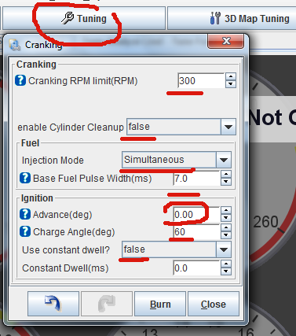

# Performing the First Start On a New rusEFI Install

One of the toughest aspects of any new ECU install is the first start of a new engine. It is an issue that a lot of users find, so hopefully this comprehensive first-start guide will help by clarifying the purpose of the settings and providing some best-practice procedures.

Before you can even try to start the engine, you have to get some of the basics right:

## Sensor Requirements

You must have known, good sensors with a correct calibration.

Without this you have no hope of getting things to work in the long run, so be sure you have a correct working MAP/MAF, CLT, IAT, TPS, and fuel pressure sensor if you have it.

See [How to Get Running With a Universal ECU](HOWTO-Get-Running) for more detailed sensor requirements.

## Ignition and Fuel & Injection System Requirements

### Fuel Supply

You must be sure you have fuel pressure; without a working fuel pump and functional fuel pressure regulator, you are not going to get a good start up. If the engine has a returnless fuel system or a fuel pressure sensor, the same applies.

Finally, make sure there is fuel in the tank; the number one non-start issue is a dry fuel tank right up to pro-level.

### Injectors and Ignition Coils

Again, you need to be sure you have the correct information on your injectors and coils; without this you won't be able to set the dead times, flow rate or dwell correctly.

Injectors and ignition coils need to be bench tested to check that each one is wired and set to the correct ECU channel. This is critical: incorrect wiring or channel setting is like having the HT leads in the wrong order. You will fuel and spark the wrong cylinders.

See [Bench Testing Outputs](Bench-Testing) for how to do this, from TunerStudio or from the console.

## Cranking Requirements

The engine must be cranking well with the starter. If the engine cranks lazily, fix that first. You need a good, strong, consistent cranking speed.

Check that your throttle is correctly adjusted with its idle stop, your idle air control valve works, and your ETB config is correct for idling the engine.

See [Cranking](Cranking) for more details.

## Verify Your Crank Sensor Reads the Trigger Wheel

Information on your crank trigger wheel is really really important, knowing the number of teeth on the trigger wheel and where the TDC offset is positioned is half the battle; if these are unknown then you will have to get that information before you can start your engine.

Check the [trigger input assignments](Trigger#trigger-input-assignments) and configure the inputs and expected pattern using the [Trigger Configuration Guide](Trigger-Configuration-Guide) and your ECU's wiring guide before cranking.

To do this go into TunerStudio and disable the fuel injection and the ignition under each of the settings tabs.

Next go into the high-speed logger and simply crank the engine. The rusEFI Console is the best tool for this job as it has a really good logger in the "engine sniffer" tab.

Look for a trace matching your expected trigger pattern. If the trace is empty, compare `triggerinfo` counters before and during cranking. If counters increase, check that capture is enabled, the display is not paused, and cranking RPM is below the configured Engine Sniffer Threshold. If counters do not increase, check sensor power, wiring, and the configured input. See [Troubleshooting Trigger Input](Trigger#troubleshooting-trigger-input).

Hopefully you have grey bars showing your crank pattern. If you're unsure of the pattern it makes a lot of sense at this point to take a screenshot and compare it to the list of rusEFI-compatible crank trigger patterns found in [All Supported Triggers](All-Supported-Triggers).

TunerStudio and rusEFI Console should show correct cranking RPM, usually between 150 and 300 with a fully charged battery.

If you need help, collect the log, tune, and relevant captures listed in the [trigger evidence matrix](Trigger#evidence-matrix).

## Confirm Top Dead Center (TDC) Position

Assuming you have the hardware ready to spark we now need to find the TDC position - we know trigger shape but we do not know the trigger wheel position in relation to TDC#1 (Top Dead Center, cylinder #1).

Follow [Setting Trigger Offset](How-Do-I-Set-My-Trigger-Offset) with a timing light before attempting to start the engine. That procedure keeps fuel disabled and enables ignition for the timing check. The measured timing must match the selected fixed advance; use the TDC mark only when fixed timing is zero.

## Cranking Parameters

rusEFI has a separate cranking control strategy for your first couple of engine revolutions - usually you want more fuel, different timing, and simultaneous injection to start an engine.

An engine can start rich, as long as it's not too rich and you have the cranking timing angle set close enough to the optimum. By default, cranking mode is active if RPM is below 500.

The trigger synchronization point often does not match TDC. Establish the offset with the [timing-light procedure](How-Do-I-Set-My-Trigger-Offset) before tuning cranking advance.

## Next Steps & Troubleshooting

[Get Tuning](Get-tuning-with-TunerStudio-and-your-rusEFI)

Operating logs can be collected with TunerStudio, the ECU's SD card, or rusEFI Console. Available fields and logging rates can differ. See the [Logging Guide](Logging-Guide) for collection steps and the [trigger evidence matrix](Trigger#evidence-matrix) for additional captures needed to diagnose trigger problems.

See also [output_channels.txt](https://github.com/rusefi/rusefi/blob/master/firmware/console/binary/output_channels.txt)

See also [Error Codes](Error-Codes)

## External Links

[Fuel injectors at first start - Forum](https://www.youtube.com/watch?v=lgvt0mh_UB8)

## Diagnostics and Troubleshooting of Your Engine

### Basic Tests

Is the ECU properly powered and communicating with your computer?

Are the on-board LEDs lit [as expected](LED-states)?

### Tests using Test Equipment

If your ECU is not reading a sensor correctly, you may need electrical test equipment to make sure that the sensor is behaving as you have told the ECU to expect. For simple sensors such as temperature sensors, a digital multimeter is all you need. For other sensors such as crankshaft and camshaft position sensors, you may need an oscilloscope.

### Get Help From a Local

We provide much more info than most OEM options. If you are stuck, you may be able to get help from a local mechanic or someone local. Try asking for help in the forums; there may be a member or a club meeting that's nearby. It's common you can find local people who are willing to help.

### Onboard Hardware Diagnostics

Use the diagnostic features and test connections documented for your ECU model and revision. Before connecting a signal to an input, confirm that the input supports its type and voltage range. A digital trigger capture shows the ECU's interpretation of signal edges; use an oscilloscope when you need to measure the sensor voltage or inspect electrical noise. See the [trigger evidence matrix](Trigger#evidence-matrix).
