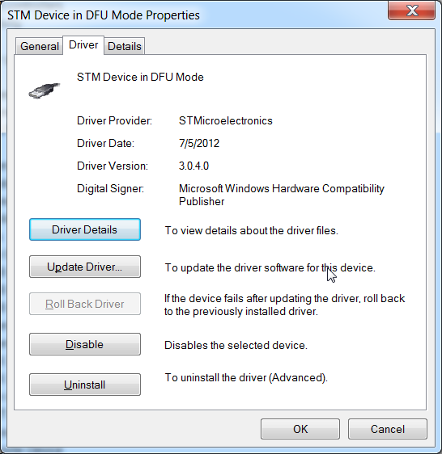
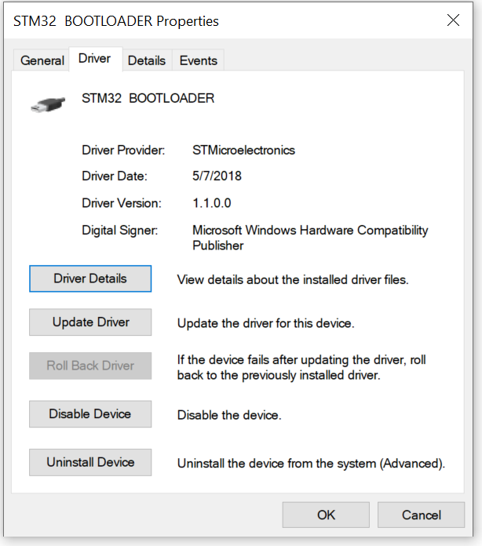

# How to Update Firmware

Disconnect it from the vehicle. Use caution.

<!-- this URL is hard-coded in rusEFI console splash screen MAKE SURE NOT TO RENAME -->

[Download the rusEFI bundle](Download) for your hardware.

## Windows

Launch [rusEFI Console](Console). You can find it in the bundle you downloaded, in the "console" folder.

Click the "Update Firmware" button once you've picked desired update mode.

## Linux

The canonical way to update the firmware on Linux is with DFU.

You will need dfu-util:

``` shell
# Debian/Ubuntu
sudo apt install dfu-util
# Arch/Manjaro
sudo pacman -Syu dfu-util
```

Once you have dfu-util, you can run this from the extracted bundle directory:

``` shell
java -jar console/rusefi_console.jar reboot_dfu

dfu-util -a 0 -D rusefi.dfu
```

## DFU mode

These days normal firmware update should be happening via more modern OpenBLT approach. We only use DFU in case of emergency. It shouldn't blink in DFU mode. When in DFU mode, we expect to see "STM32 BOOTLOADER" in device manager.


## Troubleshooting

Does blue LED close to main processor blink? If nothing is blinking after power cycle, things are pretty broken. Next step is power cycling while holding "PROG" button to enter STM32 DFU mode.

What's the status of red LED close to main processor?

## FAQ

*__Q:__ I got "DRIVER ERROR"*  
__A:__ In rusEFI console please hit "Device Manager". When ECU gets into DFU mode (blue LED stops blinking) you are expected to see a "STM32 Bootloader" device. If you see "STM device in DFU mode", please uninstall it and remove the old driver.

Bad



Good



## More Information

For more about DFU see [HOWTO-DFU](HOWTO-DFU).

ST-LINK is an advanced mode of firmware update which requires ST-LINK device, either external or built-in like on Discovery and Nucleo boards.

## Update TunerStudio Definition

Once you have updated your firmware, you also need to update your TunerStudio definition so it is able to communicate properly. A happy installation of TunerStudio will download the current .ini file automatically!

If you chose to do it manually, you can find the .ini file in the USB storage device that rusEFI board presents to your computer, or in the [rusEFI bundle](Download).
