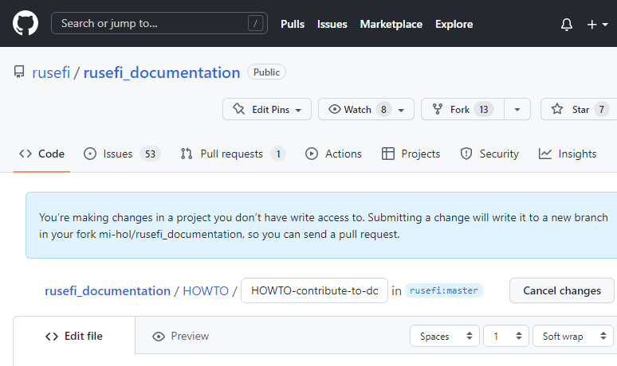
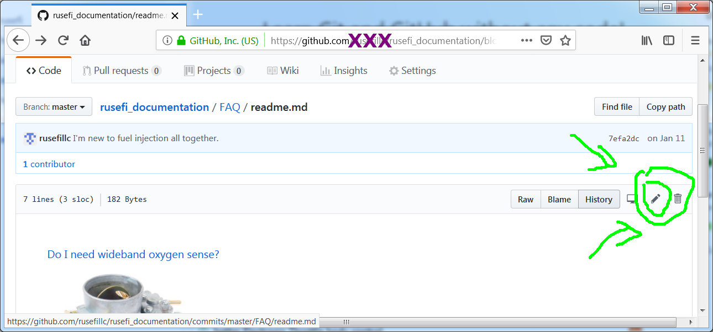
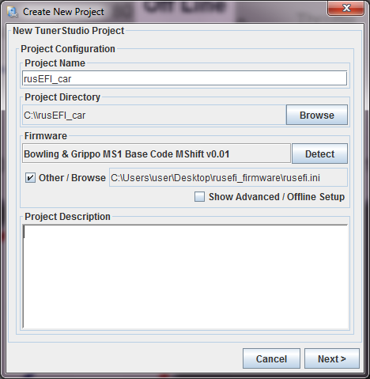

# How to Contribute to Documentation

In order to leverage the GitHub pull request process for access control to the wiki, it is stored in a separate [GitHub repo](https://github.com/rusefi/rusefi_documentation).

## Editing

### Editing from a Wiki3 page

1. From the wiki page you wish to edit on [https://wiki.rusefi.com](https://wiki.rusefi.com), click on the "Edit on GitHub" link in the upper right-hand corner.

2. Sign in to [GitHub](https://github.com) or sign up if you aren't already.

3. Edit the page, scroll to the bottom of the page, enter a "change title", then click on "Propose Changes". This will fork the repository (if not created already), create a branch and give you the option to create a pull request.

   

4. Click "Create Pull Request" and wait for your change to be reviewed.

### Alternative: Editing from a fork of the repo

1. Sign up or sign in to [GitHub](https://github.com) if you aren't already.

2. Open [the documentation repo](https://github.com/rusefi/rusefi_documentation) and click 'Fork' - this will produce your own fork/copy of rusefi_documentation which you can now edit right in your browser!
   

3. Edit your code and commit changes using the button below the editor.

4. Once you are ready to contribute your changes, click the 'New pull request' button on the main page of your fork.

### Alternative: Editing your fork locally

If you are using Linux, macOS, or WSL on Windows, this is a good option because it allows you to test your changes.

1. Fork the rusefi_documentation repo and clone it to your computer.

2. Make your changes.

3. [Test your changes](HOWTO-Test-Doc-Changes).

4. Push your changes to your fork on GitHub, and create a pull request.

### After creating a Pull Request

Within the next 5 minutes after the pull request has been merged, a GitHub Action automatically builds the wiki and uploads it to both wikis.

See also [Documentation Strategy](Documentation-Strategy)

## How to Contribute to the rusEFI TunerStudio Project

1. Sign up or sign in to [GitHub](https://github.com) if you aren't already.

2. Go to  [https://github.com/rusefi/rusefi](https://github.com/rusefi/rusefi) and click "Fork" near the upper right corner.

3. Edit your fork of [the TunerStudio input](https://github.com/rusefi/rusefi/blob/master/firmware/tunerstudio/tunerstudio.template.ini) file.

4. Click "Contribute", then "Open Pull Request", and finally "Create Pull Request".

5. Wait for your changes to be reviewed and merged.

[This commit](https://github.com/rusefi/rusefi/commit/9d9ae5a05499027b32ed76df3e7ee2e2e8240c31) is an example of how more help could be added
right into the TunerStudio project file. Lines with green background are the lines being added.

While you can modify your mainController.ini file while trying your changes, you will need to edit the tunerstudio.template.ini file which
is a template from which rusefi.ini is generated programmatically automated processes.

## Technical Implementation Details

GitHub Wiki is weird.

On the one hand, we have [https://github.com/rusefi/rusefi_documentation](https://github.com/rusefi/rusefi_documentation), which we will call "wiki-source".  
That's a git repository with nice pull request process, but less nice web page rendering which starts each page by showing a list of files - that's not what end users want to see.

On the other hand, we have [the GitHub Wiki](https://github.com/rusefi/rusefi/wiki), which we will call "wiki2" which is displayed much nicer - and that is actually implemented by *another* git repository <https://github.com/rusefi/rusefi.wiki.git> behind the scenes.  
That repository does not have a nice Pull Request process :(

Solution? A combination. [wiki2](https://github.com/rusefi/rusefi/wiki) and [wiki-source](https://github.com/rusefi/rusefi_documentation) repositories are actually set to mirror each other.
This way we have the nice Pull Request process on [wiki-source](https://github.com/rusefi/rusefi_documentation) and once changes are merged, the wiki-source repo is then automatically merged into the wiki2 repo, which makes actual content nicely visible on [wiki2](https://github.com/rusefi/rusefi/wiki)  
Synchronization between wiki2 and wiki-source is automated via [GitHub Actions](https://github.com/rusefi/rusefi/blob/master/.github/workflows/sync-wiki.yaml); file content is expected to be the same between these two repositories.

After every change, [a node map](https://wiki.rusefi.com/nodemap.html) of the links between documents is also generated.

## How Page Titles Work on Wiki3

If the first line with content is a top-level header, e.g. `# rusEFI Documentation`, that will be used as the page title.
If not, the file name will be used as the page title, but without the hyphens.

## How URL links work in markdown documents

Links to pages use only the name of the page.
Example:

`[How to contribute to documentation](HOWTO-contribute-to-documentation)`  
Result:  
[How to contribute to documentation](HOWTO-contribute-to-documentation)

Links to images are relative to the root of the wiki on Wiki2, and relative to the .md file location on Wiki3.  
The only way for this to work consistently between Wiki2 and Wiki3 is to have a flat directory structure.
Example:

``  
Result:  


See also [How To Validate Links](HOWTO-validate-links)

## Using URL link shortcuts

Link shortcuts are maintained in https://github.com/rusefi/web_backend/tree/master/www/s#readme

## Technical FAQ

*__Q:__ Is there a place where we are holding all images for these documents?*  
__A:__ We have images in the same repository! Just add your images while editing pages. Please consider using some folder structure.
For example [https://github.com/rusefi/rusefi_documentation/blob/master/Images/TS/TunerStudio_new_project.png](https://github.com/rusefi/rusefi_documentation/blob/master/Images/TS/TunerStudio_new_project.png) is visible on wiki.rusefi.com as [https://wiki.rusefi.com/Images/TS/TunerStudio_new_project.png](https://wiki.rusefi.com/Images/TS/TunerStudio_new_project.png)

*__Q:__ What sort of fancy options do we have?*  
__A:__ We can do collapsible sections and hint sections! See [cranking](Cranking) for an example. Unfortunately, it's quite picky about how you format the markdown.

``` html
<details markdown="1"><summary>More...</summary>

^ Must have empty line after </summary>
# Content
</details>

^ Must have empty line after </details>
```

*__Q:__ Is it ok that <https://github.com/rusefi/rusefi.wiki.git> cannot be opened from browser?*  
__A:__ There is no reason to open <https://github.com/rusefi/rusefi.wiki.git> from browser. Also while you technically
CAN "git clone <https://github.com/rusefi/rusefi_documentation.wiki.git>" and it would work -
 you should NOT. Anyone looking to make changes should be making changes to non-wiki git via normal fork & pull request process.

Additional automation is in charge of merging from <https://github.com/rusefi/rusefi_documentation.git> into <https://github.com/rusefi/rusefi_documentation.wiki.git>
